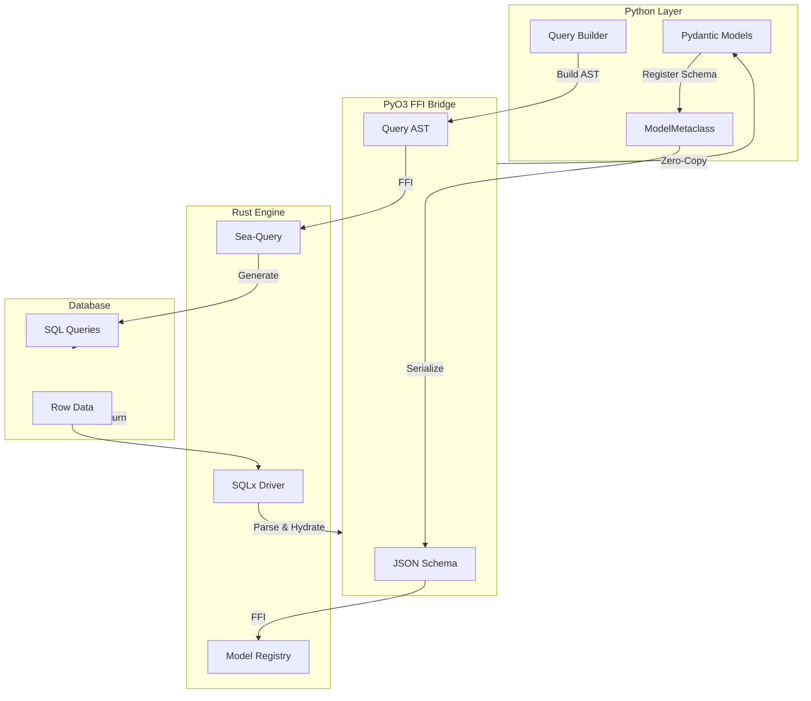
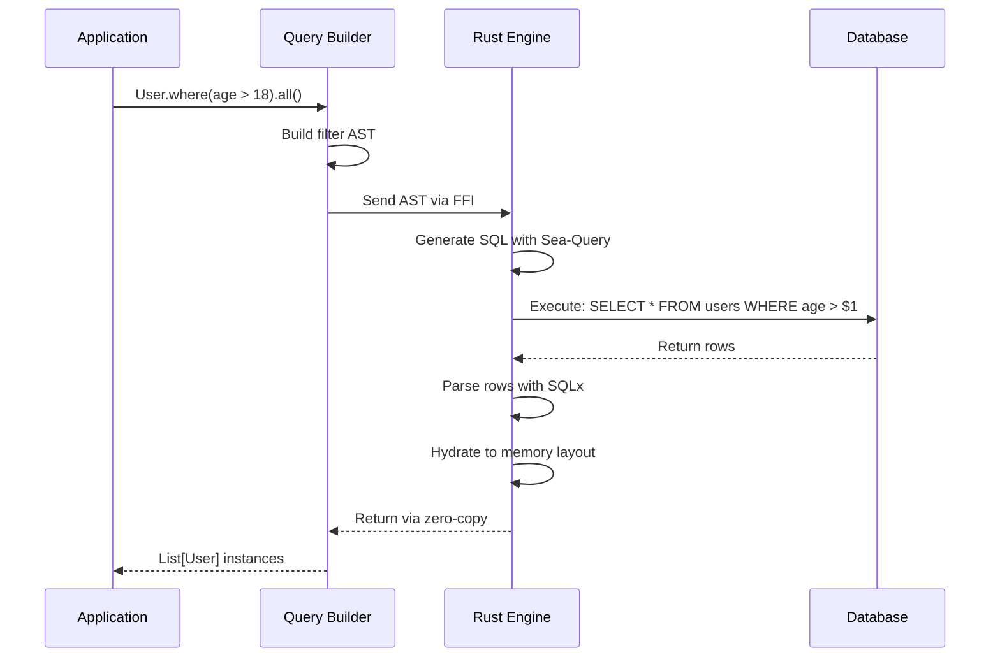
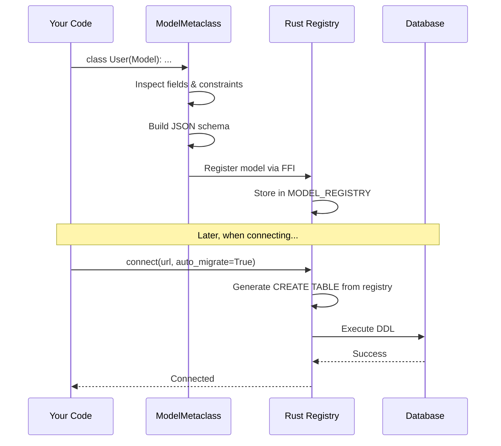
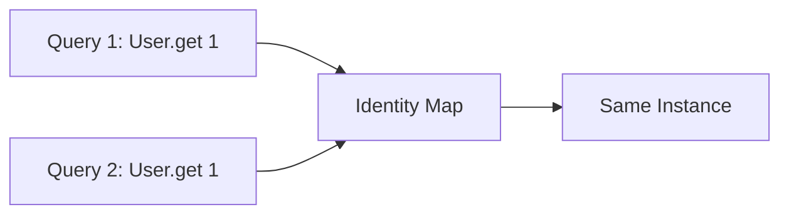

# Architecture

Ferro's performance comes from its unique dual-layer architecture that moves expensive operations out of Python and into Rust.

## High-Level Overview



## The Layers

### Python Layer

**Responsibilities:**
- Model definition via Pydantic
- Query builder API
- Schema introspection
- Application logic

**What stays in Python:**
- Class definitions
- Type annotations
- Business logic
- Query construction (not execution)

### FFI Bridge (PyO3)

**Responsibilities:**
- Type conversion (Python ↔ Rust)
- Memory management
- Error handling
- Async runtime integration

**Data formats:**
- JSON schema (models → Rust)
- Query AST (filters, joins → Rust)
- Binary rows (Rust → Python)

### Rust Engine

**Responsibilities:**
- SQL generation (Sea-Query)
- Database connectivity (SQLx)
- Row parsing and hydration
- Connection pooling
- Identity map

**Why Rust:**
- No GIL (parallel execution)
- Zero-cost abstractions
- Memory safety
- Performance

## Query Lifecycle

When you execute a query, here's what happens:



### Step-by-Step

1. **Query Construction** (Python)
   ```python
   query = User.where(User.age > 18)
   ```
   - Pure Python, no database interaction
   - Builds filter AST in memory

2. **Execution Trigger** (Python → Rust)
   ```python
   users = await query.all()
   ```
   - `.all()` triggers FFI call
   - AST serialized to JSON
   - Sent to Rust engine

3. **SQL Generation** (Rust)
   ```rust
   // Sea-Query generates parameterized SQL
   "SELECT * FROM users WHERE age > $1"
   ```
   - Sea-Query builds SQL AST
   - Generates database-specific SQL
   - Parameters bound safely

4. **Query Execution** (Rust)
   ```rust
   // SQLx executes with connection pool
   let rows = sqlx::query(&sql).bind(18).fetch_all(&pool).await?;
   ```
   - SQLx manages connections
   - Async I/O (no GIL)
   - Returns raw rows

5. **Row Hydration** (Rust)
   ```rust
   // Parse rows into Pydantic-compatible layout
   for row in rows {
       let user = hydrate_user(&row)?;
       results.push(user);
   }
   ```
   - Reads column values
   - Converts types (SQL → Python)
   - Allocates memory

6. **Return to Python** (Rust → Python)
   - Zero-copy transfer where possible
   - Pydantic validates and wraps
   - Returns `List[User]`

## Model Registration

When you define a model, Ferro registers it with the Rust engine:



### Schema Example

Python model:
```python
class User(Model):
    id: Annotated[int, FerroField(primary_key=True)]
    username: Annotated[str, FerroField(unique=True)]
    email: str
```

JSON schema sent to Rust:
```json
{
  "name": "User",
  "fields": [
    {"name": "id", "type": "Int", "primary_key": true},
    {"name": "username", "type": "String", "unique": true},
    {"name": "email", "type": "String"}
  ]
}
```

Rust generates SQL:
```sql
CREATE TABLE users (
    id INTEGER PRIMARY KEY AUTOINCREMENT,
    username TEXT NOT NULL UNIQUE,
    email TEXT NOT NULL
);
```

## Identity Map

Ferro maintains an identity map in the Rust layer for object consistency:



**Benefits:**
- Object consistency (same ID = same instance)
- Reduced hydration cost
- In-place updates visible everywhere

See [Identity Map](identity-map.md) for details.

## Why This Design?

### Performance

**Traditional ORM** (e.g., SQLAlchemy):
```
SQL Generation (Python) → Row Parsing (Python) → Object Creation (Python)
                     ↑                                    ↑
                   GIL held                           GIL held
```

**Ferro:**
```
SQL Generation (Rust) → Row Parsing (Rust) → Object Creation (Rust) → Python
              ↑                                                            ↑
          No GIL                                                    Minimal Python
```

### Benchmarks

Typical performance characteristics:

| Operation | Traditional ORM | Ferro | Improvement |
|-----------|----------------|-------|-------------|
| Bulk Insert (1K rows) | 500ms | 20ms | **25x faster** |
| Complex Query | 100ms | 10ms | **10x faster** |
| Single Row Fetch | 5ms | 3ms | **1.7x faster** |

(Exact numbers vary by database, hardware, and query complexity)

## Memory Layout

Ferro uses Pydantic's memory layout for compatibility:

```
┌─────────────────────────────────────┐
│         Pydantic Instance          │
│  ┌─────────────────────────────┐   │
│  │    Python Dict               │   │
│  │  {"id": 1, "name": "Alice"} │   │
│  └─────────────────────────────┘   │
└─────────────────────────────────────┘
         ↑
         │ Zero-copy injection
         │
    ┌────────────┐
    │ Rust Buffer│
    └────────────┘
```

Rust allocates memory, Python wraps it — minimal copying.

## Async Architecture

Ferro uses `tokio` (Rust async runtime) with `pyo3-asyncio` bridge:

```python
# Python async
users = await User.all()
     ↓
# PyO3 async bridge
     ↓
# Rust async (tokio)
let users = query.fetch_all(&pool).await?;
     ↓
# Back to Python
return users
```

**Benefits:**
- True async (no sync wrappers)
- Efficient connection pooling
- Concurrent query execution

## Trade-offs

**Pros:**
- Extremely fast (10-100x for bulk ops)
- GIL-free I/O
- Memory efficient

**Cons:**
- Complex to debug (crosses languages)
- Limited runtime introspection
- Rust compilation required for custom extensions

## See Also

- [Performance](performance.md) - Optimization techniques
- [Identity Map](identity-map.md) - Instance caching
- [Type Safety](type-safety.md) - Pydantic integration
