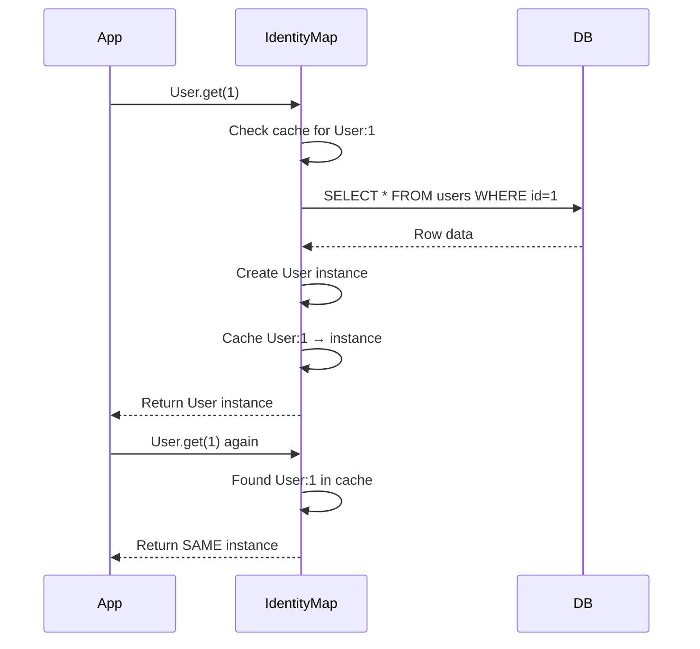

# Identity Map

The Identity Map pattern ensures that within a single application process, the same database record always returns the same Python object instance.

## How It Works



## Benefits

### Object Consistency

```python
# Fetch user twice
user_a = await User.where(User.id == 1).first()
user_b = await User.get(1)

# Same instance
assert user_a is user_b  # True (same object in memory)

# Modify one
user_a.username = "new_name"

# Other reference sees the change
print(user_b.username)  # "new_name"
```

### Performance

Second fetch from cache is nearly free:
```python
# First fetch: database hit
user = await User.get(1)  # ~3ms

# Second fetch: cache hit
user = await User.get(1)  # ~0.01ms (300x faster)
```

### In-Place Updates

```python
# Fetch user in one part of code
user = await User.get(1)

# Modify in another part
async def update_user(user_id):
    u = await User.get(user_id)
    u.email = "new@example.com"
    await u.save()

await update_user(1)

# Original reference sees the change
print(user.email)  # "new@example.com"
```

## Implementation

Ferro's identity map is implemented in the Rust layer using `DashMap` (concurrent hash map):

```rust
// Simplified representation
type IdentityMap = DashMap<(String, Value), Arc<Instance>>;

// Key: (model_name, primary_key)
// Value: Shared reference to instance
```

**Thread-safe:** Multiple async tasks can safely access the identity map concurrently.

## Cache Behavior

### When Objects are Cached

- After `.get(pk)`
- After `.first()`, `.all()` queries
- After `.create()`
- After `.refresh()`

### When Objects are NOT Cached

- During bulk operations (`.bulk_create()`)
- After explicit eviction

### Cache Lifetime

Objects stay in cache until:
1. Application restarts
2. Explicit eviction (`ferro.evict_instance()`)
3. Memory pressure (future: LRU eviction)

## Manual Eviction

Force re-fetch from database:

```python
from ferro import evict_instance

# Evict user from cache
evict_instance("User", 1)

# Next fetch will hit database
user = await User.get(1)
```

Use cases:
- External database changes
- Testing
- Memory management

## Batch Operations and Identity Map

### Regular Queries (cached)

```python
users = await User.where(User.is_active == True).all()
# All users added to identity map

# Second query returns same instances
users_again = await User.where(User.is_active == True).all()
assert users[0] is users_again[0]  # Same object
```

### Bulk Operations (not cached)

```python
users = [User(username=f"user_{i}") for i in range(1000)]
await User.bulk_create(users)

# Bulk-created instances are NOT in identity map
# This is intentional for memory efficiency
```

## Memory Implications

### Memory Usage

Each cached instance consumes memory:
```
Instance size ≈ 1-10 KB (depends on fields)
1000 cached instances ≈ 1-10 MB
```

For most applications, this is negligible.

### Large Datasets

For applications processing millions of records:

```python
# Bad: Caches all 1M users
all_users = await User.all()  # 1M instances cached!

# Good: Process in batches, cache only active batch
async def process_users():
    page = 0
    per_page = 1000

    while True:
        users = await User.limit(per_page).offset(page * per_page).all()
        if not users:
            break

        for user in users:
            await process(user)

        # Evict processed batch
        for user in users:
            evict_instance("User", user.id)

        page += 1
```

## Consistency Guarantees

### Within Process

Identity map guarantees consistency within a single process:

```python
# Process A
user = await User.get(1)
user.email = "new@example.com"
await user.save()

# Elsewhere in Process A
user2 = await User.get(1)
print(user2.email)  # "new@example.com" (same instance)
```

### Across Processes

Identity map does NOT guarantee consistency across processes:

```python
# Process A
user = await User.get(1)
user.email = "a@example.com"
await user.save()

# Process B (separate application instance)
user = await User.get(1)
print(user.email)  # "a@example.com" (reads from database)

# But if Process A still has the instance cached:
# Process A's instance is NOT automatically updated if Process B changes it
```

For multi-process consistency, use database transactions and explicit refreshes.

## Refresh from Database

Force reload from database:

```python
user = await User.get(1)

# ... time passes, external changes ...

# Refresh from database
await user.refresh()
print(user.email)  # Updated from database
```

## Debugging Identity Map

Check if instance is cached:

```python
from ferro import is_cached

# Check if User with ID=1 is cached
cached = is_cached("User", 1)
print(f"User 1 cached: {cached}")
```

Get cache statistics:

```python
from ferro import cache_stats

stats = cache_stats()
print(f"Cached instances: {stats['count']}")
print(f"Cache hits: {stats['hits']}")
print(f"Cache misses: {stats['misses']}")
```

## Best Practices

1. **Don't worry about it** - Identity map works automatically
2. **Use `.refresh()`** when external changes are expected
3. **Evict in long-running batch jobs** to control memory
4. **Don't bypass** - always use Ferro's query API

## Comparison with Other ORMs

| ORM | Identity Map |
|-----|--------------|
| **Ferro** | ✅ Automatic, Rust-based |
| **SQLAlchemy** | ✅ Session-scoped |
| **Django ORM** | ❌ No identity map |
| **Tortoise ORM** | ✅ Automatic |

## See Also

- [Architecture](architecture.md) - How identity map fits in the system
- [Performance](performance.md) - Memory optimization
- [Queries](../guide/queries.md) - Query behavior with caching
