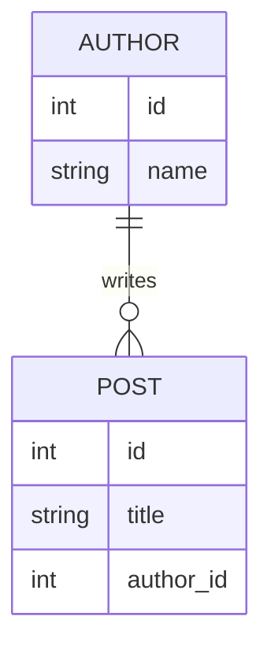
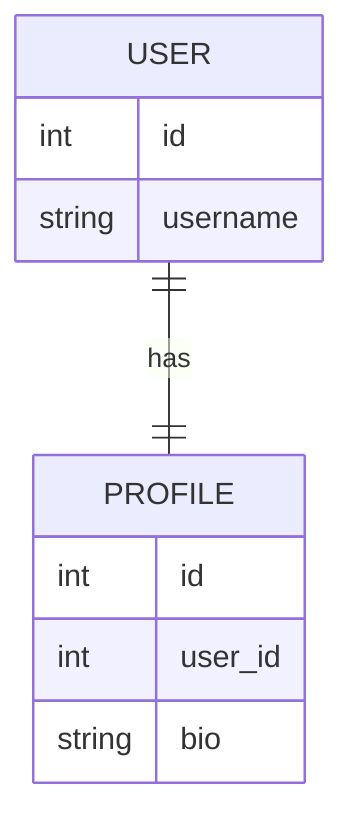
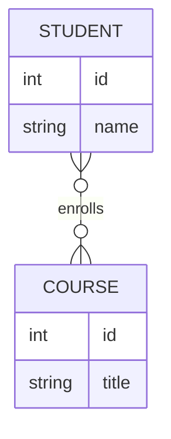

# Relationships

Ferro provides a robust system for connecting models, supporting standard relational patterns with zero-boilerplate reverse lookups and automated join table management.

## Overview

Relationships in Ferro are **lazy** — data is never fetched until you explicitly request it. This prevents N+1 query problems and gives you fine-grained control over when database hits occur.

### API Styles

Like field constraints, relationships can be declared in two equivalent styles:

- **Annotated-style** (`BackRef`): Type-first approach using `typing.Annotated`
- **Pydantic-style** (`Field(back_ref=True)`): Familiar `Field()` syntax

Choose one style and use it consistently. Do not mix `BackRef` and `back_ref=True` on the same field.

### Lazy Loading Behavior

**Forward relations** (accessing a `ForeignKey`):

```python
author = await post.author  # Database hit, returns Author instance
```

**Reverse/M2M relations** (accessing the "other side"):

```python
# Returns a Query object — no database hit yet
query = author.posts

# Chain filters before executing
published_posts = await author.posts.where(Post.published == True).all()
```

## One-to-Many

The most common relationship type: a `ForeignKey` on the "child" model and a reverse-relation field on the "parent" model.



### Annotated-style (with `BackRef`)

```python
from typing import Annotated
from ferro import Model, ForeignKey, BackRef

class Author(Model):
    id: int
    name: str
    posts: BackRef[list["Post"]] = None

class Post(Model):
    id: int
    title: str
    author: Annotated[Author, ForeignKey(related_name="posts")]
```

### Pydantic-style (with `Field(back_ref=True)`)

```python
from ferro import Model, ForeignKey, Field

class Author(Model):
    id: int
    name: str
    posts: list["Post"] | None = Field(default=None, back_ref=True)

class Post(Model):
    id: int
    title: str
    author: Annotated[Author, ForeignKey(related_name="posts")]
```

You can also use `Annotated` with `Field`: `posts: Annotated[list["Post"] | None, Field(back_ref=True)] = None`

### Shadow Fields

For every `ForeignKey` field (e.g., `author`), Ferro automatically creates a "shadow" ID column in the database (e.g., `author_id`). You can access or filter by it directly:

```python
# Access the ID directly
post_author_id = post.author_id

# Filter by foreign key ID
recent_posts = await Post.where(Post.author_id == 123).all()
```

### Usage Examples

```python
# Create with relationship
author = await Author.create(name="Jane Doe")
post = await Post.create(title="Hello World", author=author)

# Access forward relation
post_author = await post.author  # Returns Author instance

# Access reverse relation (returns Query)
author_posts = await author.posts.all()

# Filter reverse relation
published = await author.posts.where(Post.published == True).all()
recent = await author.posts.order_by(Post.created_at, "desc").limit(10).all()
```

## One-to-One

A strict 1:1 link created by adding `unique=True` to a `ForeignKey`.



### Declaration

```python
from typing import Annotated
from ferro import Model, ForeignKey, BackRef

class User(Model):
    id: int
    username: str
    profile: BackRef["Profile"] = None  # Note: singular, not list

class Profile(Model):
    id: int
    bio: str
    user: Annotated[User, ForeignKey(related_name="profile", unique=True)]
```

### Behavior

One-to-one relationships have special behavior on the reverse side:

- **Forward**: `await profile.user` returns a single `User` object
- **Reverse**: `await user.profile` returns a single `Profile` object (or `None`), not a `Query`

Ferro automatically calls `.first()` on the reverse side, so you don't need to manually execute the query.

### Usage Examples

```python
# Create with relationship
user = await User.create(username="alice")
profile = await Profile.create(user=user, bio="Software engineer")

# Access either direction
user_profile = await user.profile  # Returns Profile instance or None
profile_user = await profile.user  # Returns User instance
```

## Many-to-Many

Defined using `ManyToManyField`. Ferro automatically manages the hidden join table required for this relationship.



### Annotated-style (with `BackRef`)

```python
from typing import Annotated
from ferro import Model, ManyToManyField, BackRef

class Student(Model):
    id: int
    name: str
    courses: Annotated[list["Course"], ManyToManyField(related_name="students")] = None

class Course(Model):
    id: int
    title: str
    students: BackRef[list["Student"]] = None
```

### Pydantic-style (with `Field(back_ref=True)`)

```python
from ferro import Model, ManyToManyField, Field

class Student(Model):
    id: int
    name: str
    courses: Annotated[list["Course"], ManyToManyField(related_name="students")] = None

class Course(Model):
    id: int
    title: str
    students: list["Student"] | None = Field(default=None, back_ref=True)
```

### Join Table

The Rust engine automatically creates a join table (e.g., `student_courses`) when models are initialized. The table contains foreign keys to both sides of the relationship.

You do not need to define a "through" model manually unless you need custom fields on the join table (e.g., enrollment date, grade).

### Relationship Mutators

Many-to-many relationships provide specialized methods for managing links:

#### `.add(*instances)`

Create new links in the join table:

```python
# Add single course
await student.courses.add(math_101)

# Add multiple courses
await student.courses.add(math_101, physics_202, chemistry_301)
```

#### `.remove(*instances)`

Remove specific links:

```python
# Remove single course
await student.courses.remove(math_101)

# Remove multiple courses
await student.courses.remove(math_101, physics_202)
```

#### `.clear()`

Remove all links for the current instance:

```python
# Unenroll student from all courses
await student.courses.clear()
```

### Usage Examples

```python
# Create records
student = await Student.create(name="Alice")
math = await Course.create(title="Mathematics")
physics = await Course.create(title="Physics")

# Add relationships
await student.courses.add(math, physics)

# Query with filters
math_students = await math.students.where(Student.name.like("A%")).all()

# Access from either side
student_courses = await student.courses.all()
course_students = await math.students.all()

# Remove relationships
await student.courses.remove(physics)
await student.courses.clear()
```

## Advanced Patterns

### Self-Referential Relationships

You can create relationships where a model references itself:

```python
class Employee(Model):
    id: int
    name: str
    manager: Annotated["Employee", ForeignKey(related_name="reports")] | None = None
    reports: BackRef[list["Employee"]] = None

# Usage
manager = await Employee.create(name="Jane")
employee = await Employee.create(name="John", manager=manager)

# Access
employee_manager = await employee.manager
manager_reports = await manager.reports.all()
```

### Cascade Behavior

Configure what happens when related objects are deleted:

```python
# Cascade delete (default for most databases)
author: Annotated[Author, ForeignKey(related_name="posts", on_delete="CASCADE")]

# Set to NULL
author: Annotated[Author, ForeignKey(related_name="posts", on_delete="SET NULL")]

# Restrict deletion
author: Annotated[Author, ForeignKey(related_name="posts", on_delete="RESTRICT")]
```

## See Also

- [Models & Fields](models-and-fields.md) - Defining models and field types
- [Queries](queries.md) - Filtering and fetching related data
- [Mutations](mutations.md) - Creating and updating with relationships
