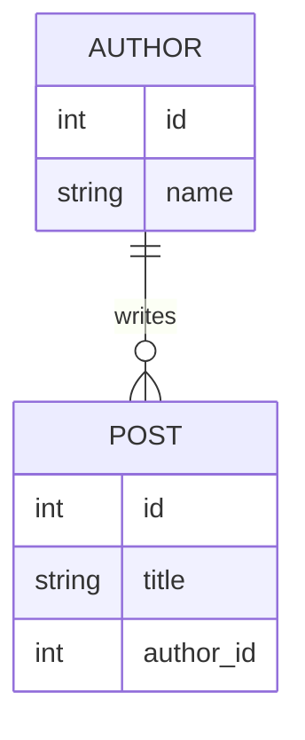
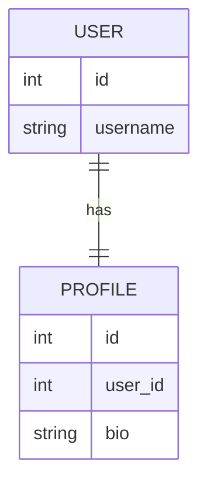
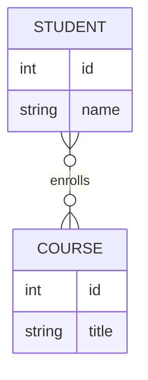

# Relationships

Ferro provides a robust system for connecting models, supporting standard relational patterns with zero-boilerplate reverse lookups and automated join table management.

## Overview

Relationships in Ferro are **lazy** — data is never fetched until you explicitly request it. This prevents N+1 query problems and gives you fine-grained control over when database hits occur.

### API Styles

Like scalar field constraints ([assignment vs `Annotated[..., Field(...)]`](models-and-fields.md#field-constraints)), relationship metadata can be declared in two equivalent styles:

- **Helper-style** (`BackRef()`, `ManyToMany(...)`): Recommended relationship helpers
- **Field-style** (`Field(back_ref=True)`, `Field(many_to_many=True, ...)`): Lower-level `Field()` syntax

Collection relationships are typed with `Relation[list[T]]`, which reflects the lazy query-like object returned at runtime.

### Lazy Loading Behavior

**Forward relations** (accessing a `ForeignKey`):

```python
author = await post.author  # Database hit, returns Author instance
```

**Reverse/M2M relations** (accessing the "other side"):

```python
# Returns a Query object — no database hit yet
query = author.posts

# Chain filters before executing
published_posts = await author.posts.where(Post.published == True).all()
```

## One-to-Many

The most common relationship type: a `ForeignKey` on the "child" model and a reverse-relation field on the "parent" model.


```mermaid
erDiagram
    AUTHOR ||--o{ POST : writes
    AUTHOR {
        int id
        string name
    }
    POST {
        int id
        string title
        int author_id
    }
```

### Helper-style (with `BackRef()`)

```python
from typing import Annotated
from ferro import Model, ForeignKey, BackRef, Relation

class Author(Model):
    id: int
    name: str
    posts: Relation[list["Post"]] = BackRef()

class Post(Model):
    id: int
    title: str
    author: Annotated[Author, ForeignKey(related_name="posts")]
```

### Field-style (with `Field(back_ref=True)`)

```python
from ferro import Model, ForeignKey, Field, Relation

class Author(Model):
    id: int
    name: str
    posts: Relation[list["Post"]] = Field(back_ref=True)

class Post(Model):
    id: int
    title: str
    author: Annotated[Author, ForeignKey(related_name="posts")]
```

You can also use `Annotated` with `Field`: `posts: Annotated[Relation[list["Post"]], Field(back_ref=True)]`

### Shadow Fields

For every `ForeignKey` field (e.g., `author`), Ferro automatically creates a **shadow** scalar column and a matching Pydantic field named `{field}_id` (e.g., `author_id`). It holds the related row’s primary key value. You can read or filter on it like any other column:

**Typing:** The shadow field’s Python type **follows the related model’s primary key annotation**, wrapped as optional (`| None`) for ORM defaults (the value starts as `None` until you set the relation or the ID). If the parent uses `UUID` for its PK, `author_id` is `UUID | None`; if the parent uses `int | None`, the shadow field matches that shape.

**Forward references:** When the FK target is only a **string** or `ForwardRef` (e.g., `Annotated["Author", ForeignKey(...)]`) because the parent class is not defined yet, Ferro may start with a **broad fallback** union for the shadow field until the target class exists. After **`resolve_relationships()`** runs—which **`connect()`** calls for you, or which you can call explicitly in tests once every model is registered—the shadow type is **reconciled** to the real PK type and Pydantic’s schema is rebuilt so validation and serialization match the resolved model graph.

```python
# Read the stored FK value (same logical type as the parent's PK)
post_author_id = post.author_id

# Filter — use the same value type as Author.id (integer PK example)
recent_posts = await Post.where(Post.author_id == 123).all()

# With a UUID (or other non-int) primary key on Author, compare using that type
# recent_posts = await Post.where(Post.author_id == author.id).all()
```

Nullable relations such as `Annotated[Author | None, ForeignKey(...)]` are supported: the inner target type is normalized so metadata and shadow columns behave consistently.

### Usage Examples

```python
# Create with relationship
author = await Author.create(name="Jane Doe")
post = await Post.create(title="Hello World", author=author)

# Access forward relation
post_author = await post.author  # Returns Author instance

# Access reverse relation (returns Query)
author_posts = await author.posts.all()

# Filter reverse relation
published = await author.posts.where(Post.published == True).all()
recent = await author.posts.order_by(Post.created_at, "desc").limit(10).all()
```

## One-to-One

A strict 1:1 link created by adding `unique=True` to a `ForeignKey`.


```mermaid
erDiagram
    USER ||--|| PROFILE : has
    USER {
        int id
        string username
    }
    PROFILE {
        int id
        int user_id
        string bio
    }
```

### Declaration

```python
from typing import Annotated
from ferro import Model, ForeignKey, BackRef

class User(Model):
    id: int
    username: str
    profile: "Profile" = BackRef()  # Note: singular relationships do not use Relation

class Profile(Model):
    id: int
    bio: str
    user: Annotated[User, ForeignKey(related_name="profile", unique=True)]
```

### Behavior

One-to-one relationships have special behavior on the reverse side:

- **Forward**: `await profile.user` returns a single `User` object
- **Reverse**: `await user.profile` returns a single `Profile` object (or `None`), not a `Query`

Ferro automatically calls `.first()` on the reverse side, so you don't need to manually execute the query.

### Usage Examples

```python
# Create with relationship
user = await User.create(username="alice")
profile = await Profile.create(user=user, bio="Software engineer")

# Access either direction
user_profile = await user.profile  # Returns Profile instance or None
profile_user = await profile.user  # Returns User instance
```

## Many-to-Many

Defined using `ManyToMany(...)`. Ferro automatically manages the hidden join table required for this relationship.


```mermaid
erDiagram
    STUDENT }o--o{ COURSE : enrolls
    STUDENT {
        int id
        string name
    }
    COURSE {
        int id
        string title
    }
```

### Helper-style (with `ManyToMany()` / `BackRef()`)

```python
from ferro import Model, ManyToMany, BackRef, Relation

class Student(Model):
    id: int
    name: str
    courses: Relation[list["Course"]] = ManyToMany(related_name="students")

class Course(Model):
    id: int
    title: str
    students: Relation[list["Student"]] = BackRef()
```

### Field-style (with `Field(...)`)

```python
from ferro import Model, Field, Relation

class Student(Model):
    id: int
    name: str
    courses: Relation[list["Course"]] = Field(many_to_many=True, related_name="students")

class Course(Model):
    id: int
    title: str
    students: Relation[list["Student"]] = Field(back_ref=True)
```

### Join Table

The Rust engine automatically creates a join table (e.g., `student_courses`) when models are initialized. The table contains foreign keys to both sides of the relationship.

You do not need to define a "through" model manually unless you need custom fields on the join table (e.g., enrollment date, grade).

### Relationship Mutators

Many-to-many relationships provide specialized methods for managing links:

#### `.add(*instances)`

Create new links in the join table:

```python
# Add single course
await student.courses.add(math_101)

# Add multiple courses
await student.courses.add(math_101, physics_202, chemistry_301)
```

#### `.remove(*instances)`

Remove specific links:

```python
# Remove single course
await student.courses.remove(math_101)

# Remove multiple courses
await student.courses.remove(math_101, physics_202)
```

#### `.clear()`

Remove all links for the current instance:

```python
# Unenroll student from all courses
await student.courses.clear()
```

### Usage Examples

```python
# Create records
student = await Student.create(name="Alice")
math = await Course.create(title="Mathematics")
physics = await Course.create(title="Physics")

# Add relationships
await student.courses.add(math, physics)

# Query with filters
math_students = await math.students.where(Student.name.like("A%")).all()

# Access from either side
student_courses = await student.courses.all()
course_students = await math.students.all()

# Remove relationships
await student.courses.remove(physics)
await student.courses.clear()
```

## Advanced Patterns

### Self-Referential Relationships

You can create relationships where a model references itself:

```python
class Employee(Model):
    id: int
    name: str
    manager: Annotated["Employee", ForeignKey(related_name="reports")] | None = None
    reports: Relation[list["Employee"]] = BackRef()

# Usage
manager = await Employee.create(name="Jane")
employee = await Employee.create(name="John", manager=manager)

# Access
employee_manager = await employee.manager
manager_reports = await manager.reports.all()
```

### Cascade Behavior

Configure what happens when related objects are deleted:

```python
# Cascade delete (default for most databases)
author: Annotated[Author, ForeignKey(related_name="posts", on_delete="CASCADE")]

# Set to NULL
author: Annotated[Author, ForeignKey(related_name="posts", on_delete="SET NULL")]

# Restrict deletion
author: Annotated[Author, ForeignKey(related_name="posts", on_delete="RESTRICT")]
```

## See Also

- [Models & Fields](models-and-fields.md) - Defining models and field types
- [Queries](queries.md) - Filtering and fetching related data
- [Mutations](mutations.md) - Creating and updating with relationships
