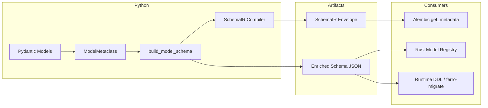
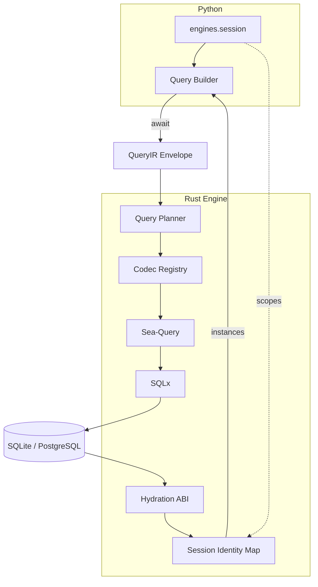
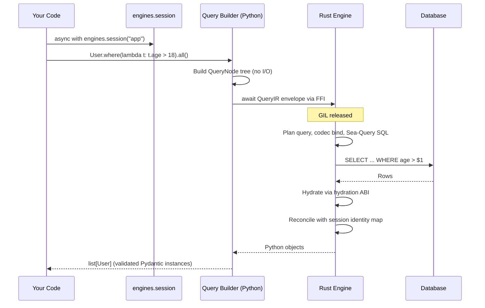
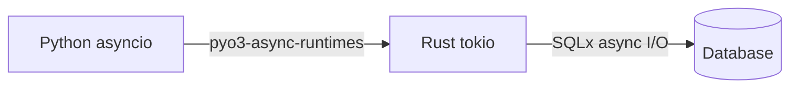

# Architecture

Ferro is a Python ORM with a Rust core. You write Pydantic models and async Python; SQL generation, database I/O, and row hydration happen in compiled Rust. This page explains how the pieces fit together and what actually happens when you run a query.

## Overview

Ferro has two main pipelines: **schema compilation** (happens at import/class-creation) and **query execution** (happens per `await`). They share IR contracts but run at different times.

### Schema path (compile-time)

Runs when a `Model` subclass is defined. `ModelMetaclass` calls `build_model_schema()` once per model; that enriched schema fans out to SchemaIR compilation and Rust registry registration.



> **Implementation status (2026-06-26):** only `SchemaIR --> Alembic` is a fully
> realized SchemaIR consumer. The runtime DDL / `ferro-migrate` path currently
> re-derives its own SchemaIR in Rust from the enriched JSON (it does not consume
> the Python-compiled SchemaIR envelope), and the runtime CREATE emitter
> (`src/schema.rs`) uses its own canonical type system rather than the shared
> `ferro-ddl-lowering` crate. Collapsing these onto one SchemaIR producer and one
> lowering library is tracked as **Phase 8.5** — see the
> [IR-first lowering consolidation audit](../../solutions/architecture-patterns/ir-first-lowering-consolidation-audit.md).

### Runtime path (per operation)

Runs inside an active session when you await a terminal query method or execute a mutation. QueryIR crosses the FFI boundary; Rust owns SQL, I/O, and hydration.



The shortest way to hold the whole design in your head:

```text
Python owns the model authoring surface.
SchemaIR and QueryIR own the cross-language contracts.
Rust owns execution, codecs, and hydration.
Sea-Query owns SQL shape.
SQLx owns typed database I/O.
Sessions scope routing, transactions, and the identity map.
The backend kind decides which database-specific path is legal.
```

## The Layers

### Python

Ferro models are real Pydantic V2 `BaseModel` subclasses. The Python layer owns:

- **Model definition.** Annotated fields become columns; Pydantic handles validation, defaults, serialization, and JSON schema generation.
- **Metaclass registration.** `ModelMetaclass` inspects each model at class-creation time, builds an enriched JSON schema (primary keys, uniques, indexes, foreign keys, nullability, composite constraints), registers it with the Rust engine, compiles a versioned **SchemaIR** artifact, and replaces class-level field access with `FieldProxy` objects for query construction.
- **Query building.** Chains like `User.where(lambda t: t.active).order_by(User.age, "desc").limit(10)` are pure Python — they accumulate an in-memory query definition. Nothing touches the database until you await a terminal method (`.all()`, `.first()`, `.count()`, `.exists()`, `.update()`, `.delete()`).
- **Session routing.** ORM and raw operations run inside an active `engines.session()` context (or with an explicit `session=` handle). Sessions scope connection routing, transactions, and the identity map under concurrency.

### The Bridge

The FFI boundary is built on [PyO3](https://pyo3.rs) with `pyo3-async-runtimes` bridging Python's asyncio event loop to Rust's tokio runtime. Versioned IR envelopes cross the boundary:

- **SchemaIR** (`ir_kind: "schema"`) — compiled at class-creation time from the enriched model schema. Cached in Python (`ferro.state`) and consumed by Alembic `get_metadata()` and parity tests. The Rust registry receives enriched JSON schema for runtime query/bind metadata, and the runtime migration planner currently re-derives its own SchemaIR in Rust from that JSON rather than consuming this envelope (consolidation tracked in [Phase 8.5](../../plans/2026-06-19-001-ir-first-roadmap.md)).
- **QueryIR** (`ir_kind: "query"`) — emitted per operation from the query builder as `{ir_kind, ir_version, payload}`. Rust deserializes the envelope, plans SQL, and binds parameters through the shared codec registry.
- **Rows** travel back as typed values that Rust hydrates into Python objects via the hydration ABI (direct `__dict__` population with required Pydantic slots initialized).

Crucially, the GIL is released while Rust waits on the database. An awaited Ferro query does not block other Python coroutines or threads.

### The Rust Engine

The engine owns everything between the IR envelope and the database:

- **Query planning** — QueryIR payloads lower to Sea-Query conditions with schema-aware bind typing.
- **Codec registry** — unified bind/fetch lowering for inserts, updates, filters, M2M links, and hydration (typed NULLs, UUIDs, decimals, temporals).
- **SQL generation** via [Sea-Query](https://github.com/SeaQL/sea-query), which lowers each operation through the dialect-specific builder (SQLite or PostgreSQL) with safely bound parameters.
- **Connection pooling and execution** via [SQLx](https://github.com/launchbadge/sqlx) typed pools — a real SQLite pool or a real PostgreSQL pool, not a generic abstraction pretending to be both.
- **Hydration ABI** — decoding database values into Python-compatible shapes and constructing instances without calling Pydantic `__init__`, while initializing `__pydantic_fields_set__`, `__pydantic_extra__`, and `__pydantic_private__`.
- **Session-scoped identity map** — a per-session cache ensuring one row maps to one Python instance within the active session. See [Identity Map](identity-map.md).

## Life of a Query



Step by step:

1. **Session** — `async with ferro.engines.session("app")` establishes ambient routing for ORM/raw operations (or pass `session=` explicitly).
2. **Construction** — `User.where(lambda t: t.age > 18)` builds a `QueryNode` tree in Python. No database interaction.
3. **Execution trigger** — awaiting `.all()` wraps the query in a **QueryIR envelope** and calls into Rust.
4. **SQL generation** — the planner and codec registry lower the IR into dialect-correct, parameterized SQL. Values are bound, never interpolated.
5. **Execution** — SQLx runs the statement on a pooled connection (or on the pinned connection if a [transaction](../guide/transactions.md) is active).
6. **Hydration** — Rust decodes each row through the hydration ABI, consulting the session identity map so a primary key you've already loaded resolves to the existing object.
7. **Return** — your code receives a plain `list[User]` of fully validated Pydantic instances.

## Model Registration

Defining a model is itself a registration step:

=== "Assignment"

    ```python
    from ferro import Field, Model


    class User(Model):
        id: int | None = Field(default=None, primary_key=True)
        username: str = Field(unique=True)
        email: str
    ```

=== "Annotated"

    ```python
    from typing import Annotated

    from ferro import Field, Model


    class User(Model):
        id: Annotated[int | None, Field(default=None, primary_key=True)]
        username: Annotated[str, Field(unique=True)]
        email: str
    ```

At class-creation time the metaclass calls `build_model_schema()`, registers the enriched JSON with the Rust engine's model registry, and compiles **SchemaIR** artifacts (per-model and model-set fingerprints) from the same schema dict. Importing your models is therefore enough for Ferro to know your full schema — but it does **not** connect to a database.

Schema DDL happens later, when you connect:

```python
from ferro import connect

await connect("sqlite::memory:", auto_migrate=True)
```

- `auto_migrate=True` creates missing tables for every registered model.
- `migrate_updates=True` (0.11.0) additionally adds missing columns to existing tables, and on PostgreSQL reconciles type and nullability drift. Runtime updates are planned from **SchemaIR** diffing (`ferro-migrate`) and executed as backend-specific DDL.
- `migrate_destructive=True` (0.11.0) additionally drops live columns no longer on the model (never whole tables).

The legacy enriched-JSON migration planner remains in the codebase as a deprecated shadow reference until `v0.14.0` (Phase 9); parity against the IR path is gated in Phase 8 ([#120](https://github.com/syn54x/ferro-orm/issues/120)).

For renames, primary-key changes, and complex transforms, use the [Alembic bridge](../guide/migrations.md). **SchemaIR** is the intended canonical contract for cross-emitter DDL parity — Alembic `get_metadata()` derives SQLAlchemy metadata from compiled SchemaIR so autogenerate agrees with Ferro's naming and type conventions. The runtime CREATE and migrate emitters do not yet consume SchemaIR directly, so today that parity is enforced by tests (`test_cross_emitter_parity.py`, `test_db_type_cross_emitter_parity.py`) rather than by shared lowering code; making it structural is tracked in [Phase 8.5](../../plans/2026-06-19-001-ir-first-roadmap.md). The enriched JSON schema in the Rust registry remains the runtime source for query bind typing and hydration metadata.

## Async Architecture

Ferro is async end to end. Python's `await` hands off to Rust's tokio runtime; there are no thread pools wrapping a synchronous driver, and no sync API with async bolted on.



Consequences:

- Database I/O never holds the GIL, so other coroutines keep running while queries are in flight.
- Concurrent queries from multiple tasks share the connection pool naturally when each task uses its own session (or explicit `session=` routing).
- [Sessions](../guide/connections.md) and [transactions](../guide/transactions.md) pin enclosed work to a scoped connection and identity map via context variables.

## Trade-offs

This design buys speed and type fidelity, but it is honest to name what it costs:

- **Compiled wheel dependency.** Ferro ships a compiled extension module. Prebuilt wheels cover common platforms; anything else means building from source with a Rust toolchain.
- **Debugging crosses a language boundary.** A stack trace stops at the FFI. Ferro works to surface clear Python exceptions, but stepping a debugger *into* SQL generation or hydration is not possible the way it is with a pure-Python ORM.
- **Limited runtime introspection.** You cannot monkeypatch the engine's internals or hook arbitrary points of the execution pipeline from Python.
- **Young ecosystem.** Ferro is pre-1.0 with a small community, fewer integrations, and fewer Stack Overflow answers than SQLAlchemy or Django ORM.

## See Also

- [Identity Map](identity-map.md) — session-scoped instance caching
- [Query Typing](query-typing.md) — lambda predicates and the query DSL
- [Type Safety](type-safety.md) — the Pydantic integration in depth
- [Backends](backends.md) — SQLite and PostgreSQL specifics
- [Performance](performance.md) — where the Rust core pays off
- [Migrations](../guide/migrations.md) — Alembic bridge and SchemaIR-backed `get_metadata()`
