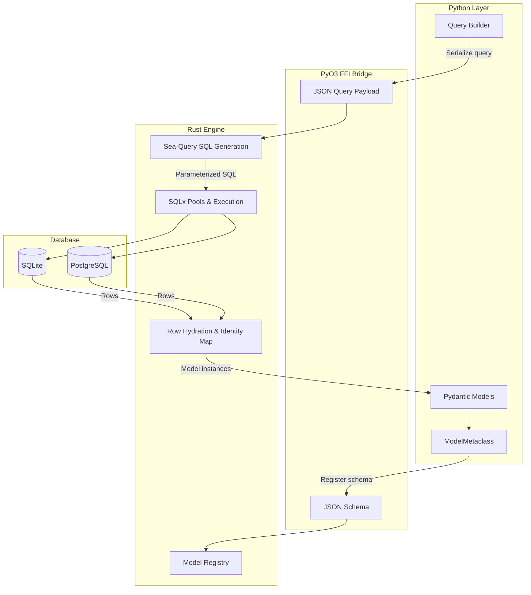
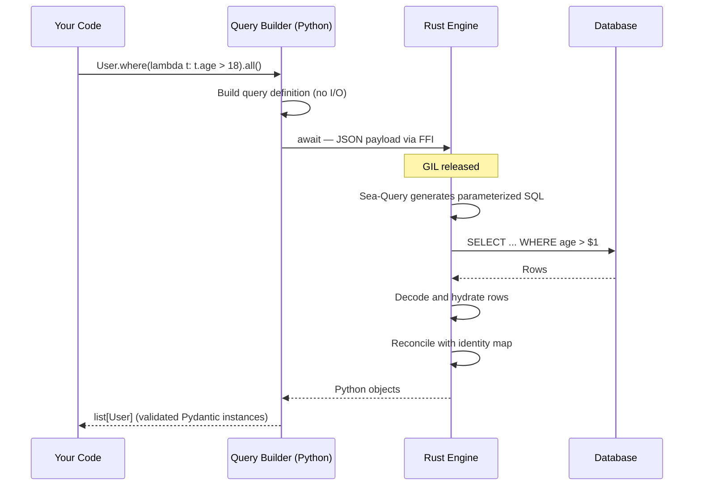
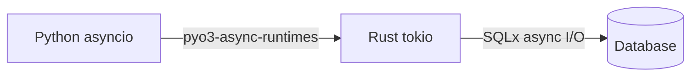

# Architecture

Ferro is a Python ORM with a Rust core. You write Pydantic models and async Python; SQL generation, database I/O, and row hydration happen in compiled Rust. This page explains how the pieces fit together and what actually happens when you run a query.

## Overview



The shortest way to hold the whole design in your head:

```text
Python owns the model contract.
Rust owns execution.
Sea-Query owns SQL shape.
SQLx owns typed database I/O.
The backend kind decides which database-specific path is legal.
```

## The Layers

### Python

Ferro models are real Pydantic V2 `BaseModel` subclasses. The Python layer owns:

- **Model definition.** Annotated fields become columns; Pydantic handles validation, defaults, serialization, and JSON schema generation.
- **Metaclass registration.** `ModelMetaclass` inspects each model at class-creation time, builds an enriched JSON schema (primary keys, uniques, indexes, foreign keys, nullability, composite constraints), registers it with the Rust engine, and replaces class-level field access with `FieldProxy` objects so `User.email == "a@b.com"` builds a query node instead of comparing values.
- **Query building.** Chains like `User.where(...).order_by(...).limit(10)` are pure Python — they accumulate an in-memory query definition. Nothing touches the database until you await a terminal method (`.all()`, `.first()`, `.count()`, `.exists()`, `.update()`, `.delete()`).

### The Bridge

The FFI boundary is built on [PyO3](https://pyo3.rs) with `pyo3-async-runtimes` bridging Python's asyncio event loop to Rust's tokio runtime. Two kinds of data cross it:

- **Schemas** travel Python → Rust once, at class-creation time, as JSON — Pydantic's JSON schema enriched with Ferro-specific keys (`primary_key`, `ferro_nullable`, `foreign_key`, `ferro_composite_uniques`, and so on).
- **Queries and mutations** travel as compact JSON payloads per operation; rows travel back as typed values that Rust assembles into Python objects.

Crucially, the GIL is released while Rust waits on the database. An awaited Ferro query does not block other Python coroutines or threads.

### The Rust Engine

The engine owns everything between the JSON payload and the database:

- **SQL generation** via [Sea-Query](https://github.com/SeaQL/sea-query), which lowers each operation through the dialect-specific builder (SQLite or PostgreSQL) with safely bound parameters.
- **Connection pooling and execution** via [SQLx](https://github.com/launchbadge/sqlx) typed pools — a real SQLite pool or a real PostgreSQL pool, not a generic abstraction pretending to be both.
- **Row hydration** — decoding database values (which are not the same as Python field values; a PostgreSQL `uuid` or `numeric` needs reconstruction) into the exact shapes Pydantic expects.
- **The identity map**, a per-connection cache ensuring one row maps to one Python instance. See [Identity Map](identity-map.md).

## Life of a Query



Step by step:

1. **Construction** — `User.where(lambda t: t.age > 18)` builds a `QueryNode` tree in Python. No database interaction.
2. **Execution trigger** — awaiting `.all()` serializes the query definition to JSON and calls into Rust.
3. **SQL generation** — Sea-Query lowers the definition into dialect-correct, parameterized SQL. Values are bound, never interpolated.
4. **Execution** — SQLx runs the statement on a pooled connection (or on the pinned connection if a [transaction](../guide/transactions.md) is active).
5. **Hydration** — Rust decodes each row's values into Python-compatible shapes and constructs instances, consulting the identity map so a primary key you've already loaded resolves to the existing object.
6. **Return** — your code receives a plain `list[User]` of fully validated Pydantic instances.

## Model Registration

Defining a model is itself a registration step:

=== "Assignment"

    ```python
    from ferro import Field, Model


    class User(Model):
        id: int | None = Field(default=None, primary_key=True)
        username: str = Field(unique=True)
        email: str
    ```

=== "Annotated"

    ```python
    from typing import Annotated

    from ferro import Field, Model


    class User(Model):
        id: Annotated[int | None, Field(default=None, primary_key=True)]
        username: Annotated[str, Field(unique=True)]
        email: str
    ```

At class-creation time the metaclass builds the enriched schema and registers it with the Rust engine's model registry. Importing your models is therefore enough for Ferro to know your full schema — but it does **not** connect to a database.

Schema DDL happens later, when you connect:

```python
from ferro import connect

await connect("sqlite::memory:", auto_migrate=True)
```

- `auto_migrate=True` creates missing tables for every registered model.
- `migrate_updates=True` (0.11.0) additionally adds missing columns to existing tables, and on PostgreSQL reconciles type and nullability drift.
- `migrate_destructive=True` (0.11.0) additionally drops live columns no longer on the model (never whole tables).

For renames, primary-key changes, and complex transforms, use the [Alembic bridge](../guide/migrations.md). The same registered schema metadata drives runtime DDL, Alembic autogeneration, and query casting decisions — the Python schema is the single contract.

## Async Architecture

Ferro is async end to end. Python's `await` hands off to Rust's tokio runtime; there are no thread pools wrapping a synchronous driver, and no sync API with async bolted on.



Consequences:

- Database I/O never holds the GIL, so other coroutines keep running while queries are in flight.
- Concurrent queries from multiple tasks share the connection pool naturally.
- Transactions pin all enclosed work to a single typed connection via a context variable, so everything inside `async with transaction():` sees the same database state.

## Trade-offs

This design buys speed and type fidelity, but it is honest to name what it costs:

- **Compiled wheel dependency.** Ferro ships a compiled extension module. Prebuilt wheels cover common platforms; anything else means building from source with a Rust toolchain.
- **Debugging crosses a language boundary.** A stack trace stops at the FFI. Ferro works to surface clear Python exceptions, but stepping a debugger *into* SQL generation or hydration is not possible the way it is with a pure-Python ORM.
- **Limited runtime introspection.** You cannot monkeypatch the engine's internals or hook arbitrary points of the execution pipeline from Python.
- **Young ecosystem.** Ferro is pre-1.0 with a small community, fewer integrations, and fewer Stack Overflow answers than SQLAlchemy or Django ORM.

## See Also

- [Identity Map](identity-map.md) — how instance caching works
- [Type Safety](type-safety.md) — the Pydantic integration in depth
- [Backends](backends.md) — SQLite and PostgreSQL specifics
- [Performance](performance.md) — where the Rust core pays off
