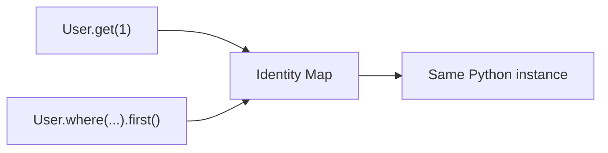

# Identity Map

Ferro keeps an identity map: within a single session and connection, the same database row resolves to the same Python object.

## What It Is

The identity map is a session-scoped cache in the Rust engine, keyed by `(connection, model name, primary key)`. When a query hydrates a row whose primary key is already in the session map, Ferro returns the existing instance instead of building a duplicate.



Each active session keeps its own map. Within a session, connection routing is deterministic and tracked independently from other concurrent sessions.

## Why It Matters

Without an identity map, two queries that return the same row give you two disconnected copies; an update to one is invisible through the other. With it, "row 1" means one object everywhere in your process:

=== "Assignment"

    ```python
    from ferro import Field, Model, connect


    class User(Model):
        id: int | None = Field(default=None, primary_key=True)
        username: str
        email: str


    await connect("sqlite::memory:", auto_migrate=True)

    created = await User.create(username="alice", email="alice@example.com")
    fetched = await User.get(created.id)
    filtered = await User.where(lambda t: t.username == "alice").first()

    # One row, one instance.
    assert fetched is created
    assert filtered is created

    # A change made through any reference is visible through all of them.
    fetched.email = "new@example.com"
    assert created.email == "new@example.com"
    ```

=== "Annotated"

    ```python
    from typing import Annotated

    from ferro import Field, Model, connect


    class User(Model):
        id: Annotated[int | None, Field(default=None, primary_key=True)]
        username: str
        email: str


    await connect("sqlite::memory:", auto_migrate=True)

    created = await User.create(username="alice", email="alice@example.com")
    fetched = await User.get(created.id)
    filtered = await User.where(lambda t: t.username == "alice").first()

    # One row, one instance.
    assert fetched is created
    assert filtered is created

    # A change made through any reference is visible through all of them.
    fetched.email = "new@example.com"
    assert created.email == "new@example.com"
    ```

This guarantee holds within one process and one connection. It does **not** synchronize across processes — if another process (or another tool entirely) updates the database, your cached instance is stale until you refresh or evict it.

## What Gets Cached

Instances enter the identity map whenever Ferro hydrates or persists a full model:

- `Model.get(pk)` and `Model.get_or_none(pk)`
- `.first()` and `.all()` query results
- `Model.create(...)`
- `instance.save()` and `instance.refresh()`

What does **not** populate the map:

- `Model.bulk_create([...])` — bulk inserts return a row count, not instances, and deliberately skip the map for memory efficiency. Re-query if you need tracked instances afterward.
- Raw SQL (`fetch_all` / `fetch_one`) — raw rows are plain dicts and never touch the map.

## Eviction and Refresh

When you know the database has changed underneath you, you have two tools.

**Refresh** reloads an instance you hold, in place:

```python
user = await User.get(1)
# ... something external updates the row ...
await user.refresh()
```

**Evict** removes an entry from the map so the *next* fetch hydrates fresh from the database. The primary key is passed as a string:

```python
from ferro import evict_instance

evict_instance("User", str(user.id))

fresh = await User.get(user.id)  # hits the database, new instance
```

Eviction is also the lever for long-running batch jobs: cached instances live until evicted or until the engine is reset, so evict processed records if you sweep millions of rows in one process.

## Opting Out

The identity map is on by default and can be disabled per connection:

```python
from ferro import connect

await connect("sqlite::memory:", auto_migrate=True, identity_map=False)
```

With `identity_map=False`, every load returns a fresh instance and the map is never consulted. You give up the `a is b` guarantee across loads in exchange for lower memory use — appropriate for read-heavy ETL-style workloads where instance identity carries no meaning.

## Identity Map in Tests

Because the map persists for the lifetime of a connection, tests that share a process must reset state between cases or earlier tests' instances will leak into later ones. `reset_engine()` tears down all connections and their identity maps:

```python
import pytest

from ferro import connect, reset_engine


@pytest.fixture
async def db():
    await connect("sqlite::memory:", auto_migrate=True)
    yield
    reset_engine()
```

## See Also

- [Architecture](architecture.md) — where the identity map lives in the engine
- [Performance](performance.md) — memory implications of caching
- [Queries](../guide/queries.md) — query behavior in depth
