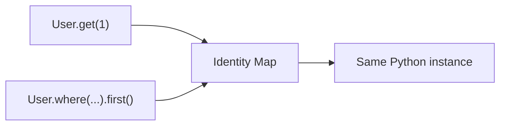

# Identity Map

Ferro keeps an identity map: within a single session, the same database row resolves to the same Python object. The map holds weak references only, so it never keeps an instance alive on its own, and it never serves a stale row — a re-fetch always reflects the database's current values.

## What It Is

The identity map is a session-scoped table in the Rust engine, keyed by `(connection, model name, primary key)`. Each entry is a **weak reference** to a Python instance, not the instance itself.


```mermaid
graph LR
    Q1["User.get(1)"] --> IM[Identity Map]
    Q2["User.where(...).first()"] --> IM
    IM --> Same[Same Python instance]
```

Two consequences follow directly from "weak reference":

- **The map never keeps an instance alive.** When your code drops the last reference to an instance, it is released like any other Python object — the map's entry becomes a tombstone that is cleaned up (either on the next lookup that hits it, or by a periodic sweep) rather than a leak. The next fetch for that row hydrates a brand-new instance.
- **Dedup only holds while you hold a reference.** `a is b` across two fetches is guaranteed only as long as something in your code still references the first instance.

Each active session has its own map, so instances from one session are never returned by a fetch in another. There is no process-global map: **`Model.get()` and every other fetch always execute a query against the database** — the identity map decides whether that query's result is returned as a new instance or as the instance you already hold; it is a deduplication table, not a query cache.

## The Guarantee: Refresh-on-Load

Within a session, fetching a row you already hold returns the same object, updated in place to the database's current values. Unsaved local mutations are overwritten by a re-fetch — the database wins.

=== "Assignment"

    ```python
    from ferro import Field, Model, connect, engines, execute


    class User(Model):
        id: int | None = Field(default=None, primary_key=True)
        username: str
        email: str


    await connect("sqlite::memory:", auto_migrate=True)

    async with engines.session():
        user = await User.create(username="alice", email="alice@example.com")

        # Something else — another request, a script, a raw SQL statement —
        # changes this row without going through `user`.
        await execute("UPDATE user SET email = ? WHERE id = ?", "new@example.com", user.id)

        refetched = await User.get(user.id)
        assert refetched is user               # same object
        assert user.email == "new@example.com"  # refreshed in place

        # An unsaved local edit does not survive a re-fetch: the database wins.
        user.email = "unsaved edit"
        again = await User.get(user.id)
        assert again is user
        assert user.email == "new@example.com"
    ```

=== "Annotated"

    ```python
    from typing import Annotated

    from ferro import Field, Model, connect, engines, execute


    class User(Model):
        id: Annotated[int | None, Field(default=None, primary_key=True)]
        username: str
        email: str


    await connect("sqlite::memory:", auto_migrate=True)

    async with engines.session():
        user = await User.create(username="alice", email="alice@example.com")

        # Something else — another request, a script, a raw SQL statement —
        # changes this row without going through `user`.
        await execute("UPDATE user SET email = ? WHERE id = ?", "new@example.com", user.id)

        refetched = await User.get(user.id)
        assert refetched is user               # same object
        assert user.email == "new@example.com"  # refreshed in place

        # An unsaved local edit does not survive a re-fetch: the database wins.
        user.email = "unsaved edit"
        again = await User.get(user.id)
        assert again is user
        assert user.email == "new@example.com"
    ```

Merging old and new field values was considered and rejected: a merge policy is exactly how stale-read bugs survive. If you have local changes you care about, `save()` them before the next fetch touches that row — or don't hold onto a mutated-but-unsaved instance across an `await` that could re-fetch it.

## Why It Matters

Without an identity map, two queries that return the same row give you two disconnected copies; an update to one is invisible through the other:

```python
async with engines.session():
    created = await User.create(username="alice", email="alice@example.com")
    fetched = await User.get(created.id)
    filtered = await User.where(lambda t: t.username == "alice").first()

    # One row, one instance.
    assert fetched is created
    assert filtered is created

    # A change made through any reference is visible through all of them.
    fetched.email = "new@example.com"
    assert created.email == "new@example.com"
```

This holds within one session on one connection. It does not synchronize across processes or across sessions in the same process — each session has its own map, by design (see below).

## No Session, No Identity

Identity is a session feature, because the session is what bounds the map's lifetime. Ferro resolves the connection for every operation exactly once, and that resolution has three outcomes:

- **A session is active** (ambient `async with engines.session():`, or an explicit `session=`) — full identity semantics: dedup, weak-value map, refresh-on-load, all scoped to that session.
- **`using="name"` alone, no session** — the operation runs normally against that connection, but with **no identity map at all**: every load returns a fresh instance, nothing is cached, and therefore nothing can go stale.
- **No session and no `using=`** — Ferro raises `RuntimeError("No database route for this operation...")` rather than guessing a connection.

```python
await connect("sqlite::memory:", auto_migrate=True)

# `using=` alone: no session, so no identity map. Every load is a fresh
# instance — correct data, no `a is b` guarantee.
created = await User.using("default").create(username="bob", email="bob@example.com")
first = await User.using("default").get(created.id)
second = await User.using("default").get(created.id)
assert first is not second
assert first.email == second.email  # same row, different objects

# No session, no `using=`: nothing to route through. Raises RuntimeError.
await User.get(created.id)
```

An explicit `using=` that names a *different* connection than the session you're ambiently inside of is also an error (`ValueError`) rather than a silent sessionless fallback — Ferro never routes an operation around the session you opened without telling you.

## What Gets Cached

Instances enter the session's identity map whenever Ferro hydrates or persists a full model, inside a session:

- `Model.get(pk)` and `Model.get_or_none(pk)`
- `.first()` and `.all()` query results
- `Model.create(...)`
- `instance.save()` and `instance.refresh()`

What does **not** populate the map:

- Any of the above run outside a session via `using=` alone — sessionless operations never touch a map, by design (see above).
- `Model.bulk_create([...])` — bulk inserts return a row count, not instances, and deliberately skip the map for memory efficiency. Re-query if you need tracked instances afterward.
- Raw SQL (`fetch_all` / `fetch_one`) — raw rows are plain dicts and never touch the map.

## Eviction and Invalidation

Because refresh-on-load already keeps a held instance current, you rarely need to force anything by hand. Two situations still call for it: forcing a *different* instance while you hold the old one, and letting Ferro invalidate on your behalf.

**Refresh** reloads an instance you hold, in place — this is the same mechanism as an ordinary re-fetch, exposed as a method:

```python
async with engines.session():
    user = await User.create(username="bob", email="bob@example.com")
    # ... something external updates the row ...
    await user.refresh()
```

**Evict** removes an entry from the session's map so the *next* fetch hydrates a fresh instance instead of the one you're currently holding — useful when you want to detach from an instance you still have a reference to, rather than wait for it to go out of scope:

```python
from ferro import evict_instance

async with engines.session():
    user = await User.create(username="bob", email="bob@example.com")

    evict_instance("User", str(user.id))
    fresh = await User.get(user.id)  # a new instance, not `user`
    assert fresh is not user
```

`evict_instance` resolves the same session/`using=` scope as any other operation (pass `using=` or `session=` explicitly if you're not inside the ambient session you want to target).

Ferro also evicts automatically, scoped to the session, so a batch job's cache never grows past what a memory-bounded weak-value map already keeps in check:

- **Rolling back a transaction** evicts that session's entire map — a rollback means every instance created or modified inside it may no longer reflect the database, so Ferro clears the slate rather than leave you to guess which ones.
- **Bulk `update()` / `delete()`** evict only that model's entries within the session — an unrelated model's cached instances are untouched.

Because eviction is scoped to `(connection, session)` or `(connection, model)`, one session's rollback or bulk write never disturbs another session's cache.

One case is intentionally *not* covered: running `ferro.migrate()` while a session is open does not evict that session's identity map. Schema changes and live sessions are your own responsibility to sequence — this is unchanged from before weak-valued maps and refresh-on-load existed.

## Opting Out

The identity map is on by default and can be disabled per connection:

```python
from ferro import connect

await connect("sqlite::memory:", auto_migrate=True, identity_map=False)
```

With `identity_map=False`, sessions opened on this connection never keep an identity map: every load returns a fresh instance, and there is no `a is b` guarantee even inside a session. Since the map is already weak-valued and memory-bounded, this option is about giving up dedup semantics you don't need — not about memory pressure — and suits read-heavy, ETL-style workloads where instance identity carries no meaning.

## Identity Map in Tests

Because a session's map lives for the session's lifetime, tests that share a process should still reset connection state between cases so one test's connections and sessions never leak into the next. `reset_engine()` tears down all connections and any sessions still open on them:

```python
import pytest

from ferro import connect, engines, reset_engine


@pytest.fixture
async def db():
    await connect("sqlite::memory:", auto_migrate=True)
    async with engines.session():
        yield
    reset_engine()
```

## See Also

- [Architecture](architecture.md) — where the identity map lives in the engine
- [Performance](performance.md) — memory implications of caching
- [Queries](../guide/queries.md) — query behavior in depth
