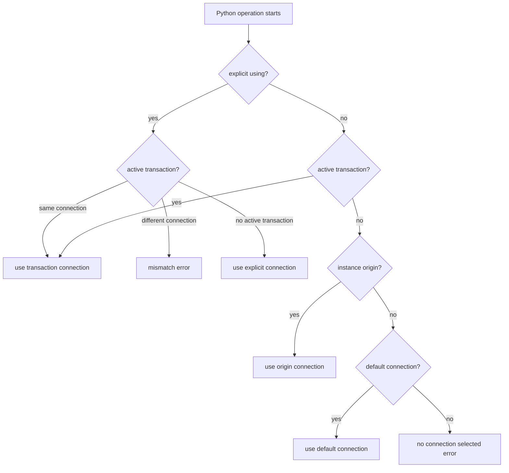
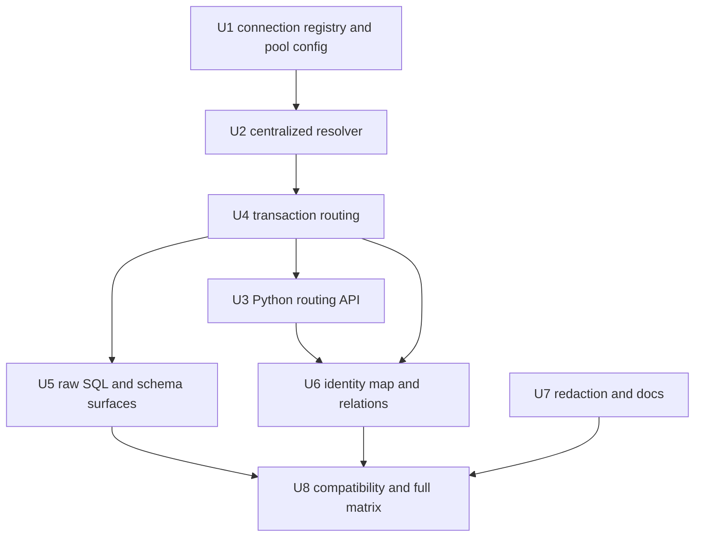
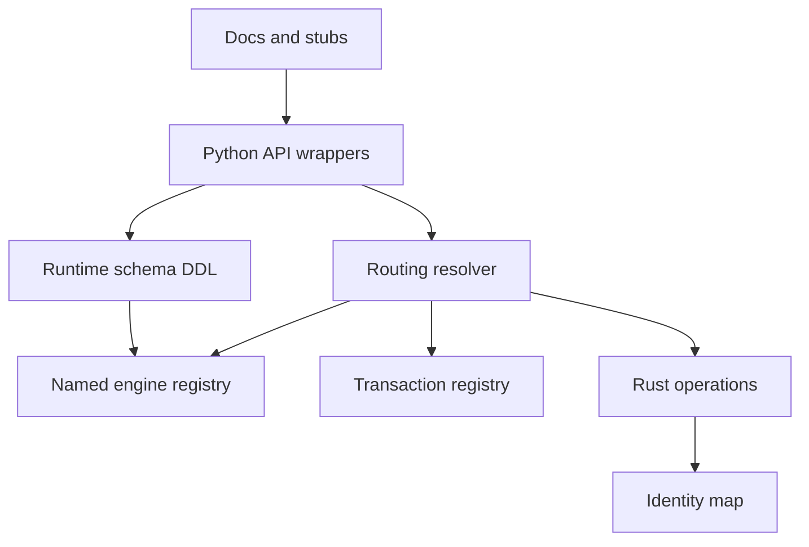

---

## title: Add Named Connection Routing

type: feat
status: active
date: 2026-04-29
origin: docs/brainstorms/2026-04-29-named-connections-role-routing-requirements.md
deepened: 2026-04-29
deepened: 2026-04-29

# Add Named Connection Routing

## Overview

Add first-class named connections to Ferro so one process can hold multiple active database pools, route ORM and raw SQL operations to a selected connection, inherit that selection inside transactions, and preserve today's single-connection ergonomics. The motivating case is two role-specific Postgres/Supabase connections: an app role for user-facing work and a service role for trusted internal pipelines.

The implementation should build on Ferro's existing typed backend architecture rather than adding a parallel execution path. Connection routing is a runtime concern: schema metadata, query generation, typed binds, and direct-to-dict hydration should continue to behave the same after the target connection is selected.

---

## Problem Frame

Ferro currently stores one global `EngineHandle` in `src/state.rs`, and every model, query, raw SQL, transaction, and schema-management call ultimately uses that active engine. This blocks applications that need app-role and service-role access to the same database without reconnecting process-global state (see origin: `docs/brainstorms/2026-04-29-named-connections-role-routing-requirements.md`).

The feature must introduce named connections without regressing the common case. `ferro.connect(url)` should still work as a single default connection, while multi-role users can register explicit names, configure each pool independently, and rely on deterministic routing rules.

---

## Requirements Trace

- R1. Support registering more than one active connection in a process, each with a stable string name.
- R2. Preserve `ferro.connect(url)` by registering and selecting `"default"`.
- R3. Support explicitly selecting the default connection during registration.
- R4. Support changing the default connection after registration.
- R5. Fail clearly when unqualified operations have no selected/default connection.
- R6. Keep pool configuration scoped to the named connection.
- R7. Expose Ferro pool configuration through API objects or kwargs, not URL query params.
- R8. Preserve native database URL settings such as Postgres TLS parameters.
- R9. Cover common pool settings: max connections, min connections when supported, acquire timeout, idle timeout, max lifetime, and health checking when supported.
- R10. Keep pool configuration optional with conservative defaults.
- R11. Support explicit per-operation routing with a concise `using` surface.
- R12. Enforce connection resolution order: explicit route, active transaction, instance origin where applicable, default, clear error.
- R13. Give raw SQL APIs the same routing model as ORM APIs.
- R14. Bind each transaction to exactly one named connection.
- R15. Let unqualified ORM and raw SQL calls inherit the active transaction connection.
- R16. Reject attempts to switch to another connection inside an active transaction.
- R17. Make nested transactions inherit or match the parent transaction connection.
- R18. Scope identity-map entries by connection name, model, and primary key.
- R19. Track model instance origin connection for later saves, refreshes, deletes, and relationship loads.
- R20. Run schema creation and `auto_migrate` against a specific named connection.
- R21. Document migration-capable connection guidance.
- R22. Never silently run migrations across all registered connections.
- R23. Warn that elevated service credentials must stay server-side.
- R24. Recommend least-privileged custom Postgres roles where possible.
- R25. Redact connection credentials in logs and user-facing errors.

**Origin actors:** A1 (Application developer), A2 (User-facing application runtime), A3 (Internal service or pipeline runtime), A4 (Migration or setup process), A5 (Downstream implementation agent)

**Origin flows:** F1 (Single-connection app startup), F2 (Multi-role Supabase startup), F3 (Service transaction with inherited routing), F4 (Schema setup on an explicit connection)

**Origin acceptance examples:** AE1 (single default connection), AE2 (app default plus explicit service route), AE3 (transaction inheritance), AE4 (transaction mismatch error), AE5 (identity-map isolation), AE6 (per-connection pool settings), AE7 (schema creation on one connection), AE8 (credential redaction)

---

## Scope Boundaries

- No automatic read/write splitting or Django-style router policy in v1.
- No distributed, two-phase, or pseudo-atomic transaction support across named connections.
- No cross-database joins or cross-connection relationship traversal guarantees.
- No dynamic tenant connection pool manager beyond the same registration primitives.
- No static per-model binding in v1, though the routing design should not preclude it later.
- No per-request RLS/JWT/security-context modeling in v1. Named connections isolate roles/pools, not user-specific session state inside one shared pool.
- No new database backend support beyond the current SQLite/Postgres contract.

### Deferred to Follow-Up Work

- Automatic routing policies: defer until explicit named routing has shipped and proven its shape.
- Read-only connection declarations such as `read_only=True`: defer because v1 is about named routing, not policy enforcement.
- Advanced Supabase pooler adaptations such as statement-cache control for transaction pooler mode: document caveats first, then evaluate as a targeted follow-up if users need it.

---

## Context & Research

### Relevant Code and Patterns

- `src/connection.rs` currently creates one typed SQLx pool, wraps it in `EngineHandle`, and stores it globally.
- `src/backend.rs` owns `EngineHandle`, `BackendPool`, `EngineConnection`, bind conversion, and backend-specific execution dispatch.
- `src/state.rs` owns global `ENGINE`, `TRANSACTION_REGISTRY`, `MODEL_REGISTRY`, and `IDENTITY_MAP`.
- `src/ferro/state.py` holds `_CURRENT_TRANSACTION`, currently a `ContextVar[str | None]`.
- `src/ferro/models.py` routes model methods through `_CURRENT_TRANSACTION` only; instance `save`, `delete`, `refresh`, `bulk_create`, `get_or_create`, and `update_or_create` need connection-aware behavior.
- `src/ferro/query/builder.py` routes query terminal methods and many-to-many operations through `_CURRENT_TRANSACTION` only.
- `src/ferro/raw.py` already shares transaction behavior with ORM operations, making it the right surface to extend for raw `using`.
- `src/schema.rs` exposes `create_tables()` through global engine state, while `internal_create_tables(engine)` already accepts an `Arc<EngineHandle>`.
- `src/ferro/_core.pyi` and `src/lib.rs` must stay aligned with any PyO3 signature changes.
- Existing tests to extend include `tests/test_connection.py`, `tests/test_transactions.py`, `tests/test_raw_sql.py`, `tests/test_schema.py`, `tests/test_auto_migrate.py`, `tests/test_crud.py`, relationship tests, and backend-matrix tests in `tests/conftest.py`.

### Institutional Learnings

- `docs/solutions/patterns/cross-emitter-ddl-parity.md`: schema creation changes must preserve Rust runtime and Alembic DDL parity.
- `docs/solutions/patterns/typed-null-binds.md`: generated SQL must keep schema-aware typed binds independent of which named connection executes it.
- `docs/solutions/patterns/shadow-fk-columns.md`: relationship and FK behavior should continue to operate on database-facing shadow columns.
- `docs/solutions/issues/sa-vs-rust-unique-constraint-shape.md` and `docs/solutions/issues/sa-pk-column-nullable-divergence.md`: semantically equivalent schema output is not enough if reflection/autogenerate shape drifts.

### External References

- Django multi-database support uses database aliases, explicit `.using(...)`, `transaction.atomic(using=...)`, and one-database-at-a-time migrations.
- SQLAlchemy/SQLModel model this with one `Engine`/pool per URL and session or bind-level routing; SQLAlchemy cautions against clever read/write switching inside one session.
- Oxyde's named connection registry, `PoolSettings`, query `using`, and `transaction.atomic(using=...)` closely match the desired Ferro UX.
- SQLx 0.8 pool options support the common fields Ferro needs: max/min connections, acquire timeout, idle timeout, max lifetime, and test-before-acquire.
- Supabase docs caution that transaction pooler mode does not support prepared statements and is not suitable for relying on session-level setup; Ferro docs should prefer direct/session-mode connections for ORM pools when session settings matter.

---

## Key Technical Decisions

- **Registry over global singleton:** Replace the single `ENGINE` slot with a named connection registry and a default connection name, while preserving an internal helper for resolving the current engine.
- **Connection identity is name plus generation:** Connection names are human routing labels, but identity-map keys and instance origins need an opaque connection generation/pool identity so stale Python objects from before `reset_engine()` cannot route into a newly registered pool with the same name.
- **Duplicate names fail:** Registering a connection with an existing name should raise unless a later explicit replacement API is introduced. Failed registration must leave the previous registry/default untouched.
- **Default changes are configuration-time only:** `set_default_connection` should support startup setup after registration, but become invalid once the registry has been used for ORM/raw/schema work unless the process resets first. This avoids async request traffic being silently rerouted by a process-global default flip.
- **Resolution is centralized:** All ORM, raw, transaction, and schema call paths should go through one connection resolver so precedence and mismatch errors do not drift.
- **Resolver is the only execution gateway:** Public ORM, raw, transaction, and schema operations should not call `engine_handle()`, transaction lookup helpers, or global engine state directly after routing lands; those become private implementation details behind the resolver.
- **Transaction id is not a connection selector:** A transaction id resolves to a transaction-bound connection and then participates in mismatch validation. Passing a transaction id must not bypass explicit `using` checks.
- **Transaction connection is invariant:** Once a transaction starts on a named connection, nested transactions and operations must use that same connection or fail.
- **Instance origin is weaker than transaction context:** Instance methods and relationship loads may prefer the instance's origin connection, but an active transaction either matches that origin or causes a mismatch error; it must not silently save a service-loaded object through an app transaction.
- **Instance-origin route changes are unsafe by default:** Instance methods and relationship operations should fail when an explicit route differs from the stored origin identity. If future cross-route reads are allowed, they should return fresh instances or define explicit origin-transition semantics.
- **Schema writes are explicit in multi-connection mode:** `connect(..., auto_migrate=True)` runs on the connection being registered; separate schema APIs should require `using` whenever more than one connection is registered, even if a default exists.
- **State mutations are all-or-nothing:** connection registration, default switching, reset, same-name registration after reset, and `auto_migrate` must not leave partially updated registry/default/identity-map state after validation, connection, or DDL failure.
- **Runtime DDL failure can still affect the database:** Registry/default state must stay atomic, but database DDL may be partially applied unless runtime schema setup is wrapped in a backend transaction. Implementation must either add transactional DDL where supported or document/test partial-DDL recovery behavior.
- **Rollbacks invalidate cached connection state:** a rollback can make hydrated or newly created instances diverge from the database, so identity-map cleanup must be scoped to the transaction's connection and happen for root and nested rollback paths.
- **Pool config validates early:** Invalid ranges or backend-specific unsupported settings should raise Python-facing errors instead of being silently ignored.
- **Credential redaction is shared:** Connection logs, exceptions, repr/debug output, and tests should use one redaction path rather than ad hoc string trimming.

---

## Open Questions

### Resolved During Planning

- Should the v1 API include automatic routers? No. Explicit routing is the v1 capability; routers are deferred.
- Should `connect(url, name="app")` automatically become the default? No. Only unnamed `connect(url)` and explicit `default=True` select a default.
- Can the default change at runtime? No for request/runtime work. Default selection may change during startup configuration after registration, but should be rejected after the registry has been used unless the process resets first.
- Should duplicate connection names replace existing pools? No. Duplicate names raise unless an explicit future replacement API exists.
- Should operations inside a transaction be able to switch connections? No. Mismatches raise clearly.
- Should raw SQL support named routing? Yes. Top-level raw APIs should accept or inherit the same routing context as ORM calls.
- Should schema creation without `using` run across all connections? No. It must target one connection.

### Deferred to Implementation

- Exact Python wrapper shape for `Model.using(...)`: the plan requires the behavior, but implementation can choose the smallest local abstraction that works across class and query methods.
- Exact Rust struct shape for named registry state: use the current backend facade and choose concrete map/default locking structures during implementation.
- Exact redaction algorithm: implementation should cover userinfo, passwords, secret-like query params, and full DSNs, but final helper boundaries can be chosen while touching `src/connection.rs`.
- Whether SQLite supports every pool option identically: implementation should validate and document any backend-specific constraints.
- Whether runtime DDL should be transactional on every backend: implementation should verify SQLite/Postgres behavior and either wrap schema setup or document/test partial-DDL recovery.

---

## High-Level Technical Design

> *This illustrates the intended approach and is directional guidance for review, not implementation specification. The implementing agent should treat it as context, not code to reproduce.*

For class/query/raw operations that do not involve an existing instance, omit the `instance origin` step. For schema APIs, use a constrained resolver mode: resolve the target before DDL, ignore instance origin, allow implicit selection only when exactly one connection is registered, and require explicit `using` once multiple connections exist.

---

## Implementation Units

- U1. **Introduce Named Connection Registry and Pool Config**

**Goal:** Replace the single active engine slot with a registry of named `EngineHandle`s, default-name state, and per-connection pool configuration.

**Requirements:** R1, R2, R3, R4, R5, R6, R7, R8, R9, R10, AE1, AE2, AE6

**Dependencies:** None

**Files:**

- Modify: `src/state.rs`
- Modify: `src/connection.rs`
- Modify: `src/backend.rs`
- Modify: `src/ferro/__init__.py`
- Modify: `src/ferro/_core.pyi`
- Modify: `src/lib.rs`
- Test: `tests/test_connection.py`
- Test: `tests/test_backend_pool_config.py`

**Approach:**

- Add a Rust connection registry keyed by validated connection name, plus default connection state and an opaque generation/pool identity for each registered connection.
- Preserve `connect(url)` as `"default"` and selected default behavior.
- Add `name`, `default`, and pool-configuration inputs to the Python and PyO3 connection surfaces.
- Add the public default-selection API promised by the requirements, but restrict it to startup/configuration time before the registry has served operations.
- Keep database-native URL parameters in the URL, including existing `ferro_search_path` handling, while applying Ferro pool settings outside URL parsing.
- Validate connection names, duplicate names, and pool settings before mutating global registry state.
- Apply connection registration and default selection atomically: failed validation, failed pool creation, or failed `auto_migrate` must leave the prior registry/default untouched.
- Keep `reset_engine()` behavior backward-compatible as an all-connection reset; consider an internal path that can later support named disconnects without exposing it in v1.
- Define reset/default-switch behavior before implementing it. The conservative v1 rule should reject registry/default mutations if the registry has active transactions or has already served runtime operations, because those mutations are process-global while application work may be task-local.
- Replace the current Python post-connect `auto_migrate` path with a core registration flow where relationship resolution happens first, then connection/pool creation, scoped schema setup, and registry/default mutation happen as one all-or-nothing sequence.

**Execution note:** Start with failing integration tests for connection registration/default behavior before replacing the global engine state.

**Patterns to follow:**

- `src/connection.rs` for current connection lifecycle and `ferro_search_path` stripping.
- `src/backend.rs` for typed SQLite/Postgres pool construction.
- `tests/test_connection.py` for bridge-level connection behavior.

**Test scenarios:**

- Covers AE1. Happy path: `connect(url)` registers `"default"` and unqualified model operations work.
- Covers AE2. Happy path: registering `app` with `default=True` and `service` without default keeps app as the default and service addressable by name.
- Covers AE6. Happy path: app and service connections use different `max_connections` values without affecting each other.
- Error path: `connect(url, name="")` and invalid names raise clear Python errors.
- Error path: duplicate `connect(url, name="app")` raises and leaves the original app connection/default intact.
- Error path: invalid pool ranges such as `min_connections > max_connections` raise before creating a pool.
- Error path: failed `connect(..., default=True)` and failed `connect(..., auto_migrate=True)` do not change the selected default, do not register a half-created connection, and do not clear existing identity-map entries.
- Error path: default-switch attempts after the registry has served operations, or while any transaction is active, raise and leave registry/default/identity-map state unchanged.
- Error path: model instances created before `reset_engine()` cannot save, refresh, delete, or lazy-load through a newly registered connection that happens to reuse the same name.
- Integration: unsupported URL schemes still fail with the existing class of connection error, but without exposing credentials.

**Verification:**

- Single-connection tests remain green.
- Registry tests prove multiple active connections can coexist and default state is deterministic.

---

- U2. **Centralize Connection Resolution**

**Goal:** Provide one routing resolver that all operation paths can use to resolve a named engine or transaction connection with consistent precedence and mismatch errors.

**Requirements:** R5, R11, R12, R14, R15, R16, R17, R19, AE2, AE3, AE4

**Dependencies:** U1

**Files:**

- Modify: `src/state.rs`
- Modify: `src/operations.rs`
- Modify: `src/schema.rs`
- Modify: `src/ferro/state.py`
- Modify: `src/ferro/_core.pyi`
- Test: `tests/test_named_connection_resolution.py`

**Approach:**

- Introduce a routing input model that can carry explicit connection name, transaction id, and optional instance-origin connection.
- Extend transaction registry entries with the bound connection name.
- Encode precedence centrally: explicit route must match active transaction if one exists; otherwise active transaction, instance origin where applicable, default connection, then clear error.
- Ensure unknown connection names and no-default cases produce actionable Python exceptions.
- Reject reset/default-change operations that would invalidate active transactions, and make same-name registration after reset use a new generation that stale instances cannot resolve.
- Treat connection names as durable user-facing labels and opaque connection generations as durable identity-map and transaction keys for the lifetime of a registered pool. Because duplicate replacement is rejected in v1, the same name cannot silently point at a different database while cached instances or transaction handles still exist; after reset, stale generations must not resolve.
- Resolve and validate the full route before starting I/O. Mismatch, unknown connection, no-default, and ambiguous DDL errors should happen before any statement is sent to a pool.

**Execution note:** Add routing matrix tests before threading the resolver through every operation surface.

**Patterns to follow:**

- `src/operations.rs::get_transaction_connection` for current transaction lookup.
- `src/state.rs::engine_handle` for current active-engine helper shape.

**Test scenarios:**

- Happy path: explicit `using="service"` resolves the service engine outside transactions.
- Happy path: no explicit route inside a service transaction resolves the service transaction connection.
- Happy path: an instance-origin route resolves before the default when no transaction exists.
- Error path: explicit `using="app"` inside a service transaction raises mismatch.
- Error path: unknown `using` raises with the missing connection name.
- Error path: unqualified operation with multiple named connections and no default raises "no connection selected".
- Error path: changing the default during runtime work or with an active transaction raises.
- Error path: failed default switching to an unknown connection leaves the previous default selected.
- Race path: two concurrent registration/default-selection attempts cannot produce a registry where the default points at a missing or failed connection.

**Verification:**

- All routing-sensitive callers can delegate connection selection instead of open-coding default or transaction lookup.

---

- U3. **Add Python ORM Routing Surface**

**Goal:** Expose ergonomic explicit routing for model class methods, query builder operations, and many-to-many operations.

**Requirements:** R11, R12, R15, R16, R19, AE2, AE3, AE4

**Dependencies:** U2, U4

**Files:**

- Modify: `src/ferro/models.py`
- Modify: `src/ferro/query/builder.py`
- Modify: `src/ferro/relations/descriptors.py`
- Modify: `src/ferro/relations/__init__.py`
- Modify: `src/ferro/_core.pyi`
- Test: `tests/test_named_connection_routing.py`
- Test: `tests/test_query_builder.py`
- Test: `tests/test_many_to_many.py`

**Approach:**

- Add an explicit `using` API that supports the origin UX from the requirements, including class-level routing for creates and query-level routing for fluent reads/updates/deletes.
- Carry connection name through `Query` cloning/chaining, relation query creation, and M2M helper calls.
- Thread routing context from Python into Rust FFI calls that currently accept only `tx_id`.
- Keep existing unqualified model methods working by resolving through transaction/default context.
- Avoid adding Django-style routers or per-model static binding.
- Do not thread new public `using` surfaces broadly until the resolver can validate active transaction mismatches. Public API ergonomics should not land ahead of the invariant that makes them role-safe.

**Execution note:** Implement new domain behavior test-first across a representative set of public ORM operations before broadening the surface.

**Patterns to follow:**

- `src/ferro/models.py` for current classmethod and instance method ergonomics.
- `src/ferro/query/builder.py` for fluent query state and terminal methods.
- Current relation descriptor patterns that create `Query` / `Relation` objects.

**Test scenarios:**

- Covers AE2. Happy path: `User.using("service")` can create, query, update, and delete through service while unqualified `User` uses default app.
- Covers AE3. Happy path: unqualified `PipelineEvent.create(...)` inside `transaction(using="service")` uses service.
- Covers AE4. Error path: `User.using("app")` inside a service transaction raises mismatch.
- Happy path: `where().using("service").all()`, `select().using("service").first()`, `count`, `exists`, `update`, and `delete` route consistently.
- Happy path: M2M `add`, `remove`, and `clear` use explicit query route or inherited transaction route.
- Error path: chaining preserves route across `where`, `order_by`, `limit`, and `offset`.
- Integration: `get_or_create`, `update_or_create`, and `bulk_create` route consistently with create/read paths.
- Audit path: every FFI-backed ORM call that previously passed only `tx_id` now passes through the same routing context rather than choosing an engine directly.

**Verification:**

- Public ORM operations have one documented way to select a named connection and all existing operations still work without `using` in single-connection mode.

---

- U4. **Make Transactions Connection-Aware**

**Goal:** Bind transactions and nested savepoints to a named connection, expose `transaction(using=...)`, and enforce no cross-connection switching inside a transaction.

**Requirements:** R12, R14, R15, R16, R17, AE3, AE4

**Dependencies:** U2

**Files:**

- Modify: `src/operations.rs`
- Modify: `src/state.rs`
- Modify: `src/ferro/models.py`
- Modify: `src/ferro/state.py`
- Modify: `src/ferro/raw.py`
- Modify: `src/ferro/_core.pyi`
- Test: `tests/test_transactions.py`
- Test: `tests/test_named_connection_transactions.py`

**Approach:**

- Extend Python transaction context to remember both transaction id and connection name, or provide an equivalent context object that remains easy for raw/model code to consume.
- Extend Rust `begin_transaction` to resolve and store the connection name with the transaction handle.
- Make nested transactions inherit parent connection when `using` is omitted and reject a different explicit connection.
- Keep savepoint behavior for same-connection nested transactions.
- Ensure transaction handles yielded to raw SQL stay bound and cannot be used after exit.
- Keep transaction lifecycle state explicit: a handle should remain discoverable until commit/release/rollback cleanup has completed, then become closed/invalid. Commit, rollback, and savepoint failures must not leave a transaction id that later resolves to an apparently healthy transaction.
- On rollback, clear identity-map entries for the transaction's connection. For nested savepoint rollback, clear the same connection scope as the conservative safe behavior unless the implementation can precisely track rows touched inside the savepoint.

**Execution note:** Preserve existing transaction tests and add named-connection tests around them rather than replacing coverage.

**Patterns to follow:**

- Existing nested transaction/savepoint tests in `tests/test_transactions.py`.
- `src/ferro/raw.py::Transaction` for bound transaction handle ergonomics.

**Test scenarios:**

- Covers AE3. Happy path: service transaction inherits service for unqualified ORM and raw SQL calls.
- Covers AE4. Error path: app route inside service transaction raises and rolls back according to normal exception behavior.
- Happy path: nested transaction with no `using` inside service transaction uses a savepoint on service.
- Happy path: nested transaction with `using="service"` inside service transaction is accepted.
- Error path: nested transaction with `using="app"` inside service transaction raises before opening a second transaction.
- Error path: reset/default-change affecting a connection with an active transaction raises.
- Integration: concurrent transactions on different named connections do not share transaction handles or connection state.
- Error path: using a yielded `Transaction` handle after its context exits raises, including after both successful commit and rollback.
- Rollback safety: objects created, hydrated, refreshed, or bulk-mutated inside a rolled-back service transaction are not returned from later service or app identity-map lookups unless reloaded from the database.
- Isolation: rollback on a service transaction does not clear unrelated app-connection identity-map entries.

**Verification:**

- Transaction behavior remains atomic for single connection and gains deterministic named-connection pinning.

---

- U5. **Route Raw SQL and Schema Management**

**Goal:** Bring raw SQL and schema creation into the same named routing model while keeping DDL explicit and parity-safe.

**Requirements:** R13, R20, R21, R22, AE3, AE7

**Dependencies:** U2, U4

**Files:**

- Modify: `src/ferro/raw.py`
- Modify: `src/schema.rs`
- Modify: `src/ferro/__init__.py`
- Modify: `src/ferro/_core.pyi`
- Modify: `src/lib.rs`
- Test: `tests/test_raw_sql.py`
- Test: `tests/test_schema.py`
- Test: `tests/test_auto_migrate.py`
- Test: `tests/test_alembic_autogenerate.py`
- Test: `tests/test_cross_emitter_parity.py`

**Approach:**

- Add `using` support to top-level raw `execute`, `fetch_all`, and `fetch_one`.
- Keep `Transaction` raw methods bound to their transaction; do not require callers to repeat `using`.
- Reject raw `using` mismatches inside an active transaction if a top-level raw call supplies an explicit different connection.
- Make `create_tables` accept a target connection and require explicit selection when multiple connections are active.
- Keep `connect(..., auto_migrate=True)` scoped to the connection being registered.
- Ensure schema creation still consumes the same model registry and Rust DDL emitter, preserving cross-emitter parity.
- Ensure routing does not alter model metadata, naming conventions, SQL type mapping, defaults, nullability, or shadow FK column behavior.
- Resolve the schema target before emitting any DDL. Unknown connection, missing default, multi-connection ambiguity, and transaction mismatch errors must be raised before the first `CREATE TABLE` or index statement.
- Treat DDL failure as a state-lifecycle event: `auto_migrate` failure must not register or select the connection; explicit `create_tables(using=...)` failure must leave registry/default/identity-map state unchanged and report the target connection name without leaking its URL.
- Document that Ferro does not provide cross-connection migration coordination. If two named connections point at the same physical database, schema setup should be run once through a migration-capable connection, not concurrently through app and service roles.
- Decide whether runtime DDL should run inside a backend transaction. If not all supported DDL paths can be transactional, document that database schema may be partially applied on failure and add recovery-oriented tests/docs rather than implying rollback of already executed DDL.

**Execution note:** Treat schema changes as parity-sensitive; add/adjust Rust and Python integration tests before changing public docs.

**Patterns to follow:**

- `src/schema.rs::internal_create_tables(engine)` already accepts an engine handle.
- `docs/solutions/patterns/cross-emitter-ddl-parity.md` for schema-emitter guardrails.
- `src/ferro/raw.py` for current raw marshalling and transaction inheritance.

**Test scenarios:**

- Covers AE3. Happy path: top-level raw SQL inside `transaction(using="service")` uses service without repeating `using`.
- Happy path: top-level `execute(..., using="service")`, `fetch_all`, and `fetch_one` route to service outside transactions.
- Error path: raw SQL with `using="app"` inside service transaction raises mismatch.
- Covers AE7. Happy path: `create_tables(using="service")` creates schema only through service.
- Error path: unqualified `create_tables()` raises whenever multiple connections are registered, even if a default connection exists.
- Integration: `connect(name="service", auto_migrate=True)` runs schema creation on service only.
- Error path: `connect(name="service", default=True, auto_migrate=True)` where DDL permissions fail does not select `service` as default and leaves existing app/service registrations untouched.
- Error path: `create_tables(using="app")` with insufficient DDL privileges fails without attempting any other registered connection.
- Concurrency path: concurrent schema setup attempts against the same database either behave idempotently or surface a clear database error without corrupting registry/default state.
- Failure path: interrupted or failed runtime DDL either rolls back as one unit where supported or leaves documented partial-DDL behavior that can be recovered by rerunning schema setup.
- Integration: Alembic/runtime DDL parity tests still pass after schema routing changes.
- Integration: runtime `create_tables(using="service")` followed by Alembic autogenerate against the same database produces no phantom diffs.

**Verification:**

- Raw SQL and schema APIs no longer have a hidden dependency on a single global engine.

---

- U6. **Scope Identity Map, Instance Stickiness, and Relationship Routing**

**Goal:** Prevent cross-role object reuse by scoping identity-map behavior to connection name and propagating instance origin through saves, refreshes, deletes, and relationship queries.

**Requirements:** R18, R19, R12, R15, R16, AE5

**Dependencies:** U2, U3, U4

**Files:**

- Modify: `src/state.rs`
- Modify: `src/operations.rs`
- Modify: `src/ferro/models.py`
- Modify: `src/ferro/query/builder.py`
- Modify: `src/ferro/relations/descriptors.py`
- Modify: `src/ferro/relations/__init__.py`
- Modify: `src/ferro/_core.pyi`
- Test: `tests/test_identity_map.py`
- Test: `tests/test_named_connection_identity_map.py`
- Test: `tests/test_relationships.py`
- Test: `tests/test_many_to_many.py`

**Approach:**

- Change identity-map keys from model/pk to connection/model/pk.
- Register and evict instances with connection-aware keys.
- Store origin connection identity on hydrated and newly saved Python model instances using internal state that does not alter user model fields or schema.
- Make instance methods prefer origin connection when no explicit route or active transaction is present.
- Make relationship descriptors and M2M relation queries inherit source instance origin unless an active transaction or explicit matching route governs the operation.
- For mismatch cases, fail rather than silently crossing role boundaries.
- Reject explicit route changes for instance operations: a service-origin instance should not be saved, refreshed, deleted, or used for relationship operations through an app route outside a transaction.
- Assign origin only after a successful create/save/hydration on the resolved connection. Failed saves and rolled-back writes must not leave durable origin or identity-map entries that imply the row exists.
- Eviction APIs and bulk update/delete cleanup must include connection identity. Clearing all entries for a model is safe but over-broad; clearing only the affected connection is preferred and should be tested explicitly if chosen.
- Store origin as opaque connection identity plus display name, not name alone, so reset and same-name re-registration cannot retarget stale Python instances.

**Execution note:** Add characterization tests for existing identity-map reuse and rollback behavior before changing key shape.

**Patterns to follow:**

- Current `IDENTITY_MAP` usage in `src/operations.rs`.
- Direct-to-dict hydration invariants in `AGENTS.md`.
- Relationship query construction in `src/ferro/relations/descriptors.py`.

**Test scenarios:**

- Covers AE5. Happy path: same model and primary key loaded via app and service produce distinct Python instances.
- Happy path: saving a service-loaded instance outside a transaction uses service origin.
- Error path: explicitly saving, refreshing, deleting, or relationship-loading/writing with a service-origin instance through `using="app"` raises rather than changing the object's security context.
- Happy path: a newly created instance records the connection that performed the successful create/save and later `save`, `refresh`, `delete`, and relationship loads prefer that origin outside transactions.
- Error path: saving a service-loaded instance inside an app transaction raises mismatch.
- Error path: a failed or rolled-back create/save does not register the instance in the identity map and does not set a durable origin that future saves rely on.
- Happy path: `refresh` and `delete` use instance origin when outside a transaction.
- Happy path: forward FK lazy loads, backrefs, and M2M relation queries inherit source instance origin.
- Integration path: service-origin relationship loads keep service origin; U7 owns the user-facing documentation warning about elevated service-origin objects.
- Lifecycle path: instances held across `reset_engine()` fail on origin-routed operations after a same-name connection is registered again, unless the caller reloads them through the new connection.
- Edge case: rollback clears or evicts identity-map entries without leaking service-origin instances into app lookups.
- Integration: bulk update/delete evicts only the relevant connection's identity-map entries, or intentionally clears globally with tests documenting that simpler safe behavior.
- Integration: two named connections pointing at different SQLite files can have the same model and primary key with different row contents, and neither instance overwrites or refreshes the other.

**Verification:**

- Identity-map behavior is role-safe and direct hydration remains intact.

---

- U7. **Add Credential Redaction and Operational Documentation**

**Goal:** Prevent credential leakage as multi-role connection strings become more common, and document the supported named-connection UX and Supabase/Postgres guidance.

**Requirements:** R21, R23, R24, R25, AE8

**Dependencies:** U1

**Files:**

- Modify: `src/connection.rs`
- Modify: `src/backend.rs`
- Modify: `src/ferro/__init__.py`
- Modify: `docs/guide/backend.md`
- Modify: `docs/guide/database.md`
- Modify: `docs/howto/multiple-databases.md`
- Modify: `docs/coming-soon.md`
- Test: `tests/test_connection_redaction.py`

**Approach:**

- Add a shared redaction helper for DSNs and connection-display strings.
- Use redacted connection identifiers in success logs, connection failures, duplicate-name errors, and invalid-pool diagnostics.
- Validate and bound connection names before reflecting them in errors or logs, including safe character set and length limits.
- Update docs from "planned multiple databases" to the actual named connection support once implemented.
- Document per-connection pool settings, default connection behavior, transaction inheritance, schema-targeting rules, and no-router v1 scope.
- Include Postgres/Supabase guidance: keep elevated credentials server-side, prefer least privilege, do not make service connections the default in user-facing runtimes, and be cautious with transaction pooler mode for ORM pools and session-level setup.
- Explain that service-origin objects can carry data unavailable to the app role; app code should treat them as elevated and avoid sending them to user-facing responses without an explicit filtering boundary.
- Explain that `using` values are privileged routing decisions selected by trusted server code. Examples should not bind connection names directly from request parameters, headers, GraphQL arguments, or other untrusted input.
- Add operational guidance for app/service DSNs: keep them out of source control, load them through environment-specific secret management, separate app and service credentials, and plan rotation/revocation for elevated credentials.
- Document that named connections do not isolate per-request RLS/JWT/session context within one pool. Callers that set Postgres session state should use transaction-local settings, avoid identity-map reuse across user security contexts, and clear or reload state at request boundaries.

**Execution note:** Redaction tests should assert absence of secrets rather than exact full error strings where SQLx messages vary by backend.

**Patterns to follow:**

- Existing docs structure in `docs/guide/backend.md` and `docs/howto/multiple-databases.md`.
- Supabase security notes already present in `docs/guide/database.md`.

**Test scenarios:**

- Covers AE8. Error path: failed Postgres URL with username/password does not expose password in Python exception.
- Covers AE8. Error path: debug/success logs use redacted URL or connection name.
- Error path: duplicate connection-name error does not include full DSN.
- Error path: invalid pool config error does not include secret-bearing URL.
- Error path: malformed URLs and query params containing names such as `password`, `apikey`, `service_role`, or `access_token` are redacted from Python exceptions and Rust logs.
- Error path: overlong or malicious connection names are rejected or safely truncated/escaped in diagnostics.
- Documentation: examples show app/service named connections, pool config, transaction inheritance, and explicit schema setup.
- Documentation: examples use constants or trusted code paths for `using`, not untrusted request input.

**Verification:**

- No public log/error path introduced by named connections prints raw credentials.

---

- U8. **Run Compatibility Audit and Smoke Matrix**

**Goal:** Run the final audit that ensures public bridge, type stubs, docs, fixtures, and smoke coverage agree on the behavior implemented by U1-U7.

**Requirements:** R2, R10, R12, R18, R20, R22, plus cross-unit acceptance coverage

**Dependencies:** U3, U4, U5, U6, U7

**Files:**

- Modify: `src/ferro/__init__.py`
- Modify: `src/ferro/_core.pyi`
- Modify: `docs/api/raw-sql.md`
- Modify: `docs/faq.md`
- Modify: `tests/conftest.py`
- Modify: `tests/db_backends.py`
- Test: `tests/test_named_connections_integration.py`
- Test: `tests/test_documentation_features.py`

**Approach:**

- Audit every exported public function and type stub touched by named routing.
- Add a small number of end-to-end smoke tests that register two SQLite connections as a fast proxy for role isolation, plus Postgres-compatible smoke coverage where the harness supports it. Detailed behavior tests belong in U1-U7.
- Ensure backend matrix fixtures can create isolated named connections without test bleed.
- Update public docs and examples so stale planned APIs such as `read_only=True` do not appear as implemented v1 behavior.
- Confirm `reset_engine`, `clear_registry`, and test isolation hooks behave predictably with multiple connections.
- Audit all public FFI operations and helpers that accept `tx_id` or call `engine_handle()` so no single-engine execution path bypasses the resolver.
- Add teardown assertions that transaction registry, connection registry, default selection, and identity map are empty after reset/test cleanup. Test bleed here would hide production lifecycle bugs.
- Verify that owning units covered failure paths such as failed registration, failed DDL, rollback, handle reuse after close, default-switch failure, and reset rejection; do not duplicate each scenario here unless a cross-layer smoke test is needed.

**Execution note:** Finish with both Rust unit coverage for pure registry/resolver logic and Python integration coverage for bridge behavior.

**Patterns to follow:**

- Existing backend matrix markers and fixtures in `tests/conftest.py` and `tests/db_backends.py`.
- `AGENTS.md` testing split: Rust unit tests for pure logic, Python integration tests for bridge behavior.

**Test scenarios:**

- Covers AE1. Integration: all existing single-connection documentation feature tests still work unchanged.
- Covers AE2-AE7. Integration: two named SQLite database files isolate app/service writes, reads, transactions, raw SQL, schema creation, and identity-map instances.
- Integration: backend-matrix Postgres run exercises named connection registration and transaction inheritance when a Postgres URL is available.
- Edge case: `reset_engine()` closes/clears all named connections and identity-map state between tests.
- Error path: unknown connection names, missing default, duplicate names, transaction mismatches, and schema ambiguity all have clear exceptions.
- Documentation: `docs/howto/multiple-databases.md` examples match implemented API.

**Verification:**

- The feature is covered across Rust unit tests, Python integration tests, docs examples, and type stubs.

---

## System-Wide Impact

- **Interaction graph:** `connect`, `transaction`, model class methods, query terminal methods, relation descriptors, raw SQL helpers, schema creation, and test reset hooks all become routing-aware.
- **Error propagation:** routing failures should surface as Python-facing value/runtime errors with connection names, not raw URLs.
- **State lifecycle risks:** duplicate registration, failed connection setup, default switching, reset, and active transactions all mutate shared state and need atomicity or explicit rejection.
- **API surface parity:** ORM, raw SQL, schema creation, type stubs, and docs must expose the same routing model.
- **Integration coverage:** unit tests alone will not prove transaction inheritance, direct hydration, relationship routing, and identity-map isolation; bridge tests are required.
- **Unchanged invariants:** schema metadata remains global model metadata, DDL parity remains mandatory, generated SQL keeps typed-bind behavior, and hydration must stay direct-to-dict.

---

## Risks & Dependencies

| Risk                                                                                              | Mitigation                                                                                                                                                                |
| ------------------------------------------------------------------------------------------------- | ------------------------------------------------------------------------------------------------------------------------------------------------------------------------- |
| Hidden single-engine assumptions remain in operations or relationship code                        | Make the resolver the only public execution gateway, audit all `tx_id`/`engine_handle()` call paths, and add a two-connection integration matrix.                         |
| Transaction mismatch handling becomes inconsistent                                                | Store connection name in transaction state and test mismatch behavior for ORM, raw SQL, nested transactions, and instance methods.                                        |
| Runtime default switching reroutes unrelated async work                                           | Treat default selection as startup/configuration-time only after registration and reject changes once the registry has served operations.                                 |
| Failed registration, default switch, or auto-migration leaves partially mutated global state      | Validate first, mutate registry/default last, and add failure-path tests that assert the previous registry/default/identity map remain unchanged.                         |
| Rollback leaves objects in the identity map that represent uncommitted or reverted database state | Clear identity-map entries for the transaction's connection on root and nested rollback, and test post-rollback reload behavior.                                          |
| Service-role loaded instances leak into app-role reads or responses                               | Include connection generation in identity-map keys, store instance origin identity, reject route changes, and document service-origin objects as elevated data carriers.  |
| Stale instances outlive reset and route into a new same-name connection                           | Include opaque connection generation in instance origin and identity-map keys; stale generations must fail rather than retarget.                                          |
| Per-request RLS/session state is mistaken for named-connection isolation                          | Document that named connections do not model user security context; recommend transaction-local settings and request-boundary cache discipline.                           |
| Schema creation accidentally runs on the app role or all roles                                    | Require explicit schema target in multi-connection mode and keep `auto_migrate` scoped to the connection being registered.                                                |
| DDL failure or concurrent schema setup creates ambiguous partial setup                            | Resolve target before DDL, do not mutate registry/default on `auto_migrate` failure, document one migration-capable setup path, and test insufficient-privilege failures. |
| Pool settings are silently ignored on one backend                                                 | Validate early and document backend-specific constraints.                                                                                                                 |
| Credentials leak through connection errors or logs                                                | Introduce shared redaction and assert secret absence in tests.                                                                                                            |
| DDL parity drifts while routing schema creation                                                   | Keep named routing outside schema metadata and run existing parity tests.                                                                                                 |

---

## Documentation / Operational Notes

- Update `docs/howto/multiple-databases.md` from planned API to implemented named connection guidance.
- Update `docs/guide/backend.md` to describe the registry, default connection, resolver, and per-connection pools.
- Update `docs/guide/database.md` with pool config examples and Supabase/Postgres cautions.
- Update `docs/api/raw-sql.md` to explain `using`, transaction inheritance, and raw typed-bind caveats.
- Note that `set_default_connection` is a startup/configuration-time tool, not a request-time router.
- Recommend that mixed app/service processes use the least-privileged app connection as the default and require explicit `using="service"` for trusted pipeline work.
- Warn that `auto_migrate=True` with elevated credentials belongs in setup/migration contexts, not normal request-serving startup.
- Warn that connection names are privileged routing decisions and should be chosen by trusted server code, not copied from request parameters or headers.
- Add service credential handling guidance: keep DSNs out of source control, separate app/service secrets by environment, and plan rotation/revocation for elevated credentials.
- Document that named connections do not isolate per-request RLS/JWT/session context inside a shared pool; use transaction-local settings and request-boundary cache discipline when relying on session state.
- Recommend direct or session-mode Postgres/Supabase connections for ORM pools when session settings or prepared statements matter.

---

## Sources & References

- **Origin document:** [docs/brainstorms/2026-04-29-named-connections-role-routing-requirements.md](../brainstorms/2026-04-29-named-connections-role-routing-requirements.md)
- Related plan: `docs/plans/2026-04-24-001-refactor-multi-db-backend-architecture-plan.md`
- Related invariant: `AGENTS.md`
- Related learnings: `docs/solutions/patterns/cross-emitter-ddl-parity.md`
- Related learnings: `docs/solutions/patterns/typed-null-binds.md`
- Related code: `src/connection.rs`, `src/state.rs`, `src/backend.rs`, `src/operations.rs`, `src/schema.rs`
- Related code: `src/ferro/models.py`, `src/ferro/query/builder.py`, `src/ferro/raw.py`, `src/ferro/state.py`
- Django multi-database docs: [https://docs.djangoproject.com/en/stable/topics/db/multi-db/](https://docs.djangoproject.com/en/stable/topics/db/multi-db/)
- SQLAlchemy partitioning docs: [https://docs.sqlalchemy.org/en/20/orm/persistence_techniques.html#partitioning-strategies-e-g-multiple-database-backends-per-session](https://docs.sqlalchemy.org/en/20/orm/persistence_techniques.html#partitioning-strategies-e-g-multiple-database-backends-per-session)
- SQLx pool options: [https://docs.rs/sqlx/0.8.6/sqlx/pool/struct.PoolOptions.html](https://docs.rs/sqlx/0.8.6/sqlx/pool/struct.PoolOptions.html)
- Supabase connection methods: [https://supabase.com/docs/guides/database/connecting-to-postgres](https://supabase.com/docs/guides/database/connecting-to-postgres)
