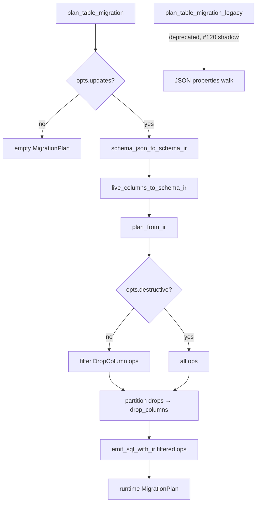

# feat: Wire runtime auto_migrate to ferro-migrate IR planner (#119)

## Summary

Cut `plan_table_migration` over to `plan_from_ir` + `emit_sql_with_ir` as the sole hot-path planner. Extract the existing enriched-JSON diff into a deprecated `plan_table_migration_legacy` helper for #120 shadow comparison. Enrich JSON→IR adapters minimally so render-level and integration tests remain byte-identical.

**Closes:** [#119](https://github.com/syn54x/ferro-orm/issues/119)  
**Base branch:** `feat/ir-p8-migrate-cutover`  
**Feature branch:** `feat/ir-p8-119-wire-automigrate`

---

## Problem Frame

Runtime auto-migrate still plans DDL via a legacy JSON `properties` walk in `src/migrate.rs` even though #118 implemented full IR-native SQL emission in `crates/ferro-migrate`. The typed plan is computed and thrown away (`_typed_plan`, `_typed_sql`). Phase 8 requires the IR pipeline to be the primary executor so runtime DDL and Alembic share one planner (AGENTS.md I-1).

See origin: `docs/brainstorms/2026-06-24-ir-p8-119-wire-automigrate-requirements.md`.

---

## Requirements

| ID | Requirement | Source |
|----|-------------|--------|
| R1 | `plan_table_migration` uses `plan_from_ir` + `emit_sql_with_ir` as primary path | #119 |
| R2 | Legacy JSON walk isolated as deprecated `plan_table_migration_legacy` | #119, Phase 8 roadmap |
| R3 | Behavior observably identical: updates/destructive flags, fail-loud NOT NULL, PG reconcile, SQLite drop execution | #119, `test_migrate_plan.py` |
| R4 | `drop_columns` remain separate from `statements` for `execute_drop_column` | `src/migrate.rs` executor contract |
| R5 | No public Python API changes | #119 migration impact |
| R6 | `shadow_compare_migration_plan` unchanged (rewired in #120) | #119 scope boundary |

---

## Key Technical Decisions

### KTD-1: Partition `DropColumn` before emission

`emit_sql_with_ir` emits `ALTER TABLE … DROP COLUMN` into `statements`. The runtime executor intentionally keeps drops in `drop_columns` and runs `execute_drop_column` (SQLite index dependency resolution). **Do not** change the executor in #119.

**Approach:** After `plan_from_ir`, split operations:

1. Collect `DropColumn` op names into `plan.drop_columns` (with PK guard from `old_ir` before push).
2. Build a filtered typed plan with non-drop ops only.
3. Call `emit_sql_with_ir` on the filtered plan.

### KTD-2: Minimal adapter enrichment (not full consolidation)

`schema_json_to_schema_ir` today populates columns only — missing `foreign_keys` and `checks` that `emit_add_column` reads. `live_columns_to_schema_ir` does not mark Postgres native enum columns, so type reconciliation may diverge from legacy.

Enrich adapters in #119 to pass existing tests. Full single-sourcing with `build_column_plan` is **deferred to #120** (see origin scope).

### KTD-3: Postgres native enum skip uses live-side marker

Legacy skips type reconciliation when `live.is_enum_udt`. `emit_alter_column_type` only checks `new_col.enum_type_name`. Add a serde-default live-only flag on `SchemaColumn` (e.g. `postgres_native_enum: bool`) set from `LiveColumn.is_enum_udt`, and teach `emit_alter_column_type` to no-op when the **old** column carries that flag — matching legacy semantics.

### KTD-4: Error mapping at FFI boundary

Map `ferro_migrate::EmissionError` → `pyo3::exceptions::PyValueError` in `plan_table_migration`, preserving message text expected by `test_migrate_plan.py` (`match=r"invoice\.created_at.*Alembic"` etc.).

### KTD-5: `MigrateOptions` filtering at wiring layer

`plan_from_ir` is options-agnostic. Apply options in `plan_table_migration`:

- `!opts.updates` → return empty `MigrationPlan` immediately (existing behavior).
- `!opts.destructive` → strip `DropColumn` ops before partition/emit.

---

## High-Level Technical Design



**Runtime types (two `MigrationPlan` names):**

| Layer | Type | Fields |
|-------|------|--------|
| ferro-migrate | `ferro_migrate::MigrationPlan` | `operations`, `warnings` |
| Runtime executor | `migrate::MigrationPlan` | `statements`, `drop_columns`, `warnings` |

Wiring converts typed ops + emission → executor plan.

---

## Implementation Units

### U1. Live IR adapter: Postgres native enum marker

**Goal:** Live columns that are Postgres enum UDTs skip type reconciliation, matching legacy.

**Requirements:** R3

**Files:**
- `crates/ferro-schema-ir/src/lib.rs`
- `src/migrate.rs` (`live_columns_to_schema_ir`)
- `crates/ferro-migrate/src/emit.rs` (`emit_alter_column_type`)

**Approach:**
- Add `#[serde(default)] postgres_native_enum: bool` to `SchemaColumn`.
- Set from `LiveColumn.is_enum_udt` in `live_columns_to_schema_ir`.
- In `emit_alter_column_type` (Postgres arm): if `old_col.postgres_native_enum`, return empty result (no DDL, no warning — legacy emits neither).

**Patterns to follow:** Legacy `plan_existing_column` guard `!live.is_enum_udt` in `src/migrate.rs`.

**Test scenarios:**
- Covers existing `test_pg_native_enum_columns_are_left_to_alembic` in `tests/test_migrate_plan.py` after U3 wiring.
- Rust unit: live adapter sets flag when `is_enum_udt: true`.

**Verification:** `test_migrate_plan.py::TestReconcileExisting::test_pg_native_enum_columns_are_left_to_alembic` passes after U3.

---

### U2. Model IR adapter: FK and check metadata

**Goal:** `emit_add_column` receives enough `SchemaModel` metadata to emit FK and `db_check` follow-up DDL.

**Requirements:** R3

**Dependencies:** None (can land before U3)

**Files:**
- `src/migrate.rs` (`schema_json_to_schema_ir`)

**Approach:** While walking `properties`, mirror metadata extraction from `build_column_plan` / `column_object_metadata`:
- `foreign_key` object → `SchemaForeignKey { column, to_table, to_column: "id", on_delete, name: None }`
- `db_check: true` → `SchemaCheck` with `db_check_constraint_name(table, col)` and expression from `build_check_constraint_sql` logic (extract shared expression helper or duplicate minimally with parity comment)

Also populate `enum_type_name` on columns when present in JSON schema (for model-side enum deferral).

**Patterns to follow:** `src/schema.rs` `build_column_plan`, `column_object_metadata`, `build_check_constraint_sql`.

**Test scenarios:**
- `test_fk_shadow_column_is_capability_relative` (Postgres + SQLite)
- `test_indexed_column_add_emits_create_index`
- `test_unique_column_strips_inline_unique_on_sqlite`
- Any `db_check` cases in `test_migrate_plan.py` if present

**Verification:** Render tests for FK/index/unique pass after U3 without legacy hot path.

---

### U3. IR-primary `plan_table_migration`

**Goal:** Replace JSON walk with IR pipeline; map to executor `MigrationPlan`.

**Requirements:** R1, R3, R4, R5

**Dependencies:** U1, U2

**Files:**
- `src/migrate.rs`

**Approach:**

1. Add `plan_table_migration_ir(...) -> PyResult<MigrationPlan>` (or inline in `plan_table_migration`):
   - Build `old_ir`, `new_ir`.
   - `let typed = plan_from_ir(&old_ir, &new_ir)`.
   - Filter ops per `opts.destructive`.
   - Partition `DropColumn` → `drop_columns` with PK check against `old_ir` columns.
   - `emit_sql_with_ir(&filtered, &old_ir, &new_ir, backend_dialect)?`.
   - Merge `emission.statements` + `emission.warnings` into runtime plan.

2. Replace `plan_table_migration` body to call IR path only.

3. Remove `_typed_plan` / `_typed_sql` discard scaffolding.

4. Import `emit_sql_with_ir` instead of legacy `emit_sql` shim where appropriate.

**Error mapping:** `EmissionError` → `PyValueError::new_err(err.message)`.

**Patterns to follow:** Existing early return for `!opts.updates`; destructive PK guard messages in legacy loop.

**Test scenarios:**
- Full `tests/test_migrate_plan.py` matrix (add, reconcile, destructive, updates=false).
- `src/migrate.rs` existing unit tests for `plan_table_migration`.
- `tests/test_auto_migrate.py` integration paths (execution + pool refresh).

**Verification:**
- `uv run pytest tests/test_migrate_plan.py -q`
- `uv run pytest tests/test_auto_migrate.py -q`
- `cargo test migrate` (Rust unit tests in `src/migrate.rs`)

---

### U4. Extract deprecated legacy planner

**Goal:** Preserve JSON walk for #120 shadow without hot-path execution.

**Requirements:** R2, R6

**Dependencies:** U3

**Files:**
- `src/migrate.rs`

**Approach:**
- Move current JSON `properties` diff body to `#[deprecated(note = "Phase 9 removal; shadow reference for #120")] fn plan_table_migration_legacy(...)`.
- Add module doc / comment pointing to #120 for shadow wiring.
- Ensure no caller invokes legacy from `plan_table_migration`, `internal_migrate`, or `_render_migration_sql_for_test`.

**Test scenarios:**
- Compile-time: legacy function exists and is callable from tests only if needed in #120.
- Grep guard: no hot-path call sites.

**Verification:** `rg plan_table_migration_legacy src/` shows definition only (or test-only use).

---

### U5. Documentation

**Goal:** Record runtime IR cutover and deprecated legacy shadow path.

**Requirements:** #119 docs impact

**Dependencies:** U3

**Files:**
- `docs/pages/concepts/architecture.md` (or migrations section referenced by issue)
- `docs/plans/ir-first-migration-guide.md` — note #119 complete when merged

**Approach:** Short paragraph: auto-migrate plans via SchemaIR diff + ferro-migrate emission; legacy JSON planner retained deprecated for shadow until v0.14.0.

**Test expectation:** none — docs only.

**Verification:** Docs build / link check if CI enforces.

---

## Scope Boundaries

### Deferred to #120

- Rewrite `shadow_compare_migration_plan` to diff IR vs `plan_table_migration_legacy`.
- Parity gate vs `create_tables` / Alembic.
- `FERRO_SHADOW_RUNTIME` CI enforcement.
- Consolidate `schema_json_to_schema_ir` with `build_column_plan`.

### Deferred to Phase 9 (#108)

- Remove `plan_table_migration_legacy` and JSON walk entirely.

### Deferred to Follow-Up Work

- `DropTable` FK dependency ordering at runtime (pre-existing review note from #118; not required for single-table `plan_table_migration`).

---

## Verification (exit gate for #119)

```text
cargo test -p ferro-schema-ir -p ferro-migrate
cargo test migrate
uv run pytest tests/test_migrate_plan.py -q
uv run pytest tests/test_auto_migrate.py -q
uv run pytest -m "backend_matrix or postgres_only" --db-backends=sqlite,postgres tests/test_auto_migrate.py tests/test_migrate_plan.py -q
```

PR body: `Closes #119`

---

## Risks and Mitigations

| Risk | Mitigation |
|------|------------|
| Subtle DDL drift between legacy and IR | `test_migrate_plan.py` pins exact SQL; legacy helper preserved for #120 shadow |
| `SchemaColumn` wire format change | `serde(default)` on new field; IR vector fixtures unchanged for absent field |
| Check constraint expression duplication | Comment + #120 consolidation; parity test coverage |

---

## Sources and Research

- Issue [#119](https://github.com/syn54x/ferro-orm/issues/119) — scope and checklist
- `docs/plans/2026-06-19-001-ir-first-roadmap.md` — Phase 8 deliverables
- `src/migrate.rs` — current dual-path scaffolding, executor contract
- `crates/ferro-migrate/src/emit.rs` — #118 emission semantics
- `tests/test_migrate_plan.py` — canonical render-level expectations
