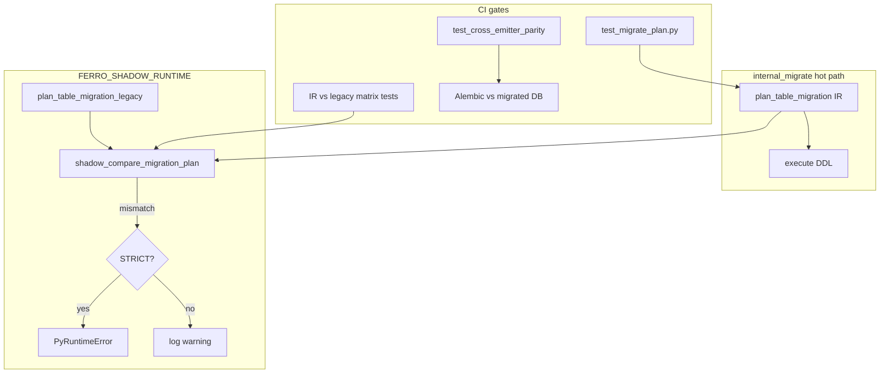

# feat: Migration parity gate and IR vs legacy shadow (#120)

## Summary

Rewire `shadow_compare_migration_plan` to diff the IR-primary planner against `plan_table_migration_legacy`, add an explicit IR-vs-legacy parity test matrix on SQLite + Postgres, consolidate JSON→IR adapters onto shared `build_column_plan` lowering, and keep Alembic/`create_tables` exit tests green so Phase 8 can close with a real enforcement gate.

**Closes:** [#120](https://github.com/syn54x/ferro-orm/issues/120)
**Base branch:** `feat/ir-p8-migrate-cutover`
**Feature branch:** `feat/ir-p8-120-parity-gate`

---

## Problem Frame

#119 made `plan_from_ir` + `emit_sql_with_ir` the runtime hot path, but `shadow_compare_migration_plan` still self-compares the IR planner via JSON roundtrip — so `FERRO_SHADOW_RUNTIME_STRICT` does not detect IR↔legacy drift. Adapter logic in `src/migrate.rs` partially duplicates `build_column_plan`, and Phase 8 requires a enforced parity gate before Phase 9 removes the legacy walk.

See origin: `docs/brainstorms/2026-06-25-ir-p8-120-parity-gate-requirements.md`.

---

## Requirements

| ID | Requirement | Source |
|----|-------------|--------|
| R1 | `shadow_compare_migration_plan` compares IR vs `plan_table_migration_legacy` | #120, Phase 8 roadmap |
| R2 | `FERRO_SHADOW_RUNTIME` / `FERRO_SHADOW_RUNTIME_STRICT` enforce migrate drift in CI | #120, `.github/workflows/ci.yml` |
| R3 | Parity matrix: add/drop column, type/nullability, destructive, PK guard, `updates=false` | #120 checklist |
| R4 | IR migrate path remains Alembic-indistinguishable (`test_cross_emitter_parity.py`) | AGENTS.md I-1 |
| R5 | Consolidate `schema_json_to_schema_ir` / `live_columns_to_schema_ir` with shared lowering | Phase 8 roadmap |
| R6 | Legacy planner deprecated, not removed | Phase 9 / #108 |

---

## Key Technical Decisions

### KTD-1: Legacy is the shadow reference until Phase 9

When IR and legacy disagree, **default to aligning IR** (emitters + adapters) to legacy output for in-scope scenarios. Legacy encodes years of `test_migrate_plan.py` pins; removing it in Phase 9 requires proven parity, not premature IR-only semantics.

Exception: if legacy is objectively wrong vs Alembic/`create_tables`, fix both IR and legacy in the same PR with cross-emitter test proof.

### KTD-2: Shadow compare shape

```text
primary  = plan_table_migration(...)           // IR path
reference = plan_table_migration_legacy(...)
compare: statements, drop_columns, warnings (exact match)
```

Remove the JSON/live roundtrip self-compare. Error message should name both sides and table (existing format is fine; update labels from `legacy`/`shadow` to `ir`/`legacy`).

### KTD-3: Adapter consolidation without new emitters

Build `schema_json_to_schema_ir` columns from `build_column_plan` + existing schema JSON:

- Map `ColumnPlan` → `SchemaColumn` (db_type token from canonical type / existing schema metadata).
- Reuse `property_json_type_and_format` for logical type (already exported `pub(crate)` from `src/schema.rs`).
- Keep `checks` / `foreign_keys` at model level in IR envelope (today's structure).

`live_columns_to_schema_ir` stays live-introspection driven; align `declared_type_to_db_type` with `canonical_column_type` inverse or share a single Postgres `information_schema` → token map in `ferro-ddl-lowering`.

Do **not** add a third independent inference function.

### KTD-4: Test-only shadow FFI (optional but recommended)

Add `_shadow_compare_migration_plan_for_test` (mirror `_shadow_compare_query_plan_for_test`) returning structured diff JSON for `tests/test_shadow_reports.py` fixtures. Keeps shadow semantics visible in the backend-matrix fixture gate without parsing log lines.

### KTD-5: Statement ordering

IR and legacy must agree on statement **order** where the executor depends on it (e.g. ADD COLUMN before CREATE INDEX). Where order is immaterial, prefer fixing the IR emitter to match legacy rather than sorting in compare (sorting hides emitter bugs).

---

## High-Level Technical Design



---

## Implementation Units

### U1. Rewire migration shadow compare

**Goal:** `shadow_compare_migration_plan` diffs IR vs legacy; strict runtime enforcement becomes meaningful.

**Requirements:** R1, R2

**Dependencies:** none

**Files:**
- `src/migrate.rs` (`shadow_compare_migration_plan`, call site in `internal_migrate`)
- `src/lib.rs` (optional test export)

**Approach:**
- Replace roundtrip `shadow` call with `plan_table_migration_legacy`.
- Rename error labels (`ir` vs `legacy`).
- Add `#[deprecated(note = "Removal planned v0.14.0 — Phase 9 #108")]` on `plan_table_migration_legacy` (Rust) + module doc cross-link.

**Test scenarios:**
- Unit: given fixture schema/live from existing `migrate::tests`, `shadow_compare_migration_plan` returns `Ok(())` when IR matches legacy.
- Unit: deliberate mismatch test (e.g. temporarily diverge mock) proves `Err` shape — or use snapshot of error formatting only if mock is too heavy; prefer testing via matrix in U2 instead.
- Integration: `test_shadow_runtime_strict_has_no_mismatch` still passes with env vars set (exercises migrate shadow on connect).

**Verification:** `cargo test --no-default-features --features testing migrate::tests` + `uv run pytest tests/test_shadow_reports.py -q`.

---

### U2. IR vs legacy parity matrix (Rust)

**Goal:** Every supported `auto_migrate` scenario asserts `plan_table_migration` == `plan_table_migration_legacy`.

**Requirements:** R3

**Dependencies:** U1

**Files:**
- `src/migrate.rs` (`#[cfg(test)]` helper `assert_ir_legacy_parity(...)`)
- Reuse/extend scenarios in `migrate::tests` module

**Approach:**
- Helper runs both planners, asserts `statements`, `drop_columns`, `warnings` equality.
- Parameterize over existing tests' schema/live fixtures (add column, PG alter, nullability, destructive, PK drop error, enum UDT skip, db_check add, optional anyOf string).
- Run each scenario for `SqlDialect::Sqlite` and `SqlDialect::Postgres` where applicable.

**Test scenarios:**
- Covers: nullable add, NOT NULL + literal default, indexed add, unique add (SQLite warning parity), FK add (PG FK SQL + SQLite warning), `db_check` add on PG, PG type mismatch alter, PG nullability SET/DROP NOT NULL, destructive drop collection, `updates=false` empty plan, PK drop error on destructive.
- Explicit: `optional_string_anyof` + `pg_matching_primitive_columns` scenarios included.

**Verification:** `cargo test --no-default-features --features testing migrate::tests`.

---

### U3. Consolidate JSON→IR adapters

**Goal:** Single-source column lowering; delete redundant `infer_schema_db_type` duplication where `build_column_plan` already decides canonical types.

**Requirements:** R5

**Dependencies:** U2 (matrix must be green before deleting duplicate logic)

**Files:**
- `src/migrate.rs` (`schema_json_to_schema_ir`, `live_columns_to_schema_ir`)
- `src/schema.rs` (optional: `column_plan_to_schema_column` helper)
- `crates/ferro-ddl-lowering/src/lib.rs` (optional: live type token map)

**Approach:**
- Add `pub(crate)` helper mapping `ColumnPlan` + raw JSON metadata → `SchemaColumn` + push FK/check/index flags into model-level IR vectors.
- `infer_schema_db_type` becomes thin wrapper or removed in favor of canonical token from `ColumnPlan`.
- Keep `postgres_native_enum` on live adapter; consider moving `declared_type_to_db_type` next to `db_type_token_to_canonical` in ferro-ddl-lowering.

**Test scenarios:**
- U2 matrix stays green after refactor (primary gate).
- `schema_json_to_schema_ir` roundtrip: optional `anyOf` string → `varchar` token, `db_check` name uses `db_check_constraint_name`.

**Verification:** U2 + `cargo test -p ferro-ddl-lowering`.

---

### U4. Cross-emitter exit tests

**Goal:** Alembic `compare_metadata` stays empty after IR migrate path; no regressions on create-table parity.

**Requirements:** R4

**Dependencies:** U1–U3

**Files:**
- `tests/test_cross_emitter_parity.py`
- `tests/test_auto_migrate.py` (only if gaps found)

**Approach:**
- Run full `test_cross_emitter_parity.py` — extend only if matrix reveals uncovered Alembic diff (e.g. additional migrate_updates sentinel cases).
- Do not weaken `_ignore_unreliable_alembic_diffs` to force green.

**Test scenarios:**
- Existing: `test_alembic_autogen_after_migrate_updates_is_idempotent[sqlite]`
- Existing: create-table parity tests
- Add only if U2/U3 expose a gap: e.g. Postgres migrate_updates + `db_check` add column Alembic idempotency

**Verification:** `uv run pytest tests/test_cross_emitter_parity.py tests/test_migrate_plan.py tests/test_auto_migrate.py -q`.

---

### U5. Shadow fixtures, docs, Phase 8 checklist

**Goal:** CI shadow report fixtures reflect real compare semantics; institutional memory updated.

**Requirements:** R2, R6

**Dependencies:** U1, U4

**Files:**
- `tests/test_shadow_reports.py`
- `tests/fixtures/shadow_reports/*.json` (if migration section needs structured compare output)
- `docs/solutions/patterns/` (new or extend `cross-emitter-ddl-parity.md`)
- `docs/plans/2026-06-19-001-ir-first-roadmap.md` (Phase 8 checkboxes when merging)
- `docs/plans/ir-first-migration-guide.md` (#120 row)

**Approach:**
- If U1 adds `_shadow_compare_migration_plan_for_test`, extend `_report_for_backend` migration section with `migration_compare` payload; update fixtures.
- Document shadow gate recipe: when to run strict, how to interpret IR vs legacy diffs, link to matrix tests.

**Test scenarios:**
- `test_shadow_report_fixture_stable` per backend
- `test_shadow_runtime_strict_has_no_mismatch`

**Verification:** `uv run pytest tests/test_shadow_reports.py -q` with `FERRO_SHADOW_RUNTIME=1` in CI env.

---

## Scope Boundaries

### Deferred to Phase 9 (#108)

- Delete `plan_table_migration_legacy` and JSON properties walk.
- Remove `#[allow(dead_code)]` / deprecation shims.

### Deferred to Follow-Up Work

- Canonical type comparison inside `plan_from_ir` (raw `db_type` string compare) — only if matrix exposes varchar-length or alias false positives after U3.
- `char_max_len` live IR for Postgres varchar narrowing — separate issue if matrix shows gap.

### Non-goals

- Public API changes.
- Runtime dual-execution fallback.

---

## Risks and Dependencies

| Risk | Mitigation |
|------|------------|
| First shadow rewire fails CI strict | Land U2 matrix fixes in same PR before merge |
| Adapter consolidation churn | U2 first; small helper extractions |
| Warning text drift IR vs legacy | Pin warnings in matrix asserts |

**Depends on:** #118, #119 merged to `feat/ir-p8-migrate-cutover`.

---

## Verification (exit gate for #120)

```bash
cargo test --no-default-features --features testing migrate
cargo test -p ferro-schema-ir -p ferro-migrate -p ferro-ddl-lowering
uv run pytest tests/test_migrate_plan.py tests/test_auto_migrate.py tests/test_cross_emitter_parity.py tests/test_shadow_reports.py -q
uv run pytest -m "backend_matrix or postgres_only" --db-backends=sqlite,postgres tests/test_auto_migrate.py tests/test_migrate_plan.py -q
```

PR body: `Closes #120`

---

## References

- Origin: `docs/brainstorms/2026-06-25-ir-p8-120-parity-gate-requirements.md`
- Prior cutover: `docs/plans/2026-06-24-001-feat-ir-p8-119-wire-automigrate-plan.md`
- I-1 pattern: `docs/solutions/patterns/cross-emitter-ddl-parity.md`
- Phase 8 roadmap: `docs/plans/2026-06-19-001-ir-first-roadmap.md`
