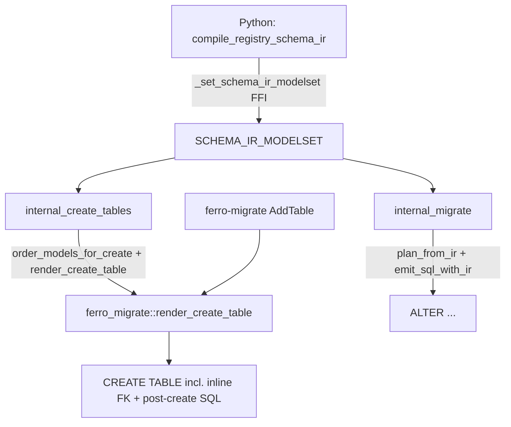

# refactor: Unify the CREATE TABLE path onto the Python SchemaIR (#153)

> **For agentic workers:** REQUIRED SUB-SKILL: Use superpowers:subagent-driven-development to implement this plan task-by-task (fresh implementer per task + two-stage review; opus for the final whole-branch review). Steps use checkbox (`- [ ]`) syntax for tracking.

**Goal:** Make the runtime CREATE TABLE path consume the Python-compiled SchemaIR (the same producer the migrate path uses) through one shared `SchemaModel → CREATE TABLE` emitter, then delete the now-dead JSON create path, the deprecated `canonical_from_parts` arms, and the test-only `schema_json_to_schema_ir`.

**Architecture:** Promote `ferro-migrate`'s `render_create_table` into the single create-table emitter — folding in **inline** foreign keys so its output is byte-identical to today's runtime DDL — and rewire both the runtime create path (`internal_create_tables`) and `ferro-migrate`'s own `AddTable` pass to call it. The Python compiler becomes the single declared-schema producer for create *and* migrate.

**Tech Stack:** Rust (PyO3, sea-query), Python (Pydantic), `cargo test` + `pytest` (SQLite + Postgres backend matrix).

**Closes:** [#153](https://github.com/syn54x/ferro-orm/issues/153)
**Base branch:** `feat/ir-p8.6-cleanups` (Epic 8.6 integration branch)
**Feature branch:** `feat/ir-p8.6-153-create-path-ir`

## Global Constraints

- **Zero emitted-DDL change.** Runtime `CREATE TABLE` + index/constraint SQL must be byte-identical on **SQLite and Postgres** (AGENTS.md I-1). The only intentional behavior change is internal: `ferro-migrate`'s `AddTable` emitter (never reached in production) gains correct inline SQLite FKs.
- **Fail loud, never degrade silently** (AGENTS.md I-6). No `unwrap()` across the FFI boundary (AGENTS.md I-3).
- **Conventional Commits** enforced (`cz`); never invent types. Validate the range before pushing.
- **No CHANGELOG.md edits** (AGENTS.md I-10).
- Postgres is CI-deferred locally; run the SQLite matrix locally and rely on CI for Postgres, but write every test to run on both.

---

## Requirements

| ID | Requirement | Source |
|----|-------------|--------|
| R1 | Runtime CREATE path consumes the Python SchemaIR modelset (single declared-IR producer for create + migrate) | #153 acceptance |
| R2 | One shared `SchemaModel → CREATE TABLE` emitter, used by runtime create **and** `ferro-migrate` `AddTable`; inline FKs on both backends | #153, spec §4.1, KTD-1 |
| R3 | Zero emitted-DDL change; cross-emitter parity green on SQLite + Postgres | #153, AGENTS.md I-1 |
| R4 | `bytes` columns stay `BLOB`/`bytea`: add a `binary` logical_type before removing the legacy `("string", Some("binary"))` arm | spec §4.3 |
| R5 | Remove the five deprecated `("string", Some(...))` / `(_, Some("decimal"))` arms in `canonical_from_parts` | #153 acceptance |
| R6 | Remove the `#[cfg(test)]` `schema_json_to_schema_ir` and the JSON create path (`build_create_table_sqls` et al.) | #153 acceptance |
| R7 | Unknown `logical_type` fails loud (reverse #140's silent-`Varchar` fallback), behind a verification gate | spec §Error handling, AGENTS.md I-6 |
| R8 | Roadmap / Project #7 / migration-guide synced; issue closed via PR keyword | roadmap traceability, AGENTS.md I-9 |

---

## Key Technical Decisions

### KTD-1: Inline FKs are the one true style

The shared emitter emits foreign keys **inline inside `CREATE TABLE`**, anonymously (no constraint name), on both backends — exactly as today's runtime does. Rationale: SQLite has no `ALTER TABLE ADD FOREIGN KEY`, so the ALTER style cannot work there (today's `AddTable` emitter drops SQLite FKs with a warning — an I-6 violation this fixes). Inline is also what production emits today, so runtime DDL is unchanged. The only capability inline can't express — true circular FKs — is already unsupported (topological ordering + SQLite's ALTER limit); it stays Alembic territory.

### KTD-2: CREATE TABLE byte-exact; post-create statements compared as a set

The golden test asserts the **`CREATE TABLE` statement is byte-identical** (column order, inline FK, inline `UNIQUE` all live inside it and all matter). Post-create statements (`CREATE [UNIQUE] INDEX`, PG `db_check` `ALTER`) are independent and order-immaterial — every column exists before any post-create artifact runs — so the golden compares them as a **sorted set**, not an ordered list. This keeps the shared emitter on its natural sorted-by-name ordering (`standalone_indexes`) instead of contorting it to reproduce the legacy column-then-composite order for zero semantic gain. The existing `test_cross_emitter_parity.py` (Alembic empty-diff) independently guarantees no schema-level difference.

### KTD-3: Capture ground-truth strings empirically

The golden's expected SQL is captured by running the **current** runtime emitter on the fixture once (via the existing `_render_create_table_sql_for_test`, before it is re-pointed) and pasting the exact output into the Rust golden. The golden then drives the new emitter (TDD red→green). This is a characterization test: the expected strings are the invariant, proving zero-DDL-change.

### KTD-4: Additive-before-subtractive ordering

`binary` logical_type + `("binary", _) => Blob` land **before** any deprecated arm is removed (both arms coexist harmlessly). The runtime cutover lands **before** the JSON path is deleted. Deletions come last, each gated on a grep proving no remaining non-test caller. At every commit the full matrix is green and runtime DDL is unchanged.

### KTD-5: One shared emitter home

The emitter lives in `ferro-migrate` (already "the IR-driven DDL emitter," already has a private `render_create_table`). The main crate already depends on `ferro-migrate` (`src/migrate.rs:21`), so `src/schema.rs` can call it. `ferro-ddl-lowering` keeps the lower-level per-column / per-name primitives (`canonical_from_schema_column`, `apply_canonical_type`, naming helpers) it builds on.

---

## High-Level Technical Design



After this plan: **one declared-schema producer** (`P`), **one create-table emitter** (`EM`).

---

## File Structure

| File | Responsibility | Change |
|------|----------------|--------|
| `crates/ferro-ddl-lowering/src/lib.rs` | canonical type lowering | add `("binary",_)=>Blob`; later remove 5 deprecated arms |
| `src/ferro/ir/compiler.py` | Python SchemaIR producer | `_logical_type` emits `"binary"` |
| `crates/ferro-migrate/src/emit.rs` | the shared create-table emitter | `render_create_table` → `CreateTableEmission` w/ inline FK; rewire `emit_add_table_passes`; `order_models_for_create` |
| `crates/ferro-migrate/src/lib.rs` | crate public surface | re-export `CreateTableEmission`, `render_create_table`, `order_models_for_create` |
| `crates/ferro-migrate/src/tests.rs` | emitter unit + golden tests | golden byte-parity test; update `AddTable` FK expectations |
| `src/schema.rs` | runtime create path | `internal_create_tables` consumes modelset; re-point `_render_create_table_sql_for_test`; delete JSON create path |
| `src/migrate.rs` | runtime migrate path | delete `schema_json_to_schema_ir` + helpers only it used |
| `src/ferro/__init__.py` / create entry | modelset push wiring | ensure `create_tables()` pushes the modelset |
| `docs/plans/2026-06-19-001-ir-first-roadmap.md`, `docs/plans/ir-first-migration-guide.md` | traceability | Phase 8.6 sync, migration impact `none` |

---

## Tasks

### Task 1: Add the `binary` logical_type (additive)

**Files:**
- Modify: `src/ferro/ir/compiler.py` (`_logical_type`, `:78`)
- Modify: `crates/ferro-ddl-lowering/src/lib.rs` (`canonical_from_parts`, `:270`)
- Test: `crates/ferro-ddl-lowering/src/lib.rs` (`#[cfg(test)]`), `tests/test_ir_vectors_contract.py` or a focused compiler test

**Interfaces:**
- Produces: `canonical_from_parts("binary", _, _, dialect) -> Ok(CanonicalType::Blob)`; `_logical_type` returns `"binary"` for a `bytes` field (JSON `type:string, format:binary`).

- [ ] **Step 1 — Failing Rust test.** In `ferro-ddl-lowering` tests, assert `canonical_from_parts("binary", None, "", Dialect::Sqlite) == Ok(CanonicalType::Blob)` and same for `Dialect::Postgres`.
- [ ] **Step 2 — Run, expect FAIL** (`unknown logical_type 'binary'`): `cargo test -p ferro-ddl-lowering`.
- [ ] **Step 3 — Implement the arm.** In `canonical_from_parts`, add above the primitive arms:

```rust
// Domain token for bytes/binary fields (compiler.py _logical_type emits "binary").
("binary", _) => Ok(CanonicalType::Blob),
```

- [ ] **Step 4 — Run, expect PASS:** `cargo test -p ferro-ddl-lowering`.
- [ ] **Step 5 — Failing Python test.** Assert a model with `contents: bytes` compiles to `logical_type == "binary"` via `compile_schema_ir_payload` (mirror an existing compiler test in `tests/test_ir_vectors_contract.py`).
- [ ] **Step 6 — Implement compiler change.** In `_logical_type`, inside the `field_type == "string"` branch, before the final `return "string"`:

```python
if field_format == "binary":
    return "binary"
```

- [ ] **Step 7 — Run, expect PASS:** `uv run pytest tests/test_ir_vectors_contract.py -q`.
- [ ] **Step 8 — Commit:** `git commit -m "feat(ir): add binary logical_type for bytes columns"`

**Note:** both `("binary",_)` and the legacy `("string", Some("binary"))` arms now coexist; nothing breaks. The legacy arm is removed in Task 6.

**Verification:** `cargo test -p ferro-ddl-lowering && uv run pytest tests/test_ir_vectors_contract.py -q`

---

### Task 2: Shared `render_create_table` with inline FKs + `CreateTableEmission`

**Files:**
- Modify: `crates/ferro-migrate/src/emit.rs` (`render_create_table:53`, `post_create_artifacts:141`, `foreign_key_statements:175`, `emit_add_table_passes:237`, `order_add_table_models:197`)
- Modify: `crates/ferro-migrate/src/lib.rs` (public re-exports)
- Test: `crates/ferro-migrate/src/tests.rs`

**Interfaces:**
- Consumes: `ferro_schema_ir::SchemaModel`, `BackendDialect`, `fk_action_from_str` / `fk_action_sql` (already imported).
- Produces (public):

```rust
pub struct CreateTableEmission {
    pub create_sql: String,         // CREATE TABLE incl. inline anonymous FKs + inline single-col UNIQUE
    pub post_create_sqls: Vec<String>, // standalone indexes/uniques + PG db_check ALTER (NO foreign keys)
    pub warnings: Vec<String>,      // e.g. SQLite db_check elision
}
pub fn render_create_table(model: &SchemaModel, dialect: BackendDialect) -> Result<CreateTableEmission, EmissionError>;
pub fn order_models_for_create(models: &[SchemaModel]) -> Vec<&SchemaModel>;
```

- [ ] **Step 1 — Capture ground truth (KTD-3).** Build the comprehensive fixture (below) as Python models and dump the current runtime create SQL on both dialects:

```python
# scratch capture — run once, paste output into the golden test, then discard.
from ferro._core import _render_create_table_sql_for_test as r
# ...register the fixture model JSON exactly as the metaclass does...
print(r("user", user_schema_json, "sqlite"))
print(r("user", user_schema_json, "postgres"))
```

Fixture coverage (one model set): int PK autoincrement, `varchar`, inline `unique`, `index`, `datetime→timestamptz`, `date`, `time→varchar`, `uuid`, `decimal`, `json`, **`bytes→blob`**, FK with `ON DELETE CASCADE` + a non-CASCADE FK, composite unique, composite index, and a PG `db_check` enum column.

- [ ] **Step 2 — Write the failing golden test** in `tests.rs`: construct the fixture as `SchemaModel` literals (use the existing `schema_model` / `col` / `pk_col` helpers, extended), call `render_create_table`, and assert:
  - `emission.create_sql == <captured exact string>` (per dialect), and
  - `sorted(emission.post_create_sqls) == sorted(<captured post-create strings>)` (KTD-2), and
  - SQLite emits the `db_check` warning; Postgres emits the `db_check` `ALTER`.

- [ ] **Step 3 — Run, expect FAIL** (today's `render_create_table` returns `String`, omits inline FKs): `cargo test -p ferro-migrate render_create_table_golden`.

- [ ] **Step 4 — Implement `render_create_table`.** Change its return type to `CreateTableEmission`. Keep the existing column loop (`:61-80`). Fold inline FKs into the `Table::create` statement, anonymously, ordering FK target column from `fk.to_column` and the action via `fk_action_from_str` (matching the runtime's `CASCADE` default — verify `fk_action_from_str(None)` maps to `Cascade`):

```rust
for fk in &model.foreign_keys {
    let action = fk_action_from_str(fk.on_delete.as_deref()); // None -> Cascade (runtime parity)
    table_stmt.foreign_key(
        ForeignKey::create()
            .from(Alias::new(table_lower), Alias::new(&fk.column))
            .to(Alias::new(&fk.to_table), Alias::new(&fk.to_column))
            .on_delete(action),
    );
}
```

  Build `post_create_sqls` from the existing `post_create_artifacts` logic (standalone indexes/uniques + PG `db_check`), and `warnings` from the SQLite `db_check` elision. **Foreign keys are no longer in `post_create_sqls`** — they are inline.

- [ ] **Step 5 — Rewire `emit_add_table_passes`** to call `render_create_table` and push `emission.create_sql` + `emission.post_create_sqls` + `emission.warnings`. **Delete** `foreign_key_statements` (`:175`) and the SQLite FK-drop warning loop (`:249-256`). Replace the private `order_add_table_models` body with a call to the new public `order_models_for_create` (move the topo-sort logic there).

- [ ] **Step 6 — Update existing `AddTable` unit tests** in `tests.rs` (`emit_sql_with_ir_add_column_fk_*`, any `AddTable` FK case) to expect **inline** FK in the `CREATE TABLE` on both backends, and **no** SQLite FK-drop warning.

- [ ] **Step 7 — Re-export** `CreateTableEmission`, `render_create_table`, `order_models_for_create` from `lib.rs`.

- [ ] **Step 8 — Run, expect PASS:** `cargo test -p ferro-migrate`.

- [ ] **Step 9 — Commit:** `git commit -m "refactor(migrate): single inline-FK create-table emitter (render_create_table)"`

**Verification:** `cargo test -p ferro-migrate` (golden + updated AddTable tests green). Runtime untouched this task → production DDL unchanged.

---

### Task 3: Cut the runtime create path over to the IR emitter

**Files:**
- Modify: `src/schema.rs` (`internal_create_tables:523`, `_render_create_table_sql_for_test:~618`)
- Modify: `src/ferro/__init__.py` / the `create_tables` entry (modelset push)
- Test: `tests/test_auto_migrate.py`, `tests/test_cross_emitter_parity.py`, `tests/test_db_type_cross_emitter_parity.py`, a new wiring test

**Interfaces:**
- Consumes: `ferro_migrate::{render_create_table, order_models_for_create}`, `SCHEMA_IR_MODELSET` (`src/state.rs:27`), `backend_dialect` (`src/migrate.rs:70`).

- [ ] **Step 1 — Failing wiring test.** Add a Python test asserting `create_tables()` creates the fixture tables correctly (and, with the modelset deliberately cleared, fails loud with the "modelset not set" message rather than silently creating nothing).

- [ ] **Step 2 — Rewrite `internal_create_tables`** to read the modelset (mirror `internal_migrate:865-872`) and emit via the shared emitter:

```rust
let modelset = {
    let guard = crate::state::SCHEMA_IR_MODELSET.read().map_err(|_| {
        pyo3::exceptions::PyRuntimeError::new_err("Failed to lock SchemaIR modelset")
    })?;
    guard.clone().ok_or_else(|| pyo3::exceptions::PyRuntimeError::new_err(
        "SchemaIR modelset not set — connect()/create_tables() must push it before creating tables"
    ))?
};
let dialect = backend_dialect(engine.backend());
for model in ferro_migrate::order_models_for_create(&modelset.payload.models) {
    let e = ferro_migrate::render_create_table(model, dialect)
        .map_err(|err| pyo3::exceptions::PyRuntimeError::new_err(err.message))?;
    engine.execute_sql(&e.create_sql).await.map_err(/* table create context */)?;
    for sql in &e.post_create_sqls { engine.execute_sql(sql).await.map_err(/* index context */)?; }
    for w in &e.warnings { crate::emit_user_warning(w); }
}
Ok(())
```

- [ ] **Step 3 — Wire the modelset push for `create_tables()`.** Confirm the standalone `create_tables()` entrypoint pushes `_set_schema_ir_modelset(json.dumps(compile_registry_schema_ir()))` before invoking the Rust create (the audit found the push only in the `connect`/`migrate` wrappers, `__init__.py:121,154`). Add it if missing, mirroring those wrappers.

- [ ] **Step 4 — Re-point `_render_create_table_sql_for_test`** through the IR path (spec §4.5): the Rust helper accepts a SchemaIR-payload JSON, deserializes a `SchemaModel`, and returns `render_create_table(...)`'s `(create_sql, post_create_sqls)`. Update its callers in `test_cross_emitter_parity.py` / `test_db_type_cross_emitter_parity.py` to compile the schema first (`compile_schema_ir_payload`) and pass the payload — asserting the **same** expected artifacts.

- [ ] **Step 5 — Run the matrix, expect PASS** on SQLite (and Postgres in CI):

```
uv run pytest tests/test_cross_emitter_parity.py tests/test_db_type_cross_emitter_parity.py tests/test_auto_migrate.py -q
uv run pytest -m "backend_matrix or postgres_only" --db-backends=sqlite,postgres tests/test_auto_migrate.py -q
```

- [ ] **Step 6 — Commit:** `git commit -m "refactor(schema): runtime create consumes the SchemaIR modelset"`

**Verification:** the create path is byte-identical (golden, Task 2) and end-to-end correct (cross-emitter + auto-migrate matrix). `build_create_table_sqls` still exists but is now unused by production — deleted in Task 6.

---

### Task 4: Fail loud on unknown `logical_type` (reverse #140's silent fallback)

**Files:**
- Modify: `src/schema.rs` (`internal_create_tables` error mapping — confirm no residual `unwrap_or(Varchar)` in the live path)
- Test: `crates/ferro-migrate/src/tests.rs`, optional `tests/`

**Interfaces:**
- Consumes: `render_create_table` already returns `Err(EmissionError)` for an unknown token (`canonical_from_schema_column`).

- [ ] **Step 1 — Verification gate (R7).** Confirm no real model field compiles to the compiler's `"unknown"` logical_type and relies on the old `varchar` landing: grep `_logical_type` paths and run the full compiler/IR-vector suite; if a legitimate field maps to `"unknown"`, give it a real `logical_type` in the compiler instead (do **not** keep a catch-all fallback).
- [ ] **Step 2 — Failing test.** In `ferro-migrate` tests, a `SchemaModel` whose column has `logical_type:"bogus"` (no `db_type`) → `render_create_table` returns `Err`.
- [ ] **Step 3 — Run, expect PASS** if already erroring (`canonical_from_schema_column` returns `Err`); otherwise tighten the path so it does. Confirm `internal_create_tables` surfaces it as a `PyRuntimeError` (Step from Task 3 already maps `EmissionError`).
- [ ] **Step 4 — Commit:** `git commit -m "refactor(schema): fail loud on unknown column type in create path"`

**Verification:** `cargo test -p ferro-migrate` + full IR-vector suite green (no field regresses to `unknown`).

---

### Task 5: Delete the JSON create path, deprecated arms, and the test-only shim

**Files:**
- Modify: `src/schema.rs` (delete `build_create_table_sqls:453`, `canonical_column_type:221`, `property_json_type_and_format:30`, `build_column_plan:349` if unused, JSON index/composite helpers, `order_schemas_for_creation:94`, `shadow_compare_create_table_sqls:495`)
- Modify: `src/migrate.rs` (delete `schema_json_to_schema_ir:1186` + helpers only it used)
- Modify: `crates/ferro-ddl-lowering/src/lib.rs` (delete deprecated arms `:279-286`)

**Interfaces:** none produced; this task only removes dead code.

- [ ] **Step 1 — Grep gate.** For each symbol, prove no remaining non-test caller:

```bash
grep -rn 'build_create_table_sqls\|canonical_column_type\|property_json_type_and_format\|order_schemas_for_creation\|shadow_compare_create_table_sqls' src/ --include='*.rs'
grep -rn 'schema_json_to_schema_ir' src/ --include='*.rs'
grep -rn '"string", Some(' crates/ferro-ddl-lowering/src/
```

  Any production hit means the cutover (Task 3) missed a site — fix that first. `build_column_plan` is deleted only if its sole remaining users were the deleted shim/path; if `src/migrate.rs` still uses it, leave it and note the residual for #142/Phase 9.

- [ ] **Step 2 — Delete the deprecated arms** (`canonical_from_parts:279-286`): the four `("string", Some(...))` arms and `(_, Some("decimal"))`. Keep the domain-token arms (`datetime`/`date`/`time`/`uuid`/`json`/`decimal`/`binary`) and the primitive arms.
- [ ] **Step 3 — Delete `schema_json_to_schema_ir`** and any `#[cfg(test)]` helper only it referenced (`migrate_column_bool`, `migrate_column_object`, `migrate_check_expression`, etc. — grep each).
- [ ] **Step 4 — Delete the JSON create path** in `src/schema.rs` and prune now-unused imports.
- [ ] **Step 5 — Run the full workspace + matrix, expect PASS:**

```
cargo test --no-default-features --features testing
cargo test -p ferro-schema-ir -p ferro-ddl-lowering -p ferro-migrate
uv run pytest tests/test_cross_emitter_parity.py tests/test_db_type_cross_emitter_parity.py tests/test_auto_migrate.py tests/test_ir_vectors_contract.py -q
uv run pytest -m "backend_matrix or postgres_only" --db-backends=sqlite,postgres tests/test_auto_migrate.py -q
```

- [ ] **Step 6 — Commit:** `git commit -m "refactor: remove JSON create path, deprecated lowering arms, and schema_json_to_schema_ir (#153)"`

**Verification:** zero greps for the deleted symbols in production; full matrix green; the single-producer / single-emitter invariant holds (grep-verified, spec §Exit).

---

### Task 6: Traceability — roadmap, Project #7, migration guide, issue closure

**Files:**
- Modify: `docs/plans/2026-06-19-001-ir-first-roadmap.md` (Phase 8.6 deliverable check + progress-log entry)
- Modify: `docs/plans/ir-first-migration-guide.md` (record migration impact `none` with justification)

- [ ] **Step 1 — Roadmap sync:** tick the #153 deliverable under Phase 8.6, add a dated progress-log entry, keep epic #145 references consistent.
- [ ] **Step 2 — Migration guide:** add the #153 row — migration impact `none` (runtime DDL byte-identical; internal-only AddTable FK fix), per the roadmap's documentation policy.
- [ ] **Step 3 — Project board:** confirm #153 on Project #7 with `Status`; keep the native sub-issue link under #145.
- [ ] **Step 4 — Commit:** `git commit -m "docs(ir-p8.6): sync roadmap + migration guide for #153"`
- [ ] **Step 5 — PR:** open against `feat/ir-p8.6-cleanups` with `Closes #153` and an exit-steps checklist (AGENTS.md I-9). Validate the commit range with `cz check` before pushing.

**Verification:** `uv run cz check --rev-range <base>..HEAD` passes; roadmap/issue/board read consistently (single source of execution truth).

---

## Self-Review

- **Spec coverage:** R1→T3; R2→T2; R3→T2(golden)+T3(matrix); R4→T1; R5/R6→T5; R7→T4; R8→T6. Spec §4.5 (test helper) → T3 Step 4. Spec §Parity details → T2 (KTD-2). All spec sections map to a task.
- **Placeholder scan:** ground-truth strings in T2 are captured empirically (KTD-3), not left as "TODO"; every code step shows real code or an exact command.
- **Type consistency:** `CreateTableEmission { create_sql, post_create_sqls, warnings }`, `render_create_table`, and `order_models_for_create` are named identically in T2 (definition), T3 (call), and the re-exports.
