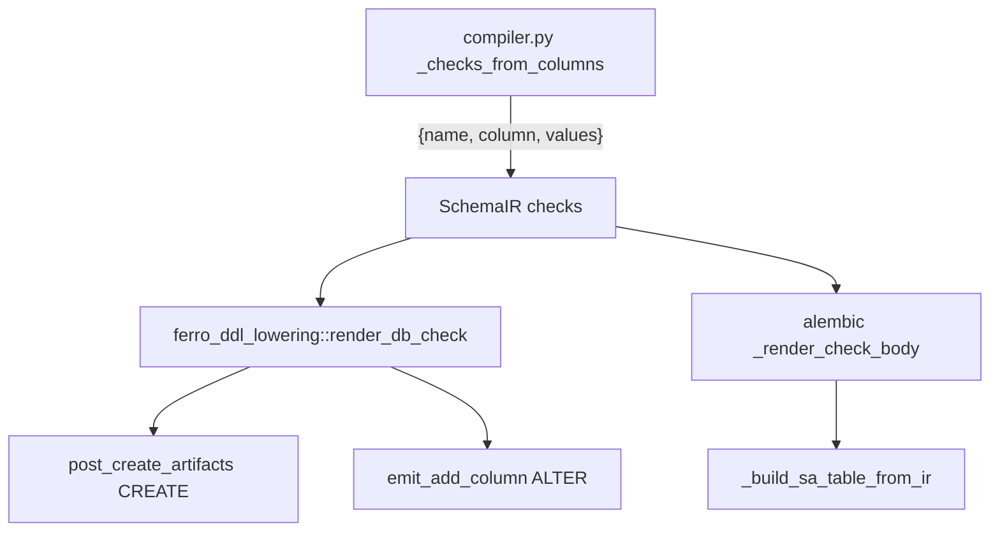

# Single check-renderer for db_check Implementation Plan

> **For agentic workers:** REQUIRED SUB-SKILL: Use superpowers:subagent-driven-development to implement this plan task-by-task (fresh implementer per task + two-stage review; opus for the final whole-branch review). Steps use checkbox (`- [ ]`) syntax for tracking.

**Goal:** Carry `db_check` CHECK constraints as **structured data** in the SchemaIR (`{ name, column, values }`) instead of a pre-rendered SQL string, so the constraint SQL is produced by **one renderer per language** — deleting `render_check_expression`'s positional re-quoting and reconciling the CREATE-vs-ALTER quoting divergence.

**Architecture:** Replace `SchemaCheck.expression: String` with `{ column: String, values: Vec<String> }` (values are pre-rendered SQL literal tokens, so value-escaping stays single-sourced in the Python compiler). A single Rust renderer `render_db_check` in `ferro-ddl-lowering` serves both the runtime CREATE path (`post_create_artifacts`) and the `ferro-migrate` ALTER path (`emit_add_column`); the Alembic emitter builds its `CheckConstraint` body from the same structured fields. The wire-format change is landed **additive-before-subtractive** (compiler adds the new fields first, consumers migrate off `expression`, `expression` is dropped last) so every commit stays green on both `cargo` and `pytest`.

**Tech Stack:** Rust (PyO3, sea-query, serde), Python (Pydantic, SQLAlchemy/Alembic), `cargo test` + `pytest` (SQLite + Postgres backend matrix).

**Closes:** [#158](https://github.com/syn54x/ferro-orm/issues/158)
**Base branch:** `feat/ir-p8.6-cleanups` (Epic 8.6 integration branch)
**Feature branch:** `feat/ir-p8.6-158-check-renderer`

## Global Constraints

- **Zero emitted-DDL change where pinned.** The runtime CREATE path (the only path with a golden) stays byte-identical on **SQLite and Postgres** (AGENTS.md I-1). The ALTER and Alembic paths converge to CREATE's canonical **quoted** form `CHECK ("col" IN ('a', 'b'))` (no prior golden defends their old unquoted bytes); the SQLite ALTER path gains an elision warning where it previously degraded silently.
- **Fail loud, never degrade silently** (AGENTS.md I-6). No `unwrap()` across the FFI boundary (AGENTS.md I-3).
- **Only the `<col> IN (...)` enum-check shape exists** — the structured type deliberately represents only this; do not add new check kinds (YAGNI).
- **Conventional Commits** enforced (`cz`); never invent types. Validate the range with `uv run cz check --rev-range <base>..HEAD` before pushing.
- **No CHANGELOG.md edits** (AGENTS.md I-10). **No AI attribution** in commits/PRs.
- Postgres is CI-deferred locally; run the SQLite matrix locally and rely on CI for Postgres (the hard merge gate — caught real bugs twice this phase), but write every test to run on both.
- **Every commit green**: each task ends with `cargo test` (the touched crates) **and** the relevant `pytest` green. The additive ordering exists to preserve this — do not reorder tasks.

---

## Requirements

| ID | Requirement | Source |
|----|-------------|--------|
| R1 | `SchemaCheck` is structured `{ name, column, values }`; `values` are pre-rendered SQL literal tokens (escaping stays in the compiler) | spec §4.1, §"Why pre-rendered tokens" |
| R2 | One Rust renderer `render_db_check` (in `ferro-ddl-lowering`) serves CREATE **and** ALTER; `render_check_expression` deleted | spec §4.3, §4.4 |
| R3 | CREATE byte output unchanged (quoted); ALTER column becomes quoted (matches CREATE); SQLite ALTER warns instead of silently dropping | spec §"Behavior reconciliation" |
| R4 | Alembic (`_build_sa_table_from_ir`) consumes the structured fields; empty-diff parity re-verified, not assumed | spec §4.5, §Testing |
| R5 | `expression` removed everywhere (struct, compiler, Alembic, fixtures, cfg(test) legacy helper); grep-gate clean | spec §Testing grep-gate |
| R6 | The synthetic `length(number) > 0` vector rewritten to a representable enum check | spec §5 |
| R7 | Legacy cfg(test) `schema_json_to_schema_ir` / `migrate_check_expression` updated mechanically (retained for Phase 9) | spec §"Current state", non-goals |
| R8 | Roadmap / Project #7 / migration-guide synced; #158 closed explicitly | roadmap traceability |

---

## Key Technical Decisions

### KTD-1: `values` are pre-rendered SQL literal tokens, not raw values

`values: Vec<String>` holds `["'admin'", "'user'"]` — already escaped. The escaping logic (string→`'O''Brien'`, bool→`true`, number→`5`) stays in the compiler's existing loop, the one place with the typed Python enum values. Each renderer only does `quote(column) + " IN (" + values.join(", ") + ")"`. Raw values would force both the Rust and Python renderers to re-implement escaping byte-identically — the exact cross-language duplication this issue removes, moved down one level.

### KTD-2: Additive-before-subtractive wire cutover

`SchemaCheck` has no `#[serde(deny_unknown_fields)]` and no field defaults: Rust **ignores extra** JSON fields but **fails on a missing** `expression`. Therefore the compiler must emit the new fields *alongside* `expression` (Task 1) **before** Rust reads them (Task 2), and `expression` is dropped (Task 6) only *after* every consumer is migrated off it (Tasks 3–5). At no point is a payload produced that a deployed deserializer rejects. Do not collapse or reorder these tasks.

### KTD-3: The renderer home is `ferro-ddl-lowering`

`render_check_body` / `render_db_check` / `CheckEmission` live in `ferro-ddl-lowering`, next to `quote_ident` and `db_check_constraint_name` (already `pub`, already imported by `emit.rs`). `ferro-ddl-lowering` already depends on `ferro-schema-ir`, so it can take `&SchemaCheck`. `emit.rs` adds the three symbols to its existing `use ferro_ddl_lowering::{…}` line — no new re-export needed (the runtime create path reaches them transitively through `ferro_migrate::render_create_table`).

### KTD-4: CREATE output is unchanged; ALTER reconciles to it

The CREATE golden (`crates/ferro-migrate/src/tests.rs`) already asserts the **quoted** form and stays byte-identical (Task 3 is a pure refactor). The ALTER path (`emit_add_column`) is untested today and currently emits the column **unquoted** + silently drops on SQLite; Task 4 routes it through `render_db_check`, making it quoted (matching CREATE) and adding the SQLite warning, and pins both with a new test.

### KTD-5: No IR version bump

The SchemaIR modelset is ephemeral (recompiled each run from the registry, passed over FFI in-process, never persisted). The contract validator `_validate_schema_payload` does not inspect a check's inner fields, and the only fingerprinted vector (`schema_phase1_fixture_models_v1.json`) has empty `checks`. So the check-shape change needs no `_IR_VERSION` bump; Task 1 includes a grep-verification that nothing keys off `_IR_VERSION` for check compatibility.

---

## High-Level Technical Design



One producer (`C`); one Rust renderer (`RDB`) for both Rust consumers; one Python body-mirror (`PY`) for Alembic.

---

## File Structure

| File | Responsibility | Change |
|------|----------------|--------|
| `src/ferro/ir/compiler.py` | SchemaIR producer | `_checks_from_columns` emits `column`/`values` (Task 1, additive) then drops `expression` (Task 6) |
| `tests/test_ir_vectors_contract.py` | compiler contract test | assert structured shape (Task 1 additive, Task 6 final) |
| `tests/fixtures/ir_vectors/schema_invoice_baseline_v1.json` | static IR envelope sample | rewrite the `length(...)` check to a representable enum check (Task 1) |
| `crates/ferro-schema-ir/src/lib.rs` | `SchemaCheck` type | add `column`/`values` (Task 2); remove `expression` (Task 6) |
| `crates/ferro-ddl-lowering/src/lib.rs` | the shared renderer | add `render_check_body`, `render_db_check`, `CheckEmission` (Task 2) |
| `crates/ferro-migrate/src/emit.rs` | the two Rust consumers | import + rewire CREATE (Task 3, delete `render_check_expression`) and ALTER (Task 4) |
| `crates/ferro-migrate/src/tests.rs` | emitter unit + golden tests | update golden fixture (Task 2); add ALTER + renderer tests (Tasks 2, 4) |
| `src/migrate.rs` | cfg(test) legacy parity fixture | update `schema_json_to_schema_ir` / `migrate_check_expression` (Task 2 add, Task 6 drop) |
| `src/ferro/migrations/alembic.py` | live Alembic autogenerate | `_render_check_body` + `_build_sa_table_from_ir` consume structured fields (Task 5) |
| `docs/plans/2026-06-19-001-ir-first-roadmap.md`, `docs/plans/ir-first-migration-guide.md` | traceability | Phase 8.6 sync, migration impact `none` (Task 7) |

---

## Tasks

### Task 1: Compiler emits structured fields alongside `expression` (additive)

**Files:**
- Modify: `src/ferro/ir/compiler.py` (`_checks_from_columns`, the `checks.append({...})` at ~234)
- Modify: `tests/test_ir_vectors_contract.py` (`test_schema_ir_compiler_emits_db_check_expression_for_closed_domain`, ~297)
- Modify: `tests/fixtures/ir_vectors/schema_invoice_baseline_v1.json` (the `checks` block, ~93)

**Interfaces:**
- Produces: SchemaIR `checks[]` entries now carry `column: str` and `values: list[str]` (pre-rendered SQL literal tokens) **in addition to** the existing `expression: str`. Later tasks consume `column`/`values`; `expression` is removed in Task 6.

- [ ] **Step 1 — Update the failing contract test (additive).** In `test_schema_ir_compiler_emits_db_check_expression_for_closed_domain`, change the assertion to expect all four keys:

```python
    assert checks == [
        {
            "name": "ck_document_format",
            "expression": "format IN ('pdf', 'json')",
            "column": "format",
            "values": ["'pdf'", "'json'"],
        }
    ]
```

- [ ] **Step 2 — Run, expect FAIL** (`column`/`values` absent): `uv run pytest tests/test_ir_vectors_contract.py::test_schema_ir_compiler_emits_db_check_expression_for_closed_domain -q`

- [ ] **Step 3 — Implement the additive emit.** In `_checks_from_columns`, change the `checks.append({...})` to keep `expression` and add the structured fields (the `rendered` list is the pre-rendered tokens):

```python
        checks.append(
            {
                "name": f"ck_{table_name}_{col_name}",
                "expression": f"{col_name} IN ({', '.join(rendered)})",
                "column": col_name,
                "values": rendered,
            }
        )
```

- [ ] **Step 4 — Run, expect PASS:** `uv run pytest tests/test_ir_vectors_contract.py -q`

- [ ] **Step 5 — Rewrite the synthetic vector.** In `schema_invoice_baseline_v1.json`, replace the non-representable free-form check with a representable enum check (referencing the existing `number` column; values are pre-rendered literal tokens). The contract validator does not inspect check inner fields, so this is purely for accuracy:

```json
          "checks": [
            {
              "name": "ck_invoice_number",
              "column": "number",
              "values": ["'A'", "'B'"]
            }
          ]
```

- [ ] **Step 6 — Verify no IR-version coupling (KTD-5).** Confirm nothing branches on `_IR_VERSION` for check-shape compatibility (expect only the two envelope-stamp sites):

```bash
grep -rn "_IR_VERSION\|ir_version" src/ferro/ | grep -iv "envelope\|= 1\|\"ir_version\": _IR_VERSION"
```

  Expected: no compatibility branch. (If any exists, stop and surface it.)

- [ ] **Step 7 — Run the full IR + Alembic safety net, expect PASS:**

```bash
uv run pytest tests/test_ir_vectors_contract.py tests/test_cross_emitter_parity.py -q
```

- [ ] **Step 8 — Commit:**

```bash
git add src/ferro/ir/compiler.py tests/test_ir_vectors_contract.py tests/fixtures/ir_vectors/schema_invoice_baseline_v1.json
git commit -m "feat(ir): emit structured db_check column/values alongside expression"
```

**Verification:** `uv run pytest tests/test_ir_vectors_contract.py tests/test_cross_emitter_parity.py -q`. Rust untouched; `cargo` unaffected. The wire now carries both shapes; Rust still ignores the extra fields (no `deny_unknown_fields`).

---

### Task 2: Structured `SchemaCheck` + the shared `render_db_check` (Rust, additive)

**Files:**
- Modify: `crates/ferro-schema-ir/src/lib.rs` (`SchemaCheck`, ~128)
- Modify: `crates/ferro-ddl-lowering/src/lib.rs` (add renderer near `db_check_constraint_name` ~365 / `quote_ident` ~466)
- Modify: `crates/ferro-migrate/src/tests.rs` (golden fixture `create_path_golden_fixture`, ~207; new renderer unit tests)
- Modify: `src/migrate.rs` (cfg(test) `migrate_check_expression` ~1168 / `schema_json_to_schema_ir` ~1281)

**Interfaces:**
- Consumes: `ferro_schema_ir::SchemaCheck`, `ferro_ddl_lowering::{quote_ident, Dialect}`.
- Produces (public, in `ferro-ddl-lowering`):

```rust
pub fn render_check_body(check: &SchemaCheck) -> String;
pub struct CheckEmission { pub statement: Option<String>, pub warning: Option<String> }
pub fn render_db_check(table: &str, check: &SchemaCheck, dialect: Dialect) -> CheckEmission;
```

- [ ] **Step 1 — Add the structured fields to `SchemaCheck`** (keep `expression`):

```rust
/// `CHECK` constraint on one column (enum `<col> IN (...)` shape).
#[derive(Debug, Clone, Serialize, Deserialize, PartialEq)]
pub struct SchemaCheck {
    /// Canonical check name (`ck_<table>_<col>` for single-column checks).
    pub name: String,
    /// SQL boolean expression inside the check. REMOVED in #158 Task 6.
    pub expression: String,
    /// The constrained column (structured — no longer parsed out of a string).
    pub column: String,
    /// Pre-rendered SQL literal tokens for the allowed values, e.g. `["'admin'", "'user'"]`.
    pub values: Vec<String>,
}
```

- [ ] **Step 2 — Fix the Rust `SchemaCheck` literals so the crate compiles.** Every Rust construction site must set the new fields. Update:
  - `crates/ferro-migrate/src/tests.rs` `create_path_golden_fixture` (~207):

```rust
        checks: vec![SchemaCheck {
            name: "ck_account_role".to_string(),
            expression: "role IN ('admin', 'user')".to_string(),
            column: "role".to_string(),
            values: vec!["'admin'".to_string(), "'user'".to_string()],
        }],
```

  - `src/migrate.rs` `migrate_check_expression` (~1168) — return the pieces instead of a string, and its caller `schema_json_to_schema_ir` (~1281). Change `migrate_check_expression` to return `Option<(String, Vec<String>)>` (column, tokens):

```rust
    fn migrate_check_expression(col_name: &str, col_info: &serde_json::Value) -> Option<(String, Vec<String>)> {
        let values = col_info.get("enum").and_then(|v| v.as_array())?;
        if values.is_empty() {
            return None;
        }
        let rendered: Vec<String> = values
            .iter()
            .map(|v| match v {
                serde_json::Value::String(s) => format!("'{}'", s.replace('\'', "''")),
                serde_json::Value::Number(n) => n.to_string(),
                serde_json::Value::Bool(b) => b.to_string(),
                other => format!("'{}'", other.to_string().replace('\'', "''")),
            })
            .collect();
        Some((col_name.to_string(), rendered))
    }
```

  and at the caller (~1281):

```rust
                if migrate_column_bool(raw_col, resolved, "db_check").unwrap_or(false)
                    && let Some((column, values)) = migrate_check_expression(name, resolved)
                {
                    checks.push(SchemaCheck {
                        name: db_check_constraint_name(table_lower, name),
                        expression: format!("\"{}\" IN ({})", column, values.join(", ")),
                        column,
                        values,
                    });
                }
```

- [ ] **Step 3 — Write the failing renderer unit tests** in `crates/ferro-migrate/src/tests.rs` (they exercise the public `ferro_ddl_lowering` symbols; import them at the top of the test module if needed):

```rust
#[test]
fn render_check_body_quotes_column_and_joins_values() {
    let check = SchemaCheck {
        name: "ck_account_role".to_string(),
        expression: String::new(),
        column: "role".to_string(),
        values: vec!["'admin'".to_string(), "'user'".to_string()],
    };
    assert_eq!(
        ferro_ddl_lowering::render_check_body(&check),
        "\"role\" IN ('admin', 'user')"
    );
}

#[test]
fn render_db_check_postgres_emits_quoted_alter_no_warning() {
    let check = SchemaCheck {
        name: "ck_account_role".to_string(),
        expression: String::new(),
        column: "role".to_string(),
        values: vec!["'admin'".to_string(), "'user'".to_string()],
    };
    let e = ferro_ddl_lowering::render_db_check("account", &check, Dialect::Postgres);
    assert_eq!(
        e.statement.as_deref(),
        Some("ALTER TABLE \"account\" ADD CONSTRAINT \"ck_account_role\" CHECK (\"role\" IN ('admin', 'user'))")
    );
    assert!(e.warning.is_none());
}

#[test]
fn render_db_check_sqlite_elides_with_warning() {
    let check = SchemaCheck {
        name: "ck_account_role".to_string(),
        expression: String::new(),
        column: "role".to_string(),
        values: vec!["'admin'".to_string(), "'user'".to_string()],
    };
    let e = ferro_ddl_lowering::render_db_check("account", &check, Dialect::Sqlite);
    assert!(e.statement.is_none());
    assert!(e.warning.as_deref().unwrap().contains("ck_account_role"));
}
```

  (Ensure `SchemaCheck` and `Dialect` are in scope in the test module.)

- [ ] **Step 4 — Run, expect FAIL** (renderer not defined): `cargo test -p ferro-migrate render_check 2>&1 | tail -20`

- [ ] **Step 5 — Implement the renderer** in `crates/ferro-ddl-lowering/src/lib.rs` (place near `db_check_constraint_name`; `quote_ident` and `Dialect` are already in this crate):

```rust
/// The CHECK body for a `db_check` enum constraint — byte-identical across the
/// CREATE and ALTER emitters (and mirrored, escaping-free, by the Alembic emitter).
/// Quoting is double-quote on both backends; the check only ever emits on Postgres.
pub fn render_check_body(check: &ferro_schema_ir::SchemaCheck) -> String {
    format!("{} IN ({})", quote_ident(&check.column), check.values.join(", "))
}

/// The outcome of emitting a `db_check` constraint for one dialect.
pub struct CheckEmission {
    /// The `ALTER TABLE ... ADD CONSTRAINT ... CHECK (...)` statement (Postgres only).
    pub statement: Option<String>,
    /// The SQLite elision warning (SQLite only).
    pub warning: Option<String>,
}

/// Single source for db_check emission: wrapper + dialect decision + body.
/// Postgres emits the ALTER; SQLite elides with a warning (no silent drop).
pub fn render_db_check(table: &str, check: &ferro_schema_ir::SchemaCheck, dialect: Dialect) -> CheckEmission {
    match dialect {
        Dialect::Postgres => CheckEmission {
            statement: Some(format!(
                "ALTER TABLE \"{table}\" ADD CONSTRAINT \"{}\" CHECK ({})",
                check.name,
                render_check_body(check),
            )),
            warning: None,
        },
        Dialect::Sqlite => CheckEmission {
            statement: None,
            warning: Some(format!(
                "Check constraint '{}' on table '{}' is not emitted on SQLite (requires table rebuild).",
                check.name, table
            )),
        },
    }
}
```

- [ ] **Step 6 — Run, expect PASS:** `cargo test -p ferro-ddl-lowering -p ferro-migrate -p ferro-schema-ir`

- [ ] **Step 7 — Commit:**

```bash
git add crates/ferro-schema-ir/src/lib.rs crates/ferro-ddl-lowering/src/lib.rs crates/ferro-migrate/src/tests.rs src/migrate.rs
git commit -m "feat(ddl): add structured SchemaCheck fields and render_db_check"
```

**Verification:** `cargo test -p ferro-ddl-lowering -p ferro-migrate -p ferro-schema-ir`. The renderer is unit-tested but not yet wired into the emitters (Tasks 3–4); production output is unchanged. The struct now reads `column`/`values` from the wire (present since Task 1).

---

### Task 3: Rewire the CREATE path; delete `render_check_expression`

**Files:**
- Modify: `crates/ferro-migrate/src/emit.rs` (import line ~4; `post_create_artifacts` ~189–206; delete `render_check_expression` ~211–232)

**Interfaces:**
- Consumes: `ferro_ddl_lowering::render_db_check`, `CheckEmission`.

- [ ] **Step 1 — Import the renderer.** Add `render_db_check` to the `ferro_ddl_lowering` use-list in `emit.rs` (~line 4):

```rust
use ferro_ddl_lowering::{
    self, apply_canonical_type, canonical_from_schema_column, db_check_constraint_name,
    fk_action_from_str, fk_action_sql, literal_default_value, pg_alter_type_target, quote_ident,
    render_db_check, single_index_name, single_unique_index_name, sqlite_declared_type,
    sqlite_type_storage_drift,
};
```

- [ ] **Step 2 — Rewire the check loop in `post_create_artifacts`.** Replace the `for check in &model.checks { match dialect { … } }` block with:

```rust
    for check in &model.checks {
        let emission = render_db_check(table_lower, check, dialect);
        if let Some(stmt) = emission.statement {
            statements.push(stmt);
        }
        if let Some(warning) = emission.warning {
            warnings.push(warning);
        }
    }
```

- [ ] **Step 3 — Delete `render_check_expression`** entirely (the `fn render_check_expression(...)` and its doc comment, ~211–232). It now has no callers.

- [ ] **Step 4 — Run, expect PASS** (the CREATE golden is byte-identical — quoted form unchanged): `cargo test -p ferro-migrate`

- [ ] **Step 5 — Grep-gate:** `grep -rn "render_check_expression" src/ crates/` returns **nothing**.

- [ ] **Step 6 — Commit:**

```bash
git add crates/ferro-migrate/src/emit.rs
git commit -m "refactor(migrate): CREATE path emits db_check via render_db_check"
```

**Verification:** `cargo test -p ferro-migrate` (golden green → CREATE output unchanged) + the grep-gate. `render_check_expression` is gone.

---

### Task 4: Rewire the ALTER path; pin it with a test

**Files:**
- Modify: `crates/ferro-migrate/src/emit.rs` (`emit_add_column` check loop ~395–405)
- Test: `crates/ferro-migrate/src/tests.rs` (new ALTER check test)

**Interfaces:**
- Consumes: `ferro_ddl_lowering::render_db_check` (already imported in Task 3).

- [ ] **Step 1 — Write the failing ALTER test** in `tests.rs`. Construct an `AddColumn` op for a column whose model carries the matching check, emit on both dialects, and assert the **quoted** Postgres CHECK and the SQLite warning. (Model the fixture on the existing `emit_sql_with_ir_add_column_*` tests; the check `name` must equal `db_check_constraint_name(table, column)` so the loop matches.)

```rust
#[test]
fn emit_sql_with_ir_add_column_db_check_postgres_quoted_and_sqlite_warns() {
    // A model whose `role` column has a db_check enum constraint.
    let mut model = schema_model("account", vec![ir_col("role", "text")]);
    model.checks = vec![SchemaCheck {
        name: test_db_check_constraint_name("account", "role"),
        expression: String::new(),
        column: "role".to_string(),
        values: vec!["'admin'".to_string(), "'user'".to_string()],
    }];
    let plan = MigrationPlan {
        table: "account".to_string(),
        operations: vec![MigrationOp::AddColumn {
            column: ir_col("role", "text"),
            model: model.clone(),
        }],
    };

    let pg = emit_sql_with_ir(&plan, Dialect::Postgres).unwrap();
    assert!(pg.statements.iter().any(|s| s
        == "ALTER TABLE \"account\" ADD CONSTRAINT \"ck_account_role\" CHECK (\"role\" IN ('admin', 'user'))"));

    let lite = emit_sql_with_ir(&plan, Dialect::Sqlite).unwrap();
    assert!(!lite.statements.iter().any(|s| s.contains("CHECK")));
    assert!(lite.warnings.iter().any(|w| w.contains("ck_account_role")));
}
```

  (Adjust `schema_model` / `ir_col` / `MigrationPlan` / `MigrationOp::AddColumn` field names to the exact local helpers and op shape — verify against the neighbouring `emit_sql_with_ir_add_column_*` tests and the `AddColumn` variant before running.)

- [ ] **Step 2 — Run, expect FAIL** (today's ALTER emits unquoted on PG and no warning on SQLite): `cargo test -p ferro-migrate emit_sql_with_ir_add_column_db_check 2>&1 | tail -20`

- [ ] **Step 3 — Rewire the check loop in `emit_add_column`.** Replace the `for check in &model.checks { if check.name == db_check_constraint_name(table, column) { if dialect == Dialect::Postgres { … } } }` block with:

```rust
    for check in &model.checks {
        if check.name == db_check_constraint_name(table, column) {
            let emission = render_db_check(table, check, dialect);
            if let Some(stmt) = emission.statement {
                result.statements.push(stmt);
            }
            if let Some(warning) = emission.warning {
                result.warnings.push(warning);
            }
        }
    }
```

  (Confirm the local accumulator field for warnings — `result.warnings` — matches the `EmissionResult` shape used elsewhere in this function.)

- [ ] **Step 4 — Run, expect PASS:** `cargo test -p ferro-migrate`

- [ ] **Step 5 — Commit:**

```bash
git add crates/ferro-migrate/src/emit.rs crates/ferro-migrate/src/tests.rs
git commit -m "refactor(migrate): ALTER path emits db_check via render_db_check (quoted + SQLite warn)"
```

**Verification:** `cargo test -p ferro-migrate`. The previously-untested ALTER path now emits the quoted CHECK (matching CREATE) and warns on SQLite.

---

### Task 5: Alembic consumes the structured fields; re-verify empty-diff

**Files:**
- Modify: `src/ferro/migrations/alembic.py` (`_build_sa_table_from_ir` check loop ~115–124; add `_render_check_body` near `_ck_constraint_name` ~33)
- Test: `tests/test_alembic_bridge.py` (a focused structured-check test) + `tests/test_cross_emitter_parity.py` (re-verify, unchanged)

**Interfaces:**
- Consumes: IR `checks[]` entries' `column` / `values` fields.

- [ ] **Step 1 — Write the failing Alembic test** in `tests/test_alembic_bridge.py` asserting `_build_sa_table_from_ir` produces a `CheckConstraint` whose text is the **quoted** body. (Build a minimal `model_ir` dict with one column and one `checks` entry `{"name": "ck_t_role", "column": "role", "values": ["'admin'", "'user'"]}`, call `_build_sa_table_from_ir(md, model_ir)`, and find the `sa.CheckConstraint` in the table args.)

```python
def test_build_sa_table_from_ir_renders_quoted_check_body():
    import sqlalchemy as sa
    from ferro.migrations.alembic import _build_sa_table_from_ir

    md = sa.MetaData()
    model_ir = {
        "table_name": "account",
        "columns": [{"name": "role", "db_type": "text", "nullable": False}],
        "checks": [{"name": "ck_account_role", "column": "role", "values": ["'admin'", "'user'"]}],
    }
    _build_sa_table_from_ir(md, model_ir)
    table = md.tables["account"]
    checks = [c for c in table.constraints if isinstance(c, sa.CheckConstraint)]
    assert len(checks) == 1
    assert str(checks[0].sqltext) == "\"role\" IN ('admin', 'user')"
    assert checks[0].name == "ck_account_role"
```

  (Match the exact `_sa_type_from_ir_column` expectations for the column dict — mirror an existing `_build_sa_table_from_ir` test fixture in this file.)

- [ ] **Step 2 — Run, expect FAIL** (`check.get("expression")` is now absent / unquoted): `uv run pytest tests/test_alembic_bridge.py::test_build_sa_table_from_ir_renders_quoted_check_body -q`

- [ ] **Step 3 — Add the body mirror** near `_ck_constraint_name` in `alembic.py`:

```python
def _render_check_body(column: str, values: list[str]) -> str:
    """Mirror of ferro_ddl_lowering::render_check_body (quote + join; escaping-free)."""
    return f'"{column}" IN ({", ".join(values)})'
```

- [ ] **Step 4 — Rewire the check loop** in `_build_sa_table_from_ir` (~115) to consume `column`/`values`:

```python
    for check in model_ir.get("checks") or []:
        if not isinstance(check, dict):
            continue
        name = check.get("name")
        column = check.get("column")
        values = check.get("values")
        if not isinstance(name, str) or not name:
            continue
        if not isinstance(column, str) or not column:
            continue
        if not isinstance(values, list) or not values:
            continue
        sqltext = _render_check_body(column, values)
        table_args.append(sa.CheckConstraint(sqltext, name=name))
```

- [ ] **Step 5 — Run, expect PASS:** `uv run pytest tests/test_alembic_bridge.py -q`

- [ ] **Step 6 — Re-verify the empty-diff parity gate** (the one "should be fine, prove it" item):

```bash
uv run pytest tests/test_cross_emitter_parity.py tests/test_db_type_cross_emitter_parity.py -q
```

  Expected: PASS. (If a db_check empty-diff regresses, stop — the quoting changed autogenerate comparison and the design assumption is wrong; surface it before proceeding.)

- [ ] **Step 7 — Commit:**

```bash
git add src/ferro/migrations/alembic.py tests/test_alembic_bridge.py
git commit -m "refactor(alembic): build db_check body from structured IR fields"
```

**Verification:** `uv run pytest tests/test_alembic_bridge.py tests/test_cross_emitter_parity.py tests/test_db_type_cross_emitter_parity.py -q`. Alembic now renders the quoted body from structured fields; empty-diff confirmed green.

---

### Task 6: Drop `expression` everywhere (subtractive); grep-gate

> **Ordering gate (KTD-2):** run only after Tasks 3–5 — nothing reads `check.expression` anymore (CREATE/ALTER → `render_db_check`; Alembic → `column`/`values`). Confirm with the grep in Step 1 before removing the field.

**Files:**
- Modify: `crates/ferro-schema-ir/src/lib.rs` (`SchemaCheck` — remove `expression`)
- Modify: `crates/ferro-migrate/src/tests.rs` (golden fixture; renderer test literals)
- Modify: `src/migrate.rs` (cfg(test) `schema_json_to_schema_ir` `SchemaCheck` literal — drop the `expression` line)
- Modify: `src/ferro/ir/compiler.py` (`_checks_from_columns` — drop the `expression` key)
- Modify: `tests/test_ir_vectors_contract.py` (contract test — drop `expression`)

- [ ] **Step 1 — Grep gate (confirm no remaining reader).** Outside the construction literals about to be edited, no code reads a check's `expression`:

```bash
grep -rn "\.expression\|\"expression\"\|expression:" src/ crates/ tests/ --include='*.rs' --include='*.py' | grep -i "check\|ck_"
```

  Expected: only the *constructions* this task removes (struct field, golden fixture, cfg(test) helper, compiler emit, contract test). No consumer reads it. (The `EmissionError.message`-style `expression` in unrelated code, and the query-IR `expression` in `nodes.py`, are different symbols — ignore.)

- [ ] **Step 2 — Remove the Rust field + literals.** Delete `pub expression: String,` from `SchemaCheck`; delete the `expression: ...` line from the golden fixture (`tests.rs` ~207), the three renderer-test literals (Task 2 Step 3), and the cfg(test) `schema_json_to_schema_ir` literal (`migrate.rs` ~1281). In `migrate_check_expression`'s caller, drop the now-unused `format!("\"{}\" IN (...)")` expression line.

- [ ] **Step 3 — Run, expect PASS:** `cargo test -p ferro-schema-ir -p ferro-ddl-lowering -p ferro-migrate`

- [ ] **Step 4 — Remove the Python emit + assertion.** In `_checks_from_columns`, drop the `"expression": ...` key (leaving `{name, column, values}`). In the contract test, drop the `"expression"` line:

```python
    assert checks == [
        {"name": "ck_document_format", "column": "format", "values": ["'pdf'", "'json'"]}
    ]
```

- [ ] **Step 5 — Run, expect PASS:** `uv run pytest tests/test_ir_vectors_contract.py tests/test_cross_emitter_parity.py tests/test_db_type_cross_emitter_parity.py -q`

- [ ] **Step 6 — Final grep-gate (R2/R5):** both return **nothing**:

```bash
grep -rn "render_check_expression" src/ crates/
grep -rn "\"expression\"\|expression:" src/ crates/ tests/ --include='*.rs' --include='*.py' | grep -i "check\|ck_\|SchemaCheck"
```

- [ ] **Step 7 — Full matrix + dead_code check:**

```bash
cargo test
uv run pytest tests/test_ir_vectors_contract.py tests/test_cross_emitter_parity.py tests/test_db_type_cross_emitter_parity.py tests/test_auto_migrate.py tests/test_alembic_bridge.py -q
uv run pytest -m "backend_matrix or postgres_only" --db-backends=sqlite,postgres tests/test_auto_migrate.py -q   # CI runs Postgres
```

  Expected: green, no **new** `dead_code` warnings.

- [ ] **Step 8 — Commit:**

```bash
git add crates/ferro-schema-ir/src/lib.rs crates/ferro-migrate/src/tests.rs src/migrate.rs src/ferro/ir/compiler.py tests/test_ir_vectors_contract.py
git commit -m "refactor(ir): drop pre-rendered db_check expression; SchemaCheck is structured"
```

**Verification:** full `cargo test` + the SQLite pytest matrix green; grep-gate clean (`render_check_expression` and check `expression` both zero); `SchemaCheck` is `{name, column, values}`. Postgres is the CI gate.

---

### Task 7: Traceability — roadmap, migration guide, Project #7, issue closure

**Files:**
- Modify: `docs/plans/2026-06-19-001-ir-first-roadmap.md` (Phase 8.6 deliverable tick + dated progress-log entry)
- Modify: `docs/plans/ir-first-migration-guide.md` (record migration impact `none`)

- [ ] **Step 1 — Roadmap sync:** tick the #158 deliverable under Phase 8.6 (single check-renderer / `render_check_expression` removed), add a dated progress-log entry noting both reconciliations (ALTER quoting + SQLite warning) and "behavior-preserving where pinned (CREATE golden)". Keep epic #145 references consistent (#145 now 3/5).
- [ ] **Step 2 — Migration guide:** add the #158 row — migration impact `none` (internal architecture; runtime CREATE DDL byte-identical; ALTER/Alembic converge to the canonical quoted form; SQLite ALTER gains a warning), per the documentation policy.
- [ ] **Step 3 — Commit:**

```bash
git add docs/plans/2026-06-19-001-ir-first-roadmap.md docs/plans/ir-first-migration-guide.md
git commit -m "docs(ir-p8.6): sync roadmap + migration guide for #158 check-renderer"
```

- [ ] **Step 4 — Validate the commit range:** `uv run cz check --rev-range feat/ir-p8.6-cleanups..HEAD` → all valid.
- [ ] **Step 5 — PR:** open against `feat/ir-p8.6-cleanups` with `Closes #158`, an exit-steps checklist, and a body stating: structured `SchemaCheck`, one `render_db_check` for CREATE+ALTER, `render_check_expression` deleted, ALTER reconciled to the quoted form + SQLite warning, Alembic empty-diff re-verified. **Note** `Closes #158` will not auto-close on merge into the integration branch (only fires on the default branch) — close #158 explicitly at the end and set its Project #7 status (per memory `ir-roadmap-issue-tracking`).

**Verification:** `uv run cz check --rev-range feat/ir-p8.6-cleanups..HEAD` passes; roadmap, migration guide, #158, and Project #7 read consistently.

---

## Self-Review

- **Spec coverage:** R1→T1(producer)+T2(struct); R2→T2(renderer)+T3(delete `render_check_expression`); R3→T3(CREATE unchanged)+T4(ALTER quoted+warn); R4→T5(Alembic+empty-diff); R5→T6(drop `expression`+grep-gate); R6→T1(vector rewrite); R7→T2(cfg(test) helper); R8→T7. Spec §"Behavior reconciliation" table → T3/T4. Spec §"Why pre-rendered tokens" → KTD-1.
- **Placeholder scan:** every code step shows real code; test fixtures that depend on local helper names (T4 `emit_sql_with_ir`/`MigrationOp::AddColumn`, T5 column dict) carry an explicit "verify against neighbouring tests" instruction rather than a guessed signature — the implementer confirms the exact local shape before running. No "TBD"/"add error handling"/"similar to".
- **Type consistency:** `SchemaCheck { name, column, values }` (+ transient `expression` until T6), `CheckEmission { statement, warning }`, `render_db_check(table, check, dialect)`, `render_check_body(check)`, and Python `_render_check_body(column, values)` are named identically across T2 (definition), T3/T4 (Rust calls), T5 (Python mirror), and T6 (field removal). `Dialect` is the post-#146 unified type imported via `crate::` in `emit.rs`.
- **Ordering invariant (KTD-2):** additive (T1 compiler, T2 struct) → migrate consumers (T3 CREATE, T4 ALTER, T5 Alembic) → subtractive (T6 drop `expression`). Every task ends green on both `cargo` and the relevant `pytest`; T6 carries the gate-grep that proves no reader remains before the field is removed.
