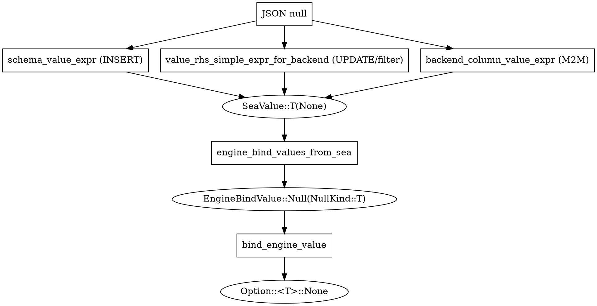

## Problem

PostgreSQL has no implicit `text -> integer` cast. If Ferro sends `null::text`
for a parameter that's bound to an `integer` / `bigint` / `bool` / `numeric` /
`bytea` / `uuid` column, Postgres rejects the statement with::

    column "..." is of type integer but expression is of type text

Pre-refactor, Ferro routed every NULL through a single catch-all to
`sea_query::Value::String(None)`, then bound `Option::<String>::None` at the
SQLx layer. Every nullable non-text column on Postgres reproduced #38.

UUID / temporal columns dodged this with `cast_as("uuid")` /
`cast_as("timestamptz")` SQL-text wrappers, which papered over the bug at
the wrong layer -- type information about a value belongs in the **bind**,
not in the SQL text.

## Takeaway

**Schema-driven NULL emission paths emit a typed SeaQuery `None` variant
based on column metadata; the bind layer maps each variant to
`Option::<T>::None`. The raw-SQL bind path is the explicit, documented
exception.**

## Schema-driven emitters (must use typed nulls)

| Path             | Function                                                | File               |
|------------------|----------------------------------------------------------|--------------------|
| INSERT values    | `schema_value_expr`                                      | `src/operations.rs`|
| UPDATE values    | `schema_value_expr` (called from `update_filtered`)      | `src/operations.rs`|
| Filter / UPDATE  | `value_rhs_simple_expr_for_backend`                      | `src/query.rs`     |
| Filter null pick | `typed_null_for_column` (called by ^)                    | `src/query.rs`     |
| M2M target IDs   | `backend_column_value_expr`                              | `src/operations.rs`|

These functions inspect column metadata (JSON type, format, `uuid_columns`
introspection, `ts_cast` metadata) and emit one of the typed SeaQuery `None`
variants:

| Pydantic / column type        | SeaValue null      | EngineBindValue NullKind | SQLx bind             |
|-------------------------------|--------------------|--------------------------|------------------------|
| `int \| None`                 | `BigInt(None)`     | `I64`                    | `Option::<i64>::None`  |
| `bool \| None`                | `Bool(None)`       | `Bool`                   | `Option::<bool>::None` |
| `float \| None`               | `Double(None)`     | `F64`                    | `Option::<f64>::None`  |
| `Decimal \| None`             | `Double(None)` *   | `F64` *                  | `Option::<f64>::None` *|
| `str \| None`                 | `String(None)`     | `String`                 | `Option::<String>::None` |
| `bytes \| None`               | `Bytes(None)`      | `Bytes`                  | `Option::<Vec<u8>>::None` |
| `UUID \| None`                | `Uuid(None)`       | `Uuid`                   | `Option::<sqlx::types::Uuid>::None` |
| `datetime \| None` / `date`   | `String(None).cast_as(...)` ** | -- | -- |

\* Decimal binds as `float8`-typed null today. Native `numeric` typed binds
are deferred (see plan §3 Scope Boundaries).

\*\* Temporal types continue to use `cast_as` until issue [#40] picks a
   datetime crate (`chrono` vs `time`).

## Raw-SQL boundary (explicit exception)

The raw-SQL bind path (`src/operations.rs::python_to_engine_bind_value`,
exposed through `ferro.raw`) has no schema or column-type context -- the user
supplies pre-built SQL text and bare Python values. Python `None` becomes
`EngineBindValue::Null(NullKind::Untyped)`, and the bind layer falls back to
`Option::<String>::None` for `Untyped`. This preserves pre-refactor behavior
for raw SQL and is the only documented place where `Untyped` is emitted by
Ferro itself.

## How to recognize the violation

- A user reports `column "..." is of type integer but expression is of type
  text` (or `bigint`, `boolean`, `numeric`, `bytea`, `uuid`) on a Postgres
  INSERT / UPDATE / filter.
- A new schema-driven emitter quietly routes JSON `null` to
  `sea_query::Value::String(None)` instead of picking from column metadata.
- A grep for `cast_as("uuid")` or `cast_as("bytea")` finds new uses outside
  the temporal / json fallback paths -- those are the deprecated workaround.
- `EngineBindValue::Null(NullKind::Untyped)` appears outside
  `python_to_engine_bind_value` and the documented SeaQuery fallback in
  `engine_bind_values_from_sea`.

## Recipe: adding a new schema-driven emitter

1. The emitter must take column metadata as input -- at minimum the model
   schema (`MODEL_REGISTRY`) plus the `uuid_columns` and `ts_cast` maps if
   it runs against Postgres.
2. JSON `null` arms switch on column metadata and emit a typed
   `sea_query::Value::T(None)` variant. Match the table in this doc.
3. Non-null UUID values on Postgres parse via `uuid::Uuid::parse_str`.
   Per AGENTS.md I-3, no `unwrap()` -- propagate parse failures via
   `PyResult` if the call surface allows it (see U5 in the typed-null-binds
   plan), or fall through to the text-cast path so Postgres surfaces the
   input error (see U6 / U8).
4. Add a Rust unit test asserting the typed null + typed value emission for
   each in-scope type.
5. Add a Python integration test in `tests/test_typed_null_binds.py` (or a
   sibling) covering the new path on `--db-backends=sqlite,postgres`.

## Recipe: adding a new in-scope type

1. Add the variant to `NullKind` in `src/backend.rs`.
2. Add the matching match arm to `bind_engine_value` (`Option::<T>::None`).
3. Add the SeaQuery typed-`None` arm to `engine_bind_values_from_sea`.
4. Update the schema-driven emitter null switches
   (`schema_value_expr`, `typed_null_for_column`, `backend_column_value_expr`)
   to recognize the type.
5. Update the table in this doc and add tests covering the new variant on
   both backends where applicable.

## Related

- AGENTS.md I-3: no `unwrap()` across the FFI boundary.
- `docs/plans/2026-04-29-001-typed-null-binds-plan.md`: the implementation
  plan with the unit-by-unit breakdown.
- Issue [#38]: the original bug report.
- Issue [#40]: temporal typed binds (deferred follow-up).

[#38]: https://github.com/syn54x/ferro-orm/issues/38
[#40]: https://github.com/syn54x/ferro-orm/issues/40
