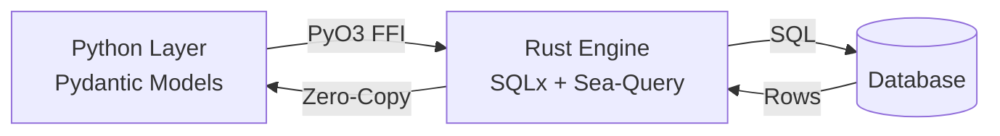

# Why Ferro?

## The Problem

Python ORMs are convenient but come with a **performance tax**. Traditional ORMs like Django ORM, SQLAlchemy, and Tortoise spend significant CPU time in Python code:

- **SQL generation**: Building query strings, escaping values, assembling complex JOINs
- **Row parsing**: Converting database rows into Python objects
- **Object instantiation**: Calling `__init__`, running validators, populating attributes
- **GIL contention**: All of this happens while holding the Global Interpreter Lock

For simple CRUD operations, this overhead is acceptable. But when you need to:

- Process thousands of rows in a request
- Run complex aggregations
- Handle high-concurrency workloads
- Minimize latency in microservices

...the Python tax becomes a bottleneck.

## How Ferro is Different

Ferro moves the expensive parts out of Python and into a high-performance Rust engine:

### Rust Core

- **SQL Generation**: Sea-Query builds optimized SQL queries in Rust
- **Row Hydration**: SQLx parses database rows directly into memory
- **Zero-Copy**: Data flows from database → Rust → Python with minimal copying
- **GIL-Free**: All I/O and parsing happens outside the GIL

### Pydantic-Native

Unlike ORMs that wrap Pydantic or use it as a serialization layer, Ferro **is** Pydantic:

- Models inherit directly from `pydantic.BaseModel`
- Validation uses `pydantic-core` (Rust)
- Type hints work exactly as expected
- No adapter layer, no conversion overhead

### Async-First

Built on `sqlx-core` and `pyo3-async-runtimes`:

- True async from Rust → Python
- No sync wrappers or thread pools
- Efficient connection pooling
- Concurrent query execution

## Architecture

When you call `User.where(User.age >= 18).all()`:

1. **Python**: Query builder creates a filter AST and passes it to Rust
2. **Rust**: Sea-Query generates `SELECT * FROM users WHERE age >= $1`
3. **SQLx**: Executes the query, receives rows
4. **Rust**: Parses rows into a memory layout compatible with Pydantic
5. **Python**: Receives hydrated `User` objects via zero-copy transfer

[Learn more about the architecture →](concepts/architecture.md)

## Benchmarks

!!! note "Benchmark Status"
    Comprehensive benchmarks comparing Ferro to other Python ORMs are in progress. Results will be published here and in the [benchmarks repository](https://github.com/syn54x/ferro-benchmarks).

### Expected Performance Characteristics

Based on Ferro's architecture:

**Fast:**
- ✅ Bulk inserts (1K+ rows)
- ✅ Complex queries with JOINs
- ✅ Filtering large result sets
- ✅ Row hydration and object creation
- ✅ Connection pooling overhead

**Similar to other ORMs:**
- Single-row operations (connection latency dominates)
- Schema introspection
- Migration generation

**Slower (by design):**
- Initial import time (Rust extension loading)

## Comparison

| Feature | Ferro | SQLAlchemy 2.0 | Tortoise ORM | Django ORM |
|---------|-------|----------------|--------------|------------|
| **Performance** | ⚡⚡⚡ Rust core | ⚡ Python | ⚡ Python | ⚡ Python |
| **Async Support** | ✅ Native | ✅ Native | ✅ Native | ⚠️ Limited |
| **Type Safety** | ✅ Pydantic | ✅ Typing | ⚡ Basic | ❌ Dynamic |
| **Learning Curve** | Low | High | Low | Low |
| **Ecosystem** | 🌱 Growing | 🌳 Mature | 🌿 Medium | 🌳 Mature |
| **Migrations** | ✅ Alembic | ✅ Alembic | ✅ Aerich | ✅ Built-in |
| **Dependencies** | Pydantic only | Many | Many | Django |

### SQLAlchemy 2.0

**Pros:**
- Battle-tested, mature ecosystem
- Extremely flexible (multiple APIs: Core, ORM, hybrid)
- Extensive dialect support
- Rich plugin ecosystem

**Cons:**
- Complex API surface (steep learning curve)
- Python-based performance ceiling
- Verbosity (especially Core API)

**Choose SQLAlchemy if:** You need maximum flexibility, have complex requirements, or are building a long-lived enterprise application where maturity matters more than raw performance.

### Tortoise ORM

**Pros:**
- Django-like API (familiar for Django devs)
- Good async support
- Simpler than SQLAlchemy

**Cons:**
- Smaller community
- Python-based performance
- Less flexible than SQLAlchemy

**Choose Tortoise if:** You want Django-style ORM ergonomics with async support and don't need cutting-edge performance.

### Django ORM

**Pros:**
- Huge ecosystem and community
- Excellent documentation
- Integrated with Django framework
- Admin interface integration

**Cons:**
- Sync-first (async support is limited)
- Tied to Django (can't use standalone easily)
- Python-based performance

**Choose Django if:** You're building a full Django application and need the integrated ecosystem (admin, auth, forms, etc.).

## Trade-offs

Ferro is **not** the best choice for every use case. Be aware of these trade-offs:

### ❌ Not Battle-Tested

Ferro is newer than SQLAlchemy (2006), Django ORM (2005), or Tortoise (2018). While it's production-ready, you may encounter edge cases that more mature ORMs have already solved.

### ❌ Smaller Ecosystem

Fewer third-party integrations, plugins, and extensions. If you need specialized adapters (GraphQL, Admin UIs, etc.), you may need to build them yourself.

### ❌ Rust Dependency

While most users never touch Rust code, custom extensions require Rust knowledge. SQLAlchemy's pure-Python codebase is easier to fork and modify.

### ❌ Compile Time

Ferro is distributed as pre-compiled wheels, but if you build from source (e.g., for an unsupported platform), compile times can be 2-5 minutes.

### ✅ When to Choose Ferro

- High-throughput APIs (>1K requests/sec)
- Data processing pipelines (bulk operations)
- Real-time applications (low latency requirements)
- Microservices (startup time and memory efficiency matter)
- FastAPI/Starlette apps (async-first, type-safe)
- Pydantic-heavy codebases (seamless integration)

### ❌ When NOT to Choose Ferro

- Prototypes (use Django ORM for speed of development)
- Enterprise apps with strict vendor support requirements
- Complex query requirements (SQLAlchemy Core is more flexible)
- Django-integrated projects (use Django ORM)

## Migration Paths

Planning to switch from another ORM?

- [Migrating from SQLAlchemy](migration-sqlalchemy.md) - Available now
- Migrating from Django ORM - Coming soon
- Migrating from Tortoise ORM - Coming soon

## Try It Yourself

The best way to evaluate Ferro is to build something with it:

[:octicons-arrow-right-24: Follow the 5-minute tutorial](getting-started/tutorial.md){ .md-button .md-button--primary }

Or jump into the [User Guide](guide/models-and-fields.md) if you prefer learning by reading.

## Still Have Questions?

- [Check the FAQ](faq.md)
- [Read about the architecture](concepts/architecture.md)
- [Ask on GitHub Discussions](https://github.com/syn54x/ferro-orm/discussions)
